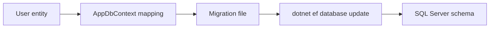

# ใช้ Migration

Migration คือไฟล์ที่บอกว่า database schema ต้องเปลี่ยนอย่างไร เช่นสร้าง table ใหม่ เพิ่ม column หรือสร้าง index

ในบทนี้เราจะสร้าง migration แรกจาก `User` entity และ `AppDbContext`

## วิธีเรียนบทนี้

บทนี้ให้คิดว่า migration เป็น “ประวัติการเปลี่ยน schema” ไม่ใช่ไฟล์ code ทั่วไปที่แก้เล่นได้

ลำดับที่ควรทำ:

1. build project ให้ผ่าน
2. ตรวจว่า `dotnet-ef` ใช้ได้
3. ตรวจว่า SQL Server ทำงานอยู่
4. สร้าง migration
5. update database
6. ตรวจว่ามี migration ในรายการ

## ก่อนเริ่มบทนี้

ให้ทำบท 19 ให้จบก่อน และตรวจว่าโปรเจกต์พร้อมทั้ง build และอ่าน `DbContext` ได้:

```powershell
dotnet build
dotnet tool run dotnet-ef --version
```

ถ้าคุณใช้ Docker ให้ตรวจ `docker ps` ด้วย ถ้าใช้ LocalDB ให้ตรวจว่า connection string เป็น `(localdb)\MSSQLLocalDB` และไม่ต้องรัน `docker ps`

## สิ่งที่จะใช้ในบทนี้

| สิ่งที่จะใช้ | ความหมาย |
| --- | --- |
| migration | ไฟล์ประวัติการเปลี่ยน schema ของ database |
| `migrations add` | สร้าง migration ใหม่จาก entity และ mapping ปัจจุบัน |
| `database update` | นำ migration ไปรันกับ database จริง |
| `migrations list` | แสดง migration ที่โปรเจกต์รู้จัก |
| `Up` | method ที่บอกว่าจะเปลี่ยน schema ไปข้างหน้าอย่างไร |
| `Down` | method ที่บอกว่าจะย้อน migration นี้อย่างไร |
| model snapshot | ไฟล์ที่ EF Core ใช้จำ schema ล่าสุดของ model |

ภาพรวมการทำงานของ migration:



## หลังจบบทนี้ ไฟล์/ฐานข้อมูลที่เปลี่ยน

```text
Migrations/
```

และ database `BackendApiDb` จะมี table `Users`

## ตรวจความพร้อมก่อนสร้าง migration

ก่อนรันคำสั่ง migration ให้ตรวจสามอย่างนี้

```powershell
dotnet build
dotnet tool run dotnet-ef --version
docker ps
```

`dotnet build` ต้องผ่านก่อน เพราะ EF Core ต้อง compile project เพื่ออ่าน `DbContext`

`dotnet tool run dotnet-ef --version` ต้องทำงานได้

`docker ps` ควรเห็น SQL Server container ถ้าคุณใช้ database ผ่าน Docker ถ้าคุณใช้ LocalDB ให้ข้าม `docker ps` และตรวจ connection string แทน

ถ้า `dotnet build` ยังไม่ผ่าน ห้ามสร้าง migration ต่อ ให้กลับไปแก้ error ใน `User` entity, `AppDbContext` หรือ `Program.cs` ก่อน

## สร้าง migration แรก

รันคำสั่งนี้ที่ root ของโปรเจกต์ `Backend.Api`

```powershell
dotnet tool run dotnet-ef migrations add InitialCreate
```

คำสั่งนี้ให้รันครั้งเดียวต่อ migration name ถ้ามี migration ชื่อ `InitialCreate` อยู่แล้ว ห้ามรันซ้ำ เพราะ EF Core จะฟ้องว่าชื่อนี้ถูกใช้แล้ว ให้ข้ามไปขั้น `database update` หรือใช้ `migrations list` เพื่อตรวจรายการ migration แทน

หลังคำสั่งสำเร็จ จะมีโฟลเดอร์ใหม่

```text
Migrations/
```

ในโฟลเดอร์นี้จะมีไฟล์ migration และ model snapshot

## ดูไฟล์ migration

เปิดไฟล์ migration ที่ถูกสร้างขึ้น จะเห็น method สำคัญสองตัว

```csharp
protected override void Up(MigrationBuilder migrationBuilder)
{
    // คำสั่งสำหรับเปลี่ยน schema ไปข้างหน้า
}

protected override void Down(MigrationBuilder migrationBuilder)
{
    // คำสั่งสำหรับย้อน migration นี้
}
```

`Up` ใช้สร้างหรือแก้ schema ส่วน `Down` ใช้ย้อนการเปลี่ยนแปลง

ใน migration แรก คุณควรเห็นการสร้าง table `Users` และ unique index ของ `Email` ถ้าไม่เห็น ให้กลับไปตรวจ `AppDbContext.OnModelCreating`

## อัปเดต database

รันคำสั่งนี้เพื่อเอา migration ไปรันกับ database จริง

```powershell
dotnet tool run dotnet-ef database update
```

ถ้าสำเร็จ database `BackendApiDb` จะถูกสร้าง และมี table `Users`

ถ้า command ค้างหรือ error เรื่อง login ให้รอสักครู่แล้วดู log ของ SQL Server:

```powershell
docker logs backend-api-sql
```

ถ้าคุณใช้ LocalDB และเจอ error connection ให้ตรวจว่า connection string ใช้ `Server=(localdb)\MSSQLLocalDB` และ database name ตรงกับที่ต้องการ

## ตรวจรายการ migration

```powershell
dotnet tool run dotnet-ef migrations list
```

ควรเห็น `InitialCreate`

## ลำดับคำสั่งแบบสั้น

ถ้าต้องการทวนทุกคำสั่งในบทนี้ ให้ใช้ชุดนี้จากโฟลเดอร์ `Backend.Api`

```powershell
dotnet build
dotnet tool run dotnet-ef --version
# Run this only if InitialCreate does not exist yet.
dotnet tool run dotnet-ef migrations add InitialCreate
dotnet tool run dotnet-ef database update
dotnet tool run dotnet-ef migrations list
```

## ปัญหาที่พบบ่อย

ถ้าเจอ error ว่าไม่พบ `DbContext` ให้ตรวจว่า `AppDbContext` ถูกสร้างเป็น `public` และลงทะเบียนใน `Program.cs` แล้ว

ถ้าเจอ error เชื่อม database ไม่ได้ ให้ตรวจว่า SQL Server เปิดอยู่ port `1433` ถูก map แล้ว และรหัสผ่านใน connection string ตรงกับตอนสร้าง container

ถ้าเจอ error ว่า login failed for user `sa` ให้รอ SQL Server start ให้เสร็จจริงก่อน หรือดู log ด้วยคำสั่งนี้

```powershell
docker logs backend-api-sql
```

ถ้าสร้าง migration ผิดและยังไม่ได้ push หรือแชร์กับใคร อาจลบ migration ล่าสุดได้ด้วยคำสั่งนี้:

```powershell
dotnet tool run dotnet-ef migrations remove
```

ใช้คำสั่งนี้เฉพาะตอนยังไม่ได้ update database ใน environment สำคัญ และต้องเข้าใจว่ากำลังย้อน migration ล่าสุดออกจาก code

## ควรแก้ไฟล์ migration ด้วยมือไหม

มือใหม่ควรหลีกเลี่ยงการแก้ไฟล์ migration ด้วยมือในช่วงแรก ให้แก้ entity หรือ `OnModelCreating` แล้วสร้าง migration ใหม่แทน

เมื่อทำงานจริง บางกรณีอาจต้องแก้ migration ด้วยมือ แต่ต้องเข้าใจผลกระทบกับ database schema ให้ดี

## Checkpoint

ก่อนอ่านบทต่อไป ให้ตรวจว่าทำได้ครบตามนี้

- รัน `dotnet tool run dotnet-ef migrations add InitialCreate` สำเร็จ หรือมี migration `InitialCreate` อยู่แล้ว
- รัน `dotnet tool run dotnet-ef database update` สำเร็จ
- database มี table `Users`
- `dotnet tool run dotnet-ef migrations list` แสดง migration ที่สร้างไว้
