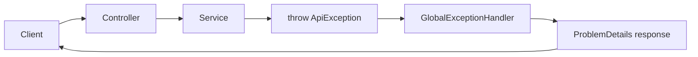

# Global Exception Handler

ถ้าใส่ `try-catch` ในทุก action method code จะซ้ำและดูแลยาก แนวทางที่ดีกว่าคือให้ Controller และ Service โยน exception ที่มีความหมาย แล้วให้ global exception handler แปลงเป็น HTTP response

บทนี้เราจะใช้ `IExceptionHandler` ของ ASP.NET Core เพื่อจัดการ exception แบบรวมศูนย์

ภาพรวม error flow หลังเพิ่ม global exception handler:



## วิธีเรียนบทนี้

บทนี้มีหลายไฟล์ ให้ทำทีละรอบ:

1. สร้าง exception base class
2. สร้าง exception เฉพาะกรณี
3. สร้าง `GlobalExceptionHandler`
4. ลงทะเบียน handler ใน `Program.cs`
5. ปรับ service ให้ throw exception
6. ลบ `try-catch` ที่ไม่จำเป็นออกจาก Controller
7. ทดสอบ `404`, `409`, และดูวิธีตรวจ `500` แบบชั่วคราวใน development

## ก่อนเริ่มบทนี้

ให้ทำบท 24 ให้จบก่อน และตรวจว่า DTO validation ยังทำงาน:

```powershell
dotnet build
```

ก่อนเริ่มบทนี้ email domain ที่ห้ามใช้ควรตอบ `400 Bad Request` และ email ซ้ำอาจยังถูกจัดการแบบชั่วคราวใน Controller หรือ Service อยู่ ซึ่งบทนี้จะย้ายไปเป็น exception flow กลาง

## สิ่งที่จะใช้ในบทนี้

| สิ่งที่จะใช้ | ความหมาย |
| --- | --- |
| `IExceptionHandler` | interface สำหรับเขียน global exception handler |
| `ProblemDetails` | response format มาตรฐานสำหรับ error |
| `IProblemDetailsService` | service ที่ช่วยเขียน `ProblemDetails` ออก response |
| `ApiException` | exception ที่ระบบเราตั้งใจโยนเอง |
| `NotFoundException` | exception สำหรับ `404 Not Found` |
| `ConflictException` | exception สำหรับ `409 Conflict` |
| `UseExceptionHandler()` | middleware ที่เปิดใช้ exception handler |

## หลังจบบทนี้ ไฟล์ที่เปลี่ยน

```text
Exceptions/ApiException.cs
Exceptions/NotFoundException.cs
Exceptions/ConflictException.cs
Exceptions/GlobalExceptionHandler.cs
Services/IUserService.cs
Services/UserService.cs
Controllers/UsersController.cs
Program.cs
```

## สร้างโฟลเดอร์ Exceptions

รันจากโฟลเดอร์ `Backend.Api`

Windows PowerShell:

```powershell
New-Item -ItemType Directory -Force -Path Exceptions
if (-not (Test-Path -LiteralPath Exceptions/ApiException.cs)) {
    New-Item -ItemType File -Path Exceptions/ApiException.cs
}
if (-not (Test-Path -LiteralPath Exceptions/NotFoundException.cs)) {
    New-Item -ItemType File -Path Exceptions/NotFoundException.cs
}
if (-not (Test-Path -LiteralPath Exceptions/ConflictException.cs)) {
    New-Item -ItemType File -Path Exceptions/ConflictException.cs
}
if (-not (Test-Path -LiteralPath Exceptions/GlobalExceptionHandler.cs)) {
    New-Item -ItemType File -Path Exceptions/GlobalExceptionHandler.cs
}
```

macOS/Linux Bash:

```bash
mkdir -p Exceptions
touch Exceptions/ApiException.cs
touch Exceptions/NotFoundException.cs
touch Exceptions/ConflictException.cs
touch Exceptions/GlobalExceptionHandler.cs
```

## ขั้นที่ 1: สร้าง ApiException

เปิดไฟล์:

```text
Exceptions/ApiException.cs
```

เพิ่ม code นี้:

```csharp
namespace Backend.Api.Exceptions;

public class ApiException : Exception
{
    public ApiException(string message, string code, int statusCode)
        : base(message)
    {
        Code = code;
        StatusCode = statusCode;
    }

    public string Code { get; }
    public int StatusCode { get; }
}
```

`ApiException` คือ exception ที่เราตั้งใจโยนเอง และมีข้อมูลพอสำหรับแปลงเป็น HTTP response ได้แก่ message, code และ status code

## ขั้นที่ 2: สร้าง exception เฉพาะกรณี

เปิดไฟล์:

```text
Exceptions/NotFoundException.cs
```

เพิ่ม code นี้:

```csharp
using Microsoft.AspNetCore.Http;

namespace Backend.Api.Exceptions;

public class NotFoundException(string message, string code)
    : ApiException(message, code, StatusCodes.Status404NotFound);
```

เปิดไฟล์:

```text
Exceptions/ConflictException.cs
```

เพิ่ม code นี้:

```csharp
using Microsoft.AspNetCore.Http;

namespace Backend.Api.Exceptions;

public class ConflictException(string message, string code)
    : ApiException(message, code, StatusCodes.Status409Conflict);
```

การมี class เฉพาะทำให้ service อ่านง่ายขึ้น เช่น `throw new NotFoundException(...)` สื่อเจตนาชัดกว่าโยน `Exception` ทั่วไป

## ขั้นที่ 3: เริ่มสร้าง GlobalExceptionHandler

เปิดไฟล์:

```text
Exceptions/GlobalExceptionHandler.cs
```

เริ่มจาก using และ class:

```csharp
using Microsoft.AspNetCore.Diagnostics;
using Microsoft.AspNetCore.Http;
using Microsoft.AspNetCore.Mvc;

namespace Backend.Api.Exceptions;

public class GlobalExceptionHandler(
    ILogger<GlobalExceptionHandler> logger,
    IProblemDetailsService problemDetailsService) : IExceptionHandler
{
}
```

`logger` ใช้บันทึก unexpected error ส่วน `problemDetailsService` ใช้เขียน `ProblemDetails` เป็น response

## ขั้นที่ 4: เพิ่ม TryHandleAsync

เพิ่ม method นี้ใน class `GlobalExceptionHandler`

```csharp
public async ValueTask<bool> TryHandleAsync(
    HttpContext httpContext,
    Exception exception,
    CancellationToken cancellationToken)
{
    var problemDetails = exception is ApiException apiException
        ? CreateApiProblemDetails(apiException)
        : CreateInternalProblemDetails(exception);

    httpContext.Response.StatusCode =
        problemDetails.Status ?? StatusCodes.Status500InternalServerError;
```

ต่อด้วยการเขียน response:

```csharp
    await problemDetailsService.TryWriteAsync(new ProblemDetailsContext
    {
        HttpContext = httpContext,
        ProblemDetails = problemDetails,
        Exception = exception
    });

    return true;
}
```

method นี้รับ exception ทุกตัวที่หลุดขึ้นมาจาก pipeline แล้วตัดสินใจว่าจะตอบ error แบบไหน

## ขั้นที่ 5: เพิ่ม method สำหรับ ApiException

เพิ่ม method นี้ใน class เดียวกัน:

```csharp
private static ProblemDetails CreateApiProblemDetails(ApiException exception)
{
    var problemDetails = new ProblemDetails
    {
        Status = exception.StatusCode,
        Title = exception.Message,
        Type = $"https://httpstatuses.com/{exception.StatusCode}"
    };

    problemDetails.Extensions["code"] = exception.Code;

    return problemDetails;
}
```

กรณีนี้ใช้ `exception.Message` ได้ เพราะเป็น exception ที่ระบบเราตั้งใจโยนเองและควบคุมข้อความแล้ว

## ขั้นที่ 6: เพิ่ม method สำหรับ unexpected error

เพิ่ม method นี้ต่อจาก `CreateApiProblemDetails`

```csharp
private ProblemDetails CreateInternalProblemDetails(Exception exception)
{
    logger.LogError(exception, "Unhandled exception occurred");

    var problemDetails = new ProblemDetails
    {
        Status = StatusCodes.Status500InternalServerError,
        Title = "Unexpected error",
        Type = "https://httpstatuses.com/500"
    };

    problemDetails.Extensions["code"] = "INTERNAL_ERROR";

    return problemDetails;
}
```

สำหรับ error ที่ไม่คาดคิด เรา log รายละเอียดไว้ที่ server แต่ตอบ client ด้วยข้อความกลาง ๆ เพื่อไม่ให้ข้อมูลภายในรั่ว

ก่อนลงทะเบียน handler ให้ตรวจโครงไฟล์ `GlobalExceptionHandler.cs` ว่ามีส่วนหลักครบแบบนี้:

```text
public class GlobalExceptionHandler(
    ILogger<GlobalExceptionHandler> logger,
    IProblemDetailsService problemDetailsService) : IExceptionHandler
{
    public async ValueTask<bool> TryHandleAsync(...) { ... }

    private static ProblemDetails CreateApiProblemDetails(...) { ... }

    private ProblemDetails CreateInternalProblemDetails(...) { ... }
}
```

ถ้า brace `{ }` อยู่ผิดตำแหน่ง ให้เทียบจากโครงนี้ก่อน เพราะ error ในไฟล์ handler มักเกิดจากการวาง method ซ้อนผิดชั้น

## ขั้นที่ 7: ลงทะเบียน Exception Handler

เปิด `Program.cs` แล้วเพิ่ม using:

```csharp
using Backend.Api.Exceptions;
```

เพิ่ม service registration ก่อน `builder.Build()`:

```csharp
builder.Services.AddProblemDetails();
builder.Services.AddExceptionHandler<GlobalExceptionHandler>();
```

หลัง `var app = builder.Build();` ให้เพิ่ม middleware ก่อน `app.MapControllers()`:

```csharp
app.UseExceptionHandler();
app.UseStatusCodePages();
```

ตำแหน่งโดยรวมควรเป็นแบบนี้:

```csharp
var app = builder.Build();

app.UseExceptionHandler();
app.UseStatusCodePages();

if (app.Environment.IsDevelopment())
{
    app.MapOpenApi();
}
```

`UseExceptionHandler()` ต้องอยู่ก่อน endpoint mapping เพื่อให้ดัก exception ที่เกิดระหว่าง request ได้

## ขั้นที่ 8: ปรับ IUserService

เปิดไฟล์:

```text
Services/IUserService.cs
```

เปลี่ยน method ที่เคยคืน `null` หรือ `false` ให้โยน exception แทน:

```csharp
using Backend.Api.Dtos.Users;

namespace Backend.Api.Services;

public interface IUserService
{
    Task<IReadOnlyList<UserResponse>> GetUsersAsync();
    Task<UserResponse> GetUserByIdAsync(int id);
    Task<UserResponse> CreateUserAsync(CreateUserRequest request);
    Task<UserResponse> UpdateUserAsync(int id, UpdateUserRequest request);
    Task DeleteUserAsync(int id);
}
```

หลังขั้นนี้ `UserService` และ `UsersController` จะยัง compile ไม่ผ่านจนกว่าจะปรับ method ให้ตรงกัน

## ขั้นที่ 9: ปรับ UserService ให้โยน exception

เปิด `UserService.cs` แล้วเพิ่ม using:

```csharp
using Backend.Api.Exceptions;
```

ปรับ `GetUserByIdAsync`:

```csharp
public async Task<UserResponse> GetUserByIdAsync(int id)
{
    var user = await userRepository.GetByIdAsync(id);

    if (user is null)
    {
        throw new NotFoundException("User not found", "USER_NOT_FOUND");
    }

    return ToResponse(user);
}
```

ปรับ email ซ้ำใน `CreateUserAsync`:

```csharp
if (existingUser is not null)
{
    throw new ConflictException("Email already exists", "EMAIL_ALREADY_EXISTS");
}
```

ปรับ `UpdateUserAsync` เมื่อไม่พบ user:

```csharp
if (user is null)
{
    throw new NotFoundException("User not found", "USER_NOT_FOUND");
}
```

ปรับ `DeleteUserAsync`:

```csharp
public async Task DeleteUserAsync(int id)
{
    var user = await userRepository.GetByIdAsync(id);

    if (user is null)
    {
        throw new NotFoundException("User not found", "USER_NOT_FOUND");
    }

    await userRepository.DeleteAsync(user);
}
```

ตอนนี้ service เป็นคนบอกว่า error มีความหมายอะไร ส่วน handler เป็นคนแปลงความหมายนั้นเป็น HTTP response

## ขั้นที่ 10: ปรับ Controller ให้บางลง

เมื่อ service โยน exception แล้ว Controller ไม่ต้อง `try-catch` ทุกกรณีเอง

ตัวอย่าง `GET {{usersPath}}/{id}`:

```csharp
[HttpGet("{id:int}")]
public async Task<IActionResult> GetUserById(int id)
{
    var user = await userService.GetUserByIdAsync(id);

    return Ok(user);
}
```

ตัวอย่าง `POST {{usersPath}}`:

```csharp
[HttpPost]
public async Task<IActionResult> CreateUser(CreateUserRequest request)
{
    var user = await userService.CreateUserAsync(request);

    return CreatedAtAction(nameof(GetUserById), new { id = user.Id }, user);
}
```

ตัวอย่าง `PUT {{usersPath}}/{id}`:

```csharp
[HttpPut("{id:int}")]
public async Task<IActionResult> UpdateUser(int id, UpdateUserRequest request)
{
    var user = await userService.UpdateUserAsync(id, request);

    return Ok(user);
}
```

ตัวอย่าง `DELETE {{usersPath}}/{id}`:

```csharp
[HttpDelete("{id:int}")]
public async Task<IActionResult> DeleteUser(int id)
{
    await userService.DeleteUserAsync(id);

    return NoContent();
}
```

## ตรวจ build

รันจากโฟลเดอร์ `Backend.Api`

```powershell
dotnet build
```

ถ้า build error หลังแก้ interface ให้ตรวจชื่อ method ใน Controller เช่น `DeleteUserAsync` ตอนนี้คืน `Task` ไม่ใช่ `Task<bool>` แล้ว

## ทดสอบ Global Exception Handler

รัน API:

```powershell
dotnet run
```

ใช้ `baseUrl` ตาม port จริง:

```http
@baseUrl = http://localhost:<http-port>
@usersPath = /api/v1/users

### User not found
GET {{baseUrl}}{{usersPath}}/999999
Accept: application/json
```

ควรได้ `404 Not Found` พร้อม `code` เป็น `USER_NOT_FOUND`

ลองสร้าง email ซ้ำ:

```http
### Email conflict
POST {{baseUrl}}{{usersPath}}
Content-Type: application/json

{
  "email": "demo-user@example.com"
}
```

ควรได้ `409 Conflict` พร้อม `code` เป็น `EMAIL_ALREADY_EXISTS`

### ตรวจ 500 แบบชั่วคราว

ในโปรเจกต์จริงเราไม่ควรสร้าง endpoint ที่ตั้งใจ throw exception ไว้ถาวร แต่ถ้าต้องการเห็นว่า unexpected error ถูกแปลงเป็น `500 Internal Server Error` จริง ให้เพิ่ม endpoint ชั่วคราวใน `Program.cs` เฉพาะตอน development โดยวางก่อน `app.MapControllers()`:

```csharp
if (app.Environment.IsDevelopment())
{
    app.MapGet("/debug/throw", () =>
        throw new InvalidOperationException("Test exception"));
}
```

จากนั้นยิง request นี้:

```http
GET {{baseUrl}}/debug/throw
Accept: application/json
```

ควรได้ `500 Internal Server Error` พร้อม `code` เป็น `INTERNAL_ERROR` และ `title` เป็น `Unexpected error`

หลังทดสอบเสร็จให้ลบ endpoint `/debug/throw` ออกทันที เพราะ endpoint นี้มีไว้ตรวจ handler เท่านั้น ไม่ใช่ส่วนหนึ่งของ API จริง

## ทำไมไม่ควรส่ง exception.Message ทุกกรณี

สำหรับ exception ที่เราตั้งใจโยนเอง เช่น `NotFoundException` และ `ConflictException` สามารถใช้ message เป็นข้อความ response ได้

แต่สำหรับ exception ที่ไม่คาดคิด เช่น database ล่มหรือ null reference ไม่ควรส่ง message จริงออกไป เพราะอาจเปิดเผยรายละเอียดภายในระบบ

ดังนั้น handler จึงตอบข้อความกลาง ๆ ว่า `Unexpected error` สำหรับ error ที่ไม่รู้จัก

## Checkpoint

ก่อนอ่านบทต่อไป ให้ตรวจว่าทำได้ครบตามนี้

- มี `ApiException`, `NotFoundException`, `ConflictException`
- มี `GlobalExceptionHandler`
- `Program.cs` เรียก `AddProblemDetails`, `AddExceptionHandler`, `UseExceptionHandler`
- `UserService` โยน exception แทนการคืน `null` หรือ `false` ใน business error
- Controller บางลงและไม่มี `try-catch` ซ้ำ
