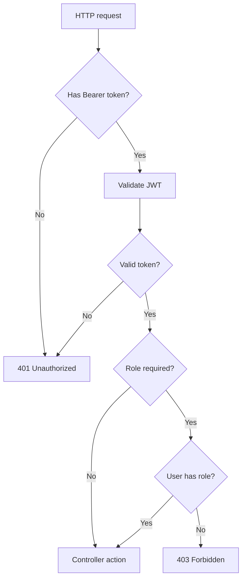

หลังจาก API validate JWT ได้แล้ว เราสามารถใช้ `[Authorize]` เพื่อบังคับว่า endpoint นี้ต้อง login ก่อน

ถ้า request ไม่มี token หรือ token ไม่ถูกต้อง ASP.NET Core จะตอบ `401 Unauthorized`

ภาพรวม request ที่ผ่าน `[Authorize]`:



## วิธีเรียนบทนี้

บทนี้เป็นบทปิดภาค ให้ทำตามลำดับ:

1. ป้องกัน endpoint ที่ไม่ควร public
2. เข้าใจว่า register/login ยังต้อง public
3. ทดสอบ request ไม่มี token
4. ทดสอบ request มี token
5. เตรียมแนวคิด role-based authorization สำหรับภาค Admin

## สิ่งที่จะใช้ในบทนี้

| สิ่งที่จะใช้ | ความหมาย |
| --- | --- |
| `[Authorize]` | บังคับให้ request ต้องผ่าน authentication |
| `[AllowAnonymous]` | เปิดบาง action ให้ public แม้ controller ถูก authorize |
| `[Authorize(Roles = "Admin")]` | บังคับทั้ง login และต้องมี role ที่กำหนด |
| `401 Unauthorized` | ไม่มี token หรือ token ไม่ถูกต้อง |
| `403 Forbidden` | token ถูกต้องแต่สิทธิ์ไม่พอ |
| `Authorization: Bearer ...` | header ที่ client ใช้ส่ง JWT |

## หลังจบบทนี้ ไฟล์ที่เปลี่ยน

```text
Controllers/UsersController.cs
Controllers/AuthController.cs
Backend.Api.http
```

## ขั้นที่ 1: ป้องกัน UsersController

หลังมีระบบ register แล้ว endpoint สร้างผู้ใช้แบบ public ไม่ควรอยู่ที่ `POST /api/v1/users` อีกต่อไป

เปิด `Controllers/UsersController.cs` แล้วเพิ่ม using:

```csharp
using Microsoft.AspNetCore.Authorization;
```

จากนั้นใส่ `[Authorize]` ที่ระดับ Controller:

```csharp
[Authorize]
[ApiController]
[Route("api/v1/[controller]")]
public class UsersController(IUserService userService) : ControllerBase
{
    // Actions
}
```

เมื่อใส่ `[Authorize]` ที่ controller ทุก action ใน controller นี้ต้อง login ก่อน

หนังสือเล่มนี้ใช้ route `[Route("api/v1/[controller]")]` ตั้งแต่บท Controller แรก จุดสำคัญของบทนี้คือเพิ่ม `[Authorize]` โดยไม่เปลี่ยน route เดิม

## ควรทำอย่างไรกับ POST /api/v1/users

ในภาคนี้แนะนำให้ป้องกัน `UsersController` ทั้งตัวด้วย `[Authorize]` เพราะ public register ถูกย้ายไปที่ `POST /api/v1/auth/register` แล้ว

ในภาค Admin เราจะย้าย logic การสร้าง user โดย admin ไปไว้ที่ admin controller แยก

ใน end-state แบบ production-grade ถ้ายังเหลือ `UsersController` จากบท CRUD เดิม ให้จำกัดทั้ง controller เป็น `Admin` หรือถอดออกจาก production API เพื่อป้องกัน user ปกติอ่านหรือแก้ไขข้อมูลผู้ใช้อื่น

## ขั้นที่ 2: ตรวจ AuthController

`AuthController` ไม่ควรใส่ `[Authorize]` ที่ระดับ controller เพราะ register และ login ต้องเป็น public

สิ่งที่ควรเป็น:

```text
POST /api/v1/auth/register  public
POST /api/v1/auth/login     public
GET  /api/v1/auth/me        protected with [Authorize]
```

ดังนั้นให้ใส่ `[Authorize]` เฉพาะ action `me` ตามบทก่อน

## AllowAnonymous ใช้เมื่อไหร่

ถ้า controller ทั้งตัวถูกใส่ `[Authorize]` แต่บาง action ต้องเปิด public ให้ใช้ `[AllowAnonymous]`

ตัวอย่าง:

```csharp
[Authorize]
[ApiController]
[Route("api/v1/[controller]")]
public class ExampleController : ControllerBase
{
    [AllowAnonymous]
    [HttpGet("public")]
    public IActionResult Public()
    {
        return Ok();
    }
}
```

ใน `AuthController` ของเราไม่จำเป็นต้องใช้ `[AllowAnonymous]` เพราะไม่ได้ใส่ `[Authorize]` ที่ระดับ controller

## เตรียม role-based authorization

ตอนสร้าง token เราใส่ claim ชื่อ `role` แล้ว และตั้งค่า `RoleClaimType = "role"` ใน `TokenValidationParameters`

ดังนั้นในภาค Admin เราจะใช้ attribute แบบนี้ได้:

```csharp
[Authorize(Roles = "Admin")]
```

ตัวอย่าง endpoint ที่ต้องเป็น Admin:

```csharp
[Authorize(Roles = "Admin")]
[HttpGet("admin-only")]
public IActionResult AdminOnly()
{
    return Ok(new { message = "Admin only" });
}
```

ถ้า user login แล้วแต่ role ไม่ใช่ `Admin` API จะตอบ `403 Forbidden`

ในบทนี้ `UsersController` ถูกป้องกันแค่ระดับ login ดังนั้น user ที่มี token ถูกต้องควรยังเรียก `GET /api/v1/users` ได้ `200 OK` เมื่อขึ้นภาค Admin แล้ว route ที่ใช้จัดการผู้ใช้จะค่อย ๆ ถูกย้ายและจำกัดเป็น role `Admin` มากขึ้น

## ขั้นที่ 3: ทดสอบ endpoint ที่ถูกป้องกัน

ก่อนทดสอบให้รัน build หนึ่งครั้ง:

```powershell
dotnet build
```

เรียก endpoint โดยไม่ส่ง token:

```http
@baseUrl = http://localhost:<http-port>
@usersPath = /api/v1/users

### Protected users endpoint without token
GET {{baseUrl}}{{usersPath}}
Accept: application/json
```

ควรได้ `401 Unauthorized`

จากนั้น login แล้ว copy `accessToken` มาใส่ตัวแปร `@token`:

```http
@token = paste-token-here

### Protected users endpoint with token
GET {{baseUrl}}{{usersPath}}
Authorization: Bearer {{token}}
Accept: application/json
```

ควรได้ `200 OK`

## เพิ่ม request ใน Backend.Api.http

ใช้ชุดนี้เป็น checkpoint หลังจบภาค 6:

```http
@baseUrl = http://localhost:<http-port>
@authPath = /api/v1/auth
@usersPath = /api/v1/users
@token = paste-token-here

### Register
POST {{baseUrl}}{{authPath}}/register
Content-Type: application/json

{
  "email": "new-user@example.com",
  "password": "Passw0rd!"
}
```

หลัง register แล้วให้ login:

```http
### Login
POST {{baseUrl}}{{authPath}}/login
Content-Type: application/json

{
  "email": "new-user@example.com",
  "password": "Passw0rd!"
}
```

copy ค่า `accessToken` จาก response มาแทน `paste-token-here` แล้วทดสอบ endpoint ที่ต้อง login:

```http
### Me
GET {{baseUrl}}{{authPath}}/me
Authorization: Bearer {{token}}
Accept: application/json

### Protected users endpoint
GET {{baseUrl}}{{usersPath}}
Authorization: Bearer {{token}}
Accept: application/json
```

ถ้าเครื่องคุณใช้ HTTPS ได้ ให้เปลี่ยน `baseUrl` เป็น port HTTPS จริงของเครื่อง เช่น `https://localhost:<https-port>`

## Checkpoint

เมื่อจบภาคนี้ คุณควรทำได้ครบตามนี้

- `AuthController` มี register, login และ me endpoint
- register และ login เปิด public
- me ใช้ `[Authorize]`
- `UsersController` ถูกป้องกันด้วย `[Authorize]`
- ไม่ส่ง token แล้วได้ `401`
- ส่ง token ที่ถูกต้องแล้วเข้า endpoint ที่ต้อง login ได้
- เข้าใจว่า `[Authorize(Roles = "Admin")]` จะใช้ต่อในภาค Admin
