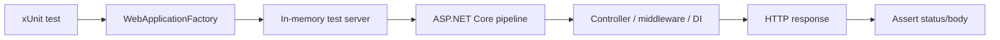

# Integration Test

Integration test ใช้ตรวจว่า endpoint, routing, middleware, DI, validation และ authentication ทำงานร่วมกันถูกต้อง

ใน ASP.NET Core เราสามารถใช้ `WebApplicationFactory<Program>` เพื่อสร้าง test server และยิง HTTP request เข้า API ได้โดยไม่ต้องเปิด server จริงแยกเอง

ภาพรวม integration test ด้วย `WebApplicationFactory`:



## วิธีเรียนบทนี้

บทนี้จะเริ่มจาก integration test ที่ไม่ต้องใช้ database จริงก่อน:

1. ติดตั้ง `Microsoft.AspNetCore.Mvc.Testing`
2. ติดตั้ง EF Core InMemory provider สำหรับ test database
3. เปิด `Program` ให้ test project เข้าถึง
4. ทำให้ seeding ปิดได้ตอน test
5. สร้าง `TestApiFactory`
6. override database เป็น InMemory ตอน test
7. สร้าง test `GET /api/v1/auth/me` แบบไม่ส่ง token
8. เพิ่ม validation test ที่ไม่ต้องเข้า database
9. รัน `dotnet test`

## ก่อนเริ่มบทนี้

ให้ตรวจว่าคุณมี test project จากบทก่อนหน้าแล้ว:

```text
Backend.Api/
Backend.Api.Tests/
Backend.Api.slnx หรือ Backend.Api.sln
```

คำสั่งในบทนี้ให้รันจาก root ของ solution คือโฟลเดอร์ที่มี `Backend.Api` และ `Backend.Api.Tests` อยู่ข้างกัน

## สิ่งที่จะใช้ในบทนี้

| สิ่งที่จะใช้ | ความหมาย |
| --- | --- |
| integration test | test ที่รันหลายส่วนร่วมกัน เช่น middleware, DI และ controller |
| `WebApplicationFactory<Program>` | helper ที่สร้าง test server จาก `Program.cs` |
| `HttpClient` | client ที่ test ใช้ยิง request เข้า test server |
| `IClassFixture<T>` | xUnit fixture ที่ reuse object ร่วมกันใน class test |
| `DataSeeding:Enabled` | config ที่ใช้ปิด seed data ตอน test |
| EF Core InMemory | database provider เบา ๆ สำหรับ integration test เริ่มต้น |

## หลังจบบทนี้ ไฟล์ที่เปลี่ยน

```text
Backend.Api/Program.cs
Backend.Api.Tests/Backend.Api.Tests.csproj
Backend.Api.Tests/TestApiFactory.cs
Backend.Api.Tests/AuthIntegrationTests.cs
```

## ขั้นที่ 1: ติดตั้ง package

รันจาก root ของ solution

Windows PowerShell:

```powershell
dotnet add Backend.Api.Tests\Backend.Api.Tests.csproj package Microsoft.AspNetCore.Mvc.Testing
dotnet add Backend.Api.Tests\Backend.Api.Tests.csproj package Microsoft.EntityFrameworkCore.InMemory
```

macOS/Linux Bash:

```bash
dotnet add Backend.Api.Tests/Backend.Api.Tests.csproj package Microsoft.AspNetCore.Mvc.Testing
dotnet add Backend.Api.Tests/Backend.Api.Tests.csproj package Microsoft.EntityFrameworkCore.InMemory
```

`Microsoft.AspNetCore.Mvc.Testing` ให้ `WebApplicationFactory<Program>` สำหรับรัน ASP.NET Core ใน test server ส่วน `Microsoft.EntityFrameworkCore.InMemory` ใช้แทน SQL Server ใน test เริ่มต้นเพื่อไม่ต้องพึ่ง database จริง

## ขั้นที่ 2: เปิด Program ให้ test project เข้าถึง

เปิด `Backend.Api/Program.cs`

เพิ่มท้ายไฟล์:

```csharp
public partial class Program { }
```

เพราะ top-level statements จะสร้าง `Program` class ให้แบบ implicit การเพิ่ม partial class ทำให้ test project reference ได้ง่าย

## ขั้นที่ 3: ควบคุม database seeding ตอน test

ถ้าโปรเจกต์มี `DataSeeder` ที่รันตอน application start ให้ปรับ `Program.cs` ให้ปิด seeding ได้ผ่าน configuration

```csharp
var seedDatabase = app.Configuration.GetValue(
    "DataSeeding:Enabled",
    true);
```

จากนั้นครอบ seeding logic:

```csharp
if (seedDatabase)
{
    using var scope = app.Services.CreateScope();
    var seeder = scope.ServiceProvider.GetRequiredService<DataSeeder>();
    await seeder.SeedAsync();
}
```

ตอน integration test เราจะตั้ง `DataSeeding__Enabled=false` เพื่อให้ test แรกไม่ต้อง seed database จริง

## ขั้นที่ 4: สร้าง TestApiFactory.cs

รันจาก root ของ solution

Windows PowerShell:

```powershell
New-Item -ItemType File -Force -Path Backend.Api.Tests/TestApiFactory.cs
```

macOS/Linux Bash:

```bash
touch Backend.Api.Tests/TestApiFactory.cs
```

เปิดไฟล์:

```text
Backend.Api.Tests/TestApiFactory.cs
```

เริ่มด้วย using และ class:

```csharp
using Microsoft.AspNetCore.Hosting;
using Microsoft.AspNetCore.Mvc.Testing;
using Microsoft.EntityFrameworkCore;
using Microsoft.EntityFrameworkCore.Infrastructure;
using Microsoft.Extensions.DependencyInjection;
using Microsoft.Extensions.DependencyInjection.Extensions;
using Backend.Api.Data;

namespace Backend.Api.Tests;

public class TestApiFactory : WebApplicationFactory<Program>
{
}
```

## ขั้นที่ 5: เพิ่มตัวเก็บค่า environment เดิม

เพิ่ม field นี้ใน class:

```csharp
private readonly Dictionary<string, string?> previousValues = [];
```

เราจะเก็บค่าเดิมไว้เพื่อ restore หลัง test จบ ไม่ให้ environment variable จาก test ไปรบกวน terminal หรือ test อื่น

## ขั้นที่ 6: ตั้งค่า config สำหรับ test

เพิ่ม constructor:

```csharp
public TestApiFactory()
{
    SetEnvironmentVariable("DataSeeding__Enabled", "false");
    SetEnvironmentVariable("Jwt__Issuer", "Backend.Api");
    SetEnvironmentVariable("Jwt__Audience", "Backend.ApiClient");
    SetEnvironmentVariable("Jwt__ExpirationMinutes", "60");
}
```

เพิ่ม JWT signing key:

```csharp
SetEnvironmentVariable(
    "Jwt__SigningKey",
    "test-signing-key-at-least-32-characters");
```

เพิ่ม connection string สำหรับ test database:

```csharp
SetEnvironmentVariable(
    "ConnectionStrings__DefaultConnection",
    "Server=localhost,1433;Database=BackendApiTests;User Id=sa;Password=Test_Local_Password_123!;TrustServerCertificate=True;");
```

เหตุผลที่ใช้ environment variable คือ project นี้ validate config ตั้งแต่ startup ถ้าค่า config มาช้าเกินไป app อาจ start ไม่ผ่าน

แม้เราจะ override database เป็น InMemory ในขั้นถัดไป แต่ยังตั้ง connection string ไว้เพื่อให้ startup validation ผ่านครบเหมือน runtime จริง

## ขั้นที่ 7: Override database เป็น InMemory

เพิ่ม method นี้ใน `TestApiFactory`:

```csharp
protected override void ConfigureWebHost(IWebHostBuilder builder)
{
    builder.UseEnvironment("Testing");

    builder.ConfigureServices(services =>
    {
        services.RemoveAll<AppDbContext>();
        services.RemoveAll<DbContextOptions<AppDbContext>>();
        services.RemoveAll<IDbContextOptionsConfiguration<AppDbContext>>();

        services.AddDbContext<AppDbContext>(options =>
            options.UseInMemoryDatabase("BackendApiTests"));
    });
}
```

`RemoveAll` ใช้ลบ registration ของ SQL Server ที่มาจาก `Program.cs` แล้วแทนด้วย InMemory database เฉพาะตอน test วิธีนี้ทำให้ integration test เริ่มต้นไม่ต้องเปิด SQL Server จริง

## ขั้นที่ 8: เพิ่ม helper restore environment

เพิ่ม `Dispose`:

```csharp
protected override void Dispose(bool disposing)
{
    foreach (var (key, value) in previousValues)
    {
        Environment.SetEnvironmentVariable(key, value);
    }

    base.Dispose(disposing);
}
```

เพิ่ม helper สำหรับ set ค่า:

```csharp
private void SetEnvironmentVariable(string key, string value)
{
    previousValues[key] = Environment.GetEnvironmentVariable(key);
    Environment.SetEnvironmentVariable(key, value);
}
```

ตอนนี้ `TestApiFactory` พร้อมสร้าง test server แล้ว

## ขั้นที่ 9: สร้าง AuthIntegrationTests.cs

รันจาก root ของ solution

Windows PowerShell:

```powershell
New-Item -ItemType File -Force -Path Backend.Api.Tests/AuthIntegrationTests.cs
```

macOS/Linux Bash:

```bash
touch Backend.Api.Tests/AuthIntegrationTests.cs
```

เปิดไฟล์:

```text
Backend.Api.Tests/AuthIntegrationTests.cs
```

เพิ่ม using และ class:

```csharp
using System.Net;
using Microsoft.AspNetCore.Mvc.Testing;

namespace Backend.Api.Tests;

public class AuthIntegrationTests(TestApiFactory factory)
    : IClassFixture<TestApiFactory>
{
}
```

## ขั้นที่ 10: เพิ่ม test protected endpoint

เพิ่ม test นี้ใน class:

```csharp
[Fact]
public async Task Me_WhenNoToken_ReturnsUnauthorized()
{
    var client = CreateClient();

    var response = await client.GetAsync("/api/v1/auth/me");

    Assert.Equal(HttpStatusCode.Unauthorized, response.StatusCode);
}
```

เพิ่ม helper สร้าง client:

```csharp
private HttpClient CreateClient()
{
    return factory.CreateClient(
        new WebApplicationFactoryClientOptions
        {
            BaseAddress = new Uri("https://localhost")
        });
}
```

test นี้ไม่ต้องใช้ database เพราะ authentication middleware ตอบ `401` ก่อนเข้า service

## ขั้นที่ 11: เพิ่ม validation test

เพิ่ม using:

```csharp
using System.Net.Http.Json;
```

เพิ่ม test register validation:

```csharp
[Fact]
public async Task Register_WhenEmailInvalid_ReturnsBadRequest()
{
    var client = CreateClient();

    var response = await client.PostAsJsonAsync("/api/v1/auth/register", new
    {
        email = "not-an-email",
        password = "Passw0rd!"
    });

    Assert.Equal(HttpStatusCode.BadRequest, response.StatusCode);
}
```

invalid model จะถูกตอบ `400` ก่อนเข้า service ที่คุยกับ database

## ขั้นที่ 12: รัน integration test

รันจาก root ของ solution

```powershell
dotnet test
```

ถ้า test fail ตั้งแต่ application start ให้ดู error จาก configuration หรือ database ก่อน เพราะ integration test ใช้ startup path ใกล้เคียงของจริง

## ระวังเรื่อง database ใน integration test

ถ้า application start แล้วต้องเชื่อม SQL Server จริง test อาจ fail เมื่อไม่มี database

แนวทางที่ทำได้มีหลายแบบ:

- ใช้ SQL Server container สำหรับ test
- override connection string ไปที่ test database
- ใช้ SQLite in-memory สำหรับบาง scenario
- แยก startup logic ที่ seed database ให้ควบคุมได้ใน test

สำหรับมือใหม่ ให้เริ่มจาก endpoint ที่ไม่ต้องใช้ database ก่อน แล้วค่อยเพิ่ม test ที่ต้องใช้ test database ชัดเจน

## Checkpoint

ก่อนอ่านบทต่อไป ให้ตรวจว่าทำได้ครบตามนี้

- test project ติดตั้ง `Microsoft.AspNetCore.Mvc.Testing`
- API มี `public partial class Program { }`
- seeding database ถูกควบคุมได้ด้วย `DataSeeding:Enabled`
- มี `TestApiFactory` ที่ตั้งค่า connection string, JWT และปิด seeding สำหรับ test
- `TestApiFactory` override `AppDbContext` เป็น InMemory database
- มี integration test สำหรับ `GET /api/v1/auth/me` แบบไม่ส่ง token
- มี validation test ที่ตอบ `400`
- รัน `dotnet test` ผ่าน
- เข้าใจว่าการ test database ต้องจัด test database ให้ชัดเจน
