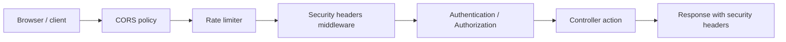

# CORS, Rate Limiting และ Security Headers

Production API ไม่ควรเปิดทุกอย่างกว้างเท่ากันหมด ค่า default ที่สะดวกตอนเรียนอาจอันตรายเมื่อ deploy จริง

ในบทนี้เราจะปรับ API ให้มี baseline สำคัญ:

- CORS ต้องกำหนด frontend origin ที่อนุญาต
- Production ต้องไม่ start ถ้าไม่ได้ตั้งค่า CORS
- auth endpoints ต้องมี rate limit
- response ต้องมี security headers พื้นฐาน
- มี integration test ตรวจ CORS, health checks และ security headers

ภาพรวม guardrail รอบ request:



## Middleware order

ลำดับ middleware ใน `Program.cs` มีผลต่อ behavior ของ request ทั้งระบบ:

```text
Request:
  UseExceptionHandler
  UseCorrelationId
  UseSecurityHeaders
  UseHttpsRedirection
  UseCors("frontend")
  UseRateLimiter
  UseAuthentication
  UseAuthorization
  MapControllers
  MapHealthChecks("/health/live")
  MapGet("/health/ready")
```

ตำแหน่งนี้ทำให้ error response, health checks และ controller response ได้ security headers กับ correlation id เหมือนกัน ส่วน CORS/rate limiter ทำงานก่อน authentication และ authorization

## CORS

CORS ไม่ใช่ระบบ auth แต่เป็น browser policy ที่บอกว่า frontend origin ไหนเรียก API ได้จาก browser

ตัวอย่าง config:

```json
{
  "Cors": {
    "AllowedOrigins": [
      "https://app.example.com"
    ]
  }
}
```

ถ้าเป็น Production แล้วไม่ได้ตั้ง `Cors:AllowedOrigins` ระบบควรไม่ยอม start:

```csharp
if (builder.Environment.IsProduction() && allowedOrigins.Length == 0)
{
    throw new InvalidOperationException("Cors:AllowedOrigins must be configured in Production.");
}
```

ตอน development ถ้าไม่ได้ตั้ง origin จะเปิดกว้างเพื่อให้มือใหม่ทดลองง่ายขึ้น แต่ production ต้องชัดเจนเสมอ

## Rate Limiting

endpoint auth เช่น register, login, refresh, forgot password และ reset password เป็นจุดที่ attacker ยิงซ้ำได้ง่าย จึงใส่ rate limit ที่ `AuthController`

```csharp
builder.Services.AddRateLimiter(options =>
{
    options.RejectionStatusCode = StatusCodes.Status429TooManyRequests;
    options.AddPolicy("auth", httpContext =>
    {
        var partitionKey = httpContext.Connection.RemoteIpAddress?.ToString() ?? "unknown";

        return RateLimitPartition.GetFixedWindowLimiter(
            partitionKey,
            _ => new FixedWindowRateLimiterOptions
            {
                PermitLimit = builder.Configuration.GetValue("RateLimiting:AuthPermitLimit", 10),
                Window = TimeSpan.FromMinutes(builder.Configuration.GetValue("RateLimiting:AuthWindowMinutes", 1)),
                QueueLimit = 0
            });
    });
});
```

แล้วเปิด middleware:

```csharp
app.UseRateLimiter();
```

ใส่ policy ที่ controller:

```csharp
[EnableRateLimiting("auth")]
public class AuthController : ControllerBase
{
}
```

ในระบบจริง ถ้าอยู่หลัง reverse proxy หรือ load balancer ต้องตั้งค่า forwarded headers ให้ถูกต้อง ไม่เช่นนั้น IP ที่ใช้ partition อาจเป็น IP ของ proxy ทั้งหมด

## Security Headers

ถึง API จะไม่ได้ render HTML เป็นหลัก แต่ response headers ยังช่วยลดความเสี่ยงเมื่อ browser เข้ามาเกี่ยวข้อง

ระบบควรเพิ่ม headers เหล่านี้:

```text
X-Content-Type-Options: nosniff
X-Frame-Options: DENY
Referrer-Policy: no-referrer
Content-Security-Policy: default-src 'none'; frame-ancestors 'none'; base-uri 'none'
Cross-Origin-Opener-Policy: same-origin
X-Permitted-Cross-Domain-Policies: none
Cache-Control: no-store
Permissions-Policy: camera=(), microphone=(), geolocation=()
```

ใน `Program.cs` เราทำเป็น middleware:

```csharp
static class SecurityHeadersExtensions
{
    public static IApplicationBuilder UseSecurityHeaders(this IApplicationBuilder app)
    {
        return app.Use(async (context, next) =>
        {
            context.Response.Headers.TryAdd("X-Content-Type-Options", "nosniff");
            context.Response.Headers.TryAdd("X-Frame-Options", "DENY");
            context.Response.Headers.TryAdd("Referrer-Policy", "no-referrer");
            context.Response.Headers.TryAdd(
                "Content-Security-Policy",
                "default-src 'none'; frame-ancestors 'none'; base-uri 'none'");
            context.Response.Headers.TryAdd("Cross-Origin-Opener-Policy", "same-origin");
            context.Response.Headers.TryAdd("X-Permitted-Cross-Domain-Policies", "none");
            context.Response.Headers.TryAdd("Cache-Control", "no-store");
            context.Response.Headers.TryAdd(
                "Permissions-Policy",
                "camera=(), microphone=(), geolocation=()");

            await next();
        });
    }
}
```

แล้วเรียกก่อน authentication:

```csharp
app.UseSecurityHeaders();
app.UseHttpsRedirection();
app.UseCors("frontend");
app.UseRateLimiter();
app.UseAuthentication();
app.UseAuthorization();
```

## Integration Tests

สิ่งที่สำคัญคืออย่าแค่เขียน middleware แล้วเชื่อว่าทำงาน ต้องมี test ยืนยัน:

```csharp
[Fact]
public async Task Response_IncludesSecurityHeaders()
{
    var client = factory.CreateClient();

    var response = await client.GetAsync("/health/live");

    Assert.Equal("nosniff", GetHeader(response, "X-Content-Type-Options"));
    Assert.Equal("DENY", GetHeader(response, "X-Frame-Options"));
    Assert.Equal("no-referrer", GetHeader(response, "Referrer-Policy"));
    Assert.Contains("default-src 'none'", GetHeader(response, "Content-Security-Policy"));
    Assert.Contains("no-store", GetHeader(response, "Cache-Control"));
}
```

และ test CORS preflight:

```csharp
[Fact]
public async Task CorsPreflight_WhenOriginIsConfigured_ReturnsCorsHeaders()
{
    var client = factory.CreateClient();
    using var request = new HttpRequestMessage(HttpMethod.Options, "/api/v1/auth/login");
    request.Headers.Add("Origin", "http://localhost:3000");
    request.Headers.Add("Access-Control-Request-Method", "POST");

    var response = await client.SendAsync(request);

    Assert.Equal(HttpStatusCode.NoContent, response.StatusCode);
    Assert.Equal("http://localhost:3000", GetHeader(response, "Access-Control-Allow-Origin"));
}
```

หลังจบบทนี้ API ไม่ได้แค่มี auth logic แต่เริ่มมี guardrail รอบนอกที่ production API ควรมี

## Checkpoint

ก่อนอ่านบทต่อไป ให้ตรวจว่าทำได้ครบตามนี้

- production CORS ไม่เปิดกว้าง
- auth endpoints มี rate limiting
- response มี security headers สำคัญ
- cache policy ไม่เก็บ response ที่อ่อนไหว
- integration tests ตรวจ CORS และ headers
