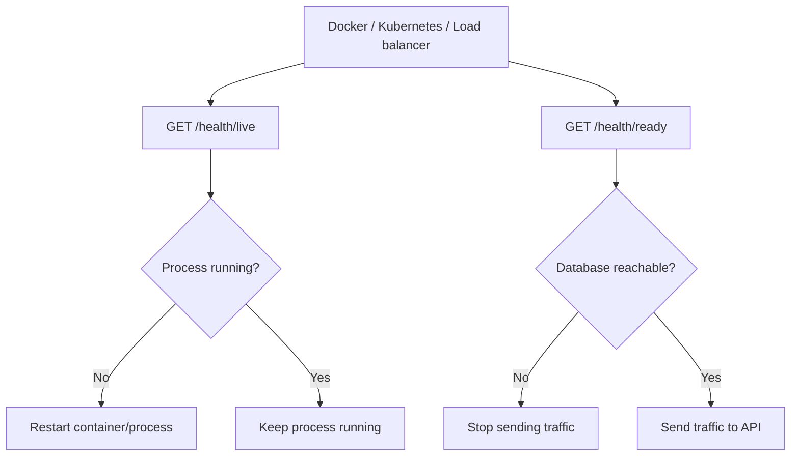

# Liveness และ Readiness Health Checks

Health check สำหรับ production ไม่ควรมีแค่ endpoint เดียว เพราะคำว่า healthy มีหลายระดับ

ภาพรวมการตัดสินใจของ health checks:



## Liveness

ใช้ตอบคำถามว่า process ยังทำงานอยู่ไหม

```http
GET /health/live
```

ถ้า liveness fail orchestrator เช่น Docker, Kubernetes หรือ platform deploy สามารถ restart process ได้

## Readiness

ใช้ตอบคำถามว่าระบบพร้อมรับ traffic จริงไหม เช่น connect database ได้หรือไม่

```http
GET /health/ready
```

readiness ควรลอง `dbContext.Database.CanConnectAsync()`

```csharp
app.MapGet("/health/ready", async (AppDbContext dbContext, CancellationToken ct) =>
{
    var canConnect = await dbContext.Database.CanConnectAsync(ct);
    return canConnect ? Results.Ok(new { status = "ready" }) : Results.StatusCode(503);
});
```

## ทำไมต้องแยกกัน

ถ้า database ล่มชั่วคราว process ยังไม่ควรถูก restart เสมอไป เพราะ restart API ไม่ได้ทำให้ database กลับมา แต่ควรหยุดรับ traffic ชั่วคราวผ่าน readiness

การแยก liveness/readiness ทำให้ระบบ deploy และ load balancer ตัดสินใจได้ถูกกว่า endpoint `/health` เดียวที่ตอบ `ok` ตลอดเวลา

## Checkpoint

ก่อนอ่านบทต่อไป ให้ตรวจว่าทำได้ครบตามนี้

- `/health/live` ตอบเมื่อ process ยังทำงาน
- `/health/ready` ตรวจ dependency สำคัญ เช่น database
- readiness fail ไม่จำเป็นต้อง restart process ทันที
- Docker/deploy platform ใช้ health endpoint ที่เหมาะกับหน้าที่
