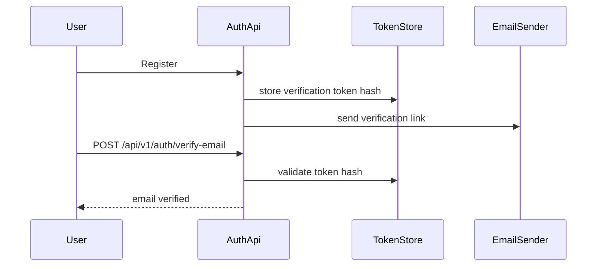
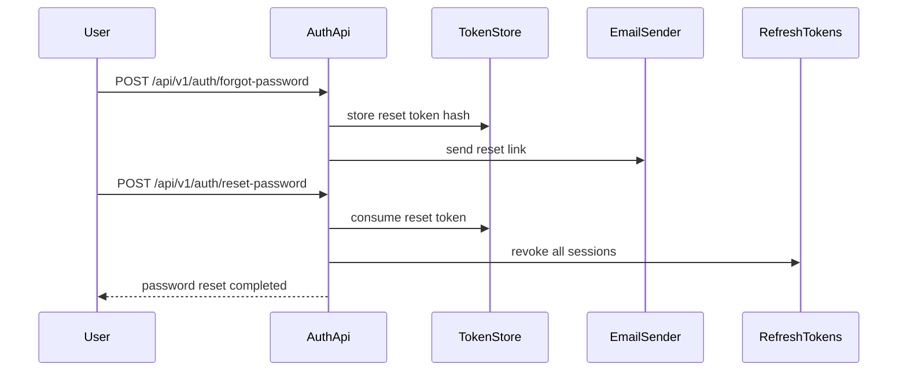

ระบบ production ไม่ควรเชื่อ account ใหม่ทันทีจนกว่าจะยืนยันอีเมลแล้ว และต้องมี forgot/reset password ที่ไม่ทำให้ token หรือข้อมูล user รั่ว

ในบทนี้เราจะทำ flow สำคัญเหล่านี้:

- email verification
- forgot password
- reset password
- token แบบสุ่มด้วย `RandomNumberGenerator`
- เก็บเฉพาะ token hash ใน database
- token มีวันหมดอายุและใช้ได้ครั้งเดียว
- revoke token active เดิมเมื่อขอ token ใหม่
- reset password แล้ว revoke refresh token ทั้งหมดของ user
- ส่ง email ผ่าน `IEmailSender` เพื่อเปลี่ยนจาก log sender ไป SMTP หรือ provider จริงได้
- มี integration test รองรับ flow สำคัญ

## Model ที่เพิ่ม

ใน `User` มี field สำหรับ email verification และความปลอดภัยของ password:

```csharp
public bool IsEmailVerified { get; set; }
public DateTimeOffset? EmailVerifiedAt { get; set; }
public DateTimeOffset? PasswordChangedAt { get; set; }
public ICollection<EmailVerificationToken> EmailVerificationTokens { get; set; } = [];
public ICollection<PasswordResetToken> PasswordResetTokens { get; set; } = [];
```

`EmailVerificationToken` และ `PasswordResetToken` ใช้แนวเดียวกัน:

```csharp
public class PasswordResetToken
{
    public Guid Id { get; set; }
    public Guid UserId { get; set; }
    public required string TokenHash { get; set; }
    public string? CreatedByIp { get; set; }
    public DateTimeOffset CreatedAt { get; set; }
    public DateTimeOffset ExpiresAt { get; set; }
    public DateTimeOffset? UsedAt { get; set; }
    public DateTimeOffset? RevokedAt { get; set; }
    public User User { get; set; } = null!;

    public bool IsActive(DateTimeOffset utcNow)
    {
        return UsedAt is null && RevokedAt is null && ExpiresAt > utcNow;
    }
}
```

เหตุผลที่ต้องแยก `EmailVerificationToken` กับ `PasswordResetToken` คือ lifecycle ต่างกัน email verification อาจหมดอายุยาวกว่า ส่วน reset password ควรสั้นกว่าและกระทบ session เดิมของ user

## EF Core Mapping

ใน `AppDbContext` เพิ่ม `DbSet`:

```csharp
public DbSet<EmailVerificationToken> EmailVerificationTokens => Set<EmailVerificationToken>();
public DbSet<PasswordResetToken> PasswordResetTokens => Set<PasswordResetToken>();
```

ทั้งสองตารางต้องมี:

- unique index ที่ `TokenHash`
- index ที่ `{ UserId, ExpiresAt }`
- relationship ไปที่ `Users`
- cascade delete เมื่อ user ถูกลบ

สร้าง migration:

```powershell
dotnet tool run dotnet-ef migrations add EmailVerification --project Backend.Api --startup-project Backend.Api
dotnet tool run dotnet-ef migrations add PasswordReset --project Backend.Api --startup-project Backend.Api
dotnet tool run dotnet-ef database update --project Backend.Api --startup-project Backend.Api
```

## Config

เพิ่ม config สำหรับ verification และ reset:

```json
{
  "EmailVerification": {
    "ExpirationHours": 24,
    "VerificationUrlTemplate": "http://localhost:3000/verify-email?token={token}"
  },
  "PasswordReset": {
    "ExpirationHours": 1,
    "ResetUrlTemplate": "http://localhost:3000/reset-password?token={token}"
  }
}
```

ใน production ให้ตั้งค่าผ่าน environment variables หรือ secret manager และให้ URL ชี้ไป frontend จริง

## Email Sender

เราไม่เรียก SMTP ตรงจาก business logic แต่ใช้ interface:

```csharp
public interface IEmailSender
{
    Task SendAsync(EmailMessage message, CancellationToken cancellationToken = default);
}
```

โปรเจกต์มี sender สองแบบ:

- `LoggingEmailSender` สำหรับ development และ test
- `SmtpEmailSender` สำหรับ SMTP จริงเมื่อเปิด `Email:UseSmtp`

ระบบจริงสามารถเปลี่ยน implementation ไปใช้ Amazon SES, SendGrid, Mailgun หรือ provider อื่นได้โดยไม่ต้องเปลี่ยน auth flow

## Email Verification Flow

flow ยืนยันอีเมล:



1. user register
2. server สร้าง raw token แบบสุ่ม
3. server hash token ด้วย SHA-256
4. server revoke verification token active เดิมของ user
5. server เก็บ token hash พร้อม `ExpiresAt`
6. server ส่ง link ไปทาง email
7. frontend อ่าน token จาก URL แล้วเรียก backend
8. backend hash token ที่รับมาแล้วเทียบกับ database
9. ถ้า token active ให้ตั้ง `IsEmailVerified = true` และ `EmailVerifiedAt`
10. mark token ว่าใช้แล้ว และ revoke token อื่นของ user

```text
VerifyEmail(rawToken):
  tokenHash = Hash(rawToken)
  storedToken = find active verification token by tokenHash

  if token is missing, used, revoked, or expired:
    return 401

  user.IsEmailVerified = true
  user.EmailVerifiedAt = utcNow
  storedToken.UsedAt = utcNow
  revoke other active verification tokens for the same user
  write EMAIL_VERIFIED audit log
  return current user response
```

endpoint:

```text
POST /api/v1/auth/verify-email
POST /api/v1/auth/resend-email-verification
```

ตัวอย่าง request:

```http
POST {{baseUrl}}/api/v1/auth/verify-email
Content-Type: application/json

{
  "token": "{{verificationToken}}"
}
```

`resend-email-verification` ต้องตอบกลาง ๆ เสมอ ถ้า email ไม่มีอยู่จริงหรือ verify แล้ว ก็ไม่ควรบอก client เพื่อป้องกัน user enumeration

## Reset Password Flow

flow ลืมรหัสผ่าน:



1. user ส่ง email มาที่ `forgot-password`
2. server ตอบ `204 No Content` เสมอ
3. ถ้ามี user active จริง server สร้าง reset token
4. server เก็บเฉพาะ token hash
5. server ส่งลิงก์ reset password
6. user ส่ง token และ password ใหม่มาที่ `reset-password`
7. server ตรวจ token ว่ายัง active
8. server hash password ใหม่
9. server ตั้ง `PasswordChangedAt`
10. server reset `AccessFailedCount` และ `LockoutEnd`
11. server revoke refresh token ทั้งหมดของ user
12. mark reset token ว่าใช้แล้ว และ revoke reset token อื่นของ user

```text
ResetPassword(rawToken, newPassword):
  tokenHash = Hash(rawToken)
  storedToken = find active reset token by tokenHash

  if token is missing, used, revoked, or expired:
    return 401

  user.PasswordHash = HashPassword(newPassword)
  user.PasswordChangedAt = utcNow
  user.AccessFailedCount = 0
  user.LockoutEnd = null
  storedToken.UsedAt = utcNow
  revoke other active reset tokens for the same user
  revoke every active refresh token for the same user
  write PASSWORD_RESET_COMPLETED audit log
  return 204
```

endpoint:

```text
POST /api/v1/auth/forgot-password
POST /api/v1/auth/reset-password
```

ตัวอย่าง forgot password:

```http
POST {{baseUrl}}/api/v1/auth/forgot-password
Content-Type: application/json

{
  "email": "user@example.com"
}
```

ตัวอย่าง reset password:

```http
POST {{baseUrl}}/api/v1/auth/reset-password
Content-Type: application/json

{
  "token": "{{resetToken}}",
  "newPassword": "NewPassw0rd!"
}
```

หลัง reset สำเร็จ refresh token เดิมต้องใช้ไม่ได้ เพื่อบังคับให้ session เก่าที่อาจหลุดไป login ใหม่

## Test ที่ต้องมี

integration test ควรครอบคลุม:

- register แล้วส่ง verification email
- register แล้ว database เก็บเฉพาะ token hash ไม่เก็บ raw token
- verify email ด้วย token ถูกต้อง
- verify email ด้วย token ผิดแล้วได้ `401`
- verify email ด้วย token หมดอายุแล้วได้ `401`
- verify email ด้วย token ที่ใช้แล้วซ้ำแล้วได้ `401`
- resend verification email
- resend verification email แล้ว revoke token เดิม
- resend verification email ของ email ที่ไม่มีอยู่หรือ verified แล้วต้องตอบกลาง ๆ และไม่ส่ง email เพิ่ม
- verify email สำเร็จต้อง mark token เป็น used และเขียน audit log `EMAIL_VERIFIED`
- forgot password แล้วส่ง reset email
- forgot password ของ email ที่ไม่มีอยู่หรือ user inactive ต้องตอบกลาง ๆ และไม่ส่ง email เพิ่ม
- forgot password ต้องเก็บเฉพาะ reset token hash ไม่เก็บ raw token
- forgot password ซ้ำต้อง revoke reset token เดิม
- reset password ด้วย token ผิดแล้วได้ `401`
- reset password ด้วย token หมดอายุแล้วได้ `401`
- reset password สำเร็จแล้ว login ด้วย password เก่าไม่ได้
- login ด้วย password ใหม่ได้
- refresh token เก่าถูก revoke
- reset token ใช้ซ้ำไม่ได้
- reset password สำเร็จต้อง mark reset token เป็น used, reset lockout state และเขียน audit log `PASSWORD_RESET_COMPLETED`

ใน test ใช้ `TestEmailSender` เพื่อดึง token จาก email body โดยไม่ต้องต่อ SMTP จริง

## Checklist สำคัญ

- database ไม่เก็บ raw token
- token ต้องมี expiry
- token ต้องใช้ได้ครั้งเดียว
- resend verification ต้อง revoke token เดิม
- verify email สำเร็จต้องเขียน audit log และไม่เก็บ raw token ใน audit detail
- forgot password ต้องไม่บอกว่า email มีในระบบหรือไม่
- forgot password ของ user inactive ต้องไม่ส่ง reset email
- reset token ต้องเก็บเป็น hash เท่านั้นและ token ใหม่ต้อง revoke token active เดิม
- reset password ต้อง revoke refresh token ทั้งหมด
- reset password สำเร็จต้อง reset `AccessFailedCount` และ `LockoutEnd`
- reset password ต้องเขียน audit log โดยไม่เก็บ raw token ใน audit detail
- email sender ต้องเป็น abstraction
- production ต้องเก็บ SMTP credential ใน secret manager

หลังจบบทนี้ auth flow สำคัญของระบบ production มีครบขึ้นมาก: register, login, JWT, refresh token rotation, email verification และ reset password

## Checkpoint

ก่อนอ่านบทต่อไป ให้ตรวจว่าทำได้ครบตามนี้

- verification/reset token เก็บเฉพาะ hash
- token มี expiry และใช้ได้ครั้งเดียว
- resend/request ใหม่ revoke token active เดิม
- forgot password ไม่ leak ว่า email มีอยู่หรือไม่
- reset password revoke refresh token ทั้งหมดและเขียน audit log
