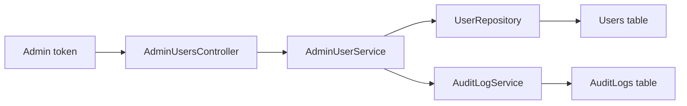

ภาคนี้ต่อยอดจาก JWT ไปสู่ authorization โดยใช้ role ที่อยู่ใน token เพื่อจำกัดสิทธิ์ endpoint สำหรับผู้ดูแลระบบ

หลังจบภาคนี้ API จะมี admin endpoint สำหรับดูรายชื่อผู้ใช้ เปลี่ยน role เปิดปิดบัญชี ป้องกัน admin ทำ action อันตรายกับบัญชีตัวเอง บันทึก audit log และรองรับ pagination/filtering/sorting

## วิธีเรียนภาคนี้

ภาคนี้เป็นภาคที่เริ่มมี business rule จริง ให้ทำทีละชั้น:

1. รวมชื่อ role ไว้ที่เดียว
2. สร้าง admin seed สำหรับทดสอบ
3. สร้าง endpoint ที่ต้องใช้ role `Admin`
4. เพิ่ม service สำหรับงาน admin แทนให้ Controller query database เอง
5. เพิ่ม self-protection ก่อนอนุญาตให้เปลี่ยน role/status
6. บันทึก audit log หลัง action สำคัญสำเร็จ
7. ปรับ list endpoint ให้รองรับ pagination/filtering/sorting

หลังแต่ละบทให้รัน `dotnet build` และทดสอบด้วย admin token จริง ไม่ใช้ user token แทน

## ค่าที่ใช้ทดสอบตลอดภาคนี้

ในภาคนี้จะมี request หลายตัวที่ต้องใช้ token และ user id ให้เพิ่มตัวแปรเหล่านี้ไว้บนสุดของ `Backend.Api.http` แล้วค่อยเปลี่ยนค่าตามผลลัพธ์จริงของเครื่องคุณ:

```http
@baseUrl = http://localhost:<http-port>
@authPath = {{baseUrl}}/api/v1/auth
@adminUsersPath = {{baseUrl}}/api/v1/admin/users
@userToken = paste-user-token-here
@adminToken = paste-admin-token-here
@adminUserId = paste-admin-user-id-here
@targetUserId = paste-target-user-id-here
```

ลำดับการหาค่าคือ login เป็น admin เพื่อเอา `adminToken` ก่อน จากนั้นเรียก `GET {{adminUsersPath}}` แล้ว copy `id` ของ `admin@example.com` ไปใส่ `adminUserId` และ copy `id` ของ user คนอื่น เช่น `demo-user@example.com` ไปใส่ `targetUserId`

ในบทเรียน ณ จุดนี้ `id` ยังเป็น `int` ส่วนการย้ายเป็น `Guid` จะอยู่ในภาค production hardening ภายหลัง

## บทในภาคนี้

- บทที่ 34: ออกแบบ Role และ Permission
- บทที่ 35: สร้าง Admin Endpoint
- บทที่ 36: ดูรายการผู้ใช้สำหรับ Admin
- บทที่ 37: เปลี่ยน Role หรือสถานะผู้ใช้
- บทที่ 38: ป้องกันไม่ให้ Admin ลบตัวเองผิดพลาด
- บทที่ 39: ทำ Audit Log
- บทที่ 40: Pagination, Filtering และ Sorting

## สิ่งที่ต้องได้หลังจบภาคนี้

- มี role constants แทนการใช้ string กระจัดกระจาย
- มีบัญชี admin เริ่มต้นสำหรับทดสอบ
- endpoint admin ถูกป้องกันด้วย `[Authorize(Roles = Roles.Admin)]`
- Admin ดูรายชื่อผู้ใช้ได้
- Admin เปลี่ยน role และสถานะผู้ใช้ได้
- ระบบป้องกัน Admin deactivate หรือ demote ตัวเองผิดพลาด
- action สำคัญถูกบันทึก audit log
- รายการผู้ใช้รองรับ pagination, filtering และ sorting

## ภาพรวม flow หลังจบภาคนี้



## ภาพรวมสิทธิ์

ในหนังสือเล่มนี้เราจะเริ่มด้วย role สองแบบ

```text
User
Admin
```

`User` คือผู้ใช้ทั่วไป ส่วน `Admin` คือผู้ดูแลระบบที่จัดการผู้ใช้คนอื่นได้
