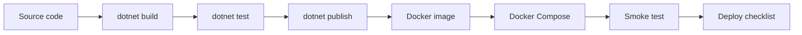

ภาคนี้ทำให้โปรเจกต์พร้อมส่งงานหรือ deploy มากขึ้น โดยเพิ่ม logging, configuration, OpenAPI, automated tests, Docker และ checklist ก่อน deploy

คำว่า production ready ในหนังสือนี้ไม่ได้แปลว่าระบบพร้อมรับ traffic ระดับใหญ่ทันที แต่หมายถึงโปรเจกต์มีพื้นฐานที่ดีพอสำหรับส่งงานจริง พัฒนาในทีมได้ และต่อยอดสู่ production ได้อย่างมีทิศทาง

## วิธีเรียนภาคนี้

ภาคนี้ไม่ได้เพิ่ม feature ให้ผู้ใช้โดยตรง แต่เพิ่มเครื่องมือรอบระบบให้ project น่าเชื่อถือขึ้น ให้เรียนตามลำดับนี้:

1. ทำให้ระบบมี log ที่อ่านและค้นต่อได้
2. แยก configuration และ secret ออกจาก source code
3. แยกค่าแต่ละ environment ให้ชัด
4. เปิด OpenAPI เป็น contract ของ API
5. เพิ่ม unit test สำหรับ logic เล็ก
6. เพิ่ม integration test สำหรับ HTTP pipeline
7. สร้าง Docker image
8. รัน API กับ SQL Server ด้วย Docker Compose
9. ตรวจ build, test, publish และ smoke test
10. ใช้ checklist ก่อน deploy

หลังจบแต่ละบทให้รันคำสั่งตรวจที่บทนั้นกำหนด เช่น `dotnet test`, `dotnet publish` หรือ `docker compose config`

## บทในภาคนี้

- บทที่ 41: Logging
- บทที่ 42: Configuration และ Environment Variables
- บทที่ 43: appsettings หลาย environment
- บทที่ 44: OpenAPI และเอกสาร API
- บทที่ 45: Unit Test
- บทที่ 46: Integration Test
- บทที่ 47: Dockerfile
- บทที่ 48: Docker Compose
- บทที่ 49: Build และ Publish
- บทที่ 50: Checklist ก่อน deploy

## สิ่งที่ต้องได้หลังจบภาคนี้

- ระบบมี log ที่ช่วย debug ได้โดยไม่รั่ว secret
- configuration แยก local, development และ production ได้
- secret ถูกส่งผ่าน environment variable หรือ secret store
- OpenAPI document ใช้เป็น contract ของ API ได้
- มี unit test และ integration test เบื้องต้น
- API และ SQL Server รันด้วย Docker Compose ได้
- publish output และ Docker image ถูกตรวจได้ก่อน deploy
- มี checklist ปิดงานก่อนส่งขึ้น production

## ภาพรวมหลังจบภาคนี้

## ข้อควรจำ

Production ready ไม่ใช่เรื่องเดียว แต่เป็นชุดนิสัย:

- config สำคัญต้องมาจาก environment หรือ secret store
- log ต้องช่วย debug ได้แต่ไม่รั่ว secret
- test ต้องจับ regression พื้นฐานได้
- container ต้องรันซ้ำได้ด้วยคำสั่งชัดเจน
- ก่อน deploy ต้องมี checklist ที่ตรวจซ้ำได้
