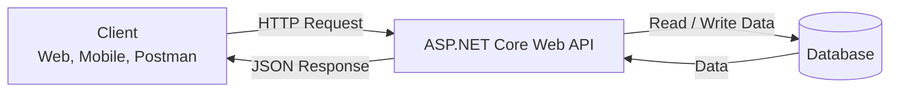
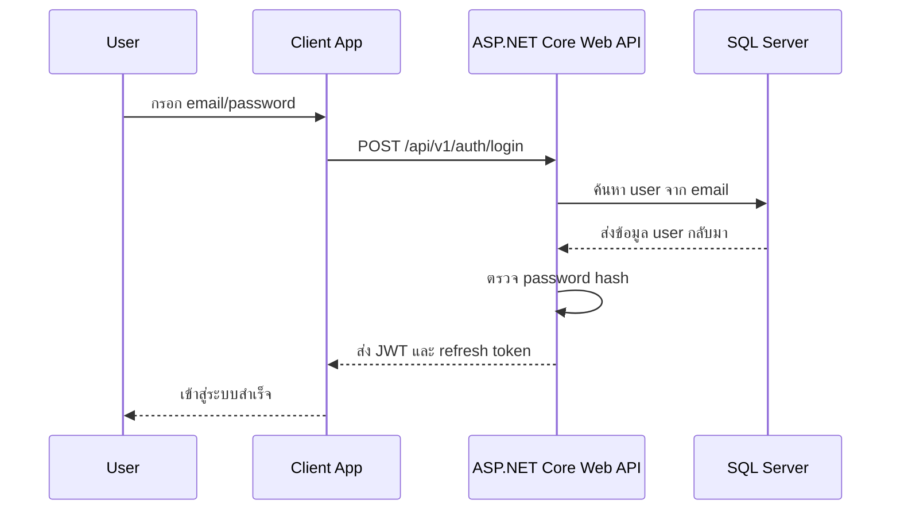

ASP.NET Core Web API คือ framework สำหรับสร้าง HTTP API ด้วยภาษา C# และ .NET เหมาะกับงาน backend ที่ต้องรับ request จาก frontend, mobile app หรือระบบอื่น แล้วตอบกลับเป็นข้อมูล เช่น JSON

ในหนังสือเล่มนี้เราจะสร้าง API สำหรับระบบ Secure Admin ทีละขั้น จาก project ว่างไปจนถึงระบบที่มี register, login, JWT, role admin, database, validation, test และ Docker

## วิธีเรียนบทนี้

บทนี้ยังไม่ต้องเขียน code ให้โฟกัสที่ภาพรวมก่อน ถ้าเจอคำที่ยังไม่เข้าใจ เช่น JWT, database หรือ Docker ให้จำไว้แค่ว่าเป็นส่วนที่จะเรียนในบทหลัง

อ่านบทนี้ให้ได้คำตอบสามข้อ:

1. API รับ request จากใคร
2. API ส่ง response กลับไปแบบไหน
3. ทำไม backend ต้องมีชั้น API อยู่ตรงกลาง

## เป้าหมายของบทนี้

หลังจบบทนี้ คุณควรเข้าใจภาพรวมก่อนลงมือเขียน code จริง:

- Web API อยู่ตรงไหนของระบบ backend
- Client, API และ database คุยกันอย่างไร
- ASP.NET Core ช่วยลดงานพื้นฐานอะไรให้เรา
- Controller API ต่างจาก Minimal API อย่างไร
- โปรเจกต์ที่เราจะสร้างตลอดเล่มจะมีความสามารถอะไรบ้าง

## API อยู่ตรงไหนของระบบ

ให้มองระบบทั่วไปเป็น 3 ส่วนหลัก



`Client` อาจเป็นเว็บ React, Angular, Vue, mobile app, Postman หรือระบบ backend อื่น

`Web API` คือชั้นกลางที่รับ request ตรวจข้อมูล ตรวจสิทธิ์ ประมวลผล business rule แล้วอ่าน/เขียนข้อมูลกับ database

`Database` คือที่เก็บข้อมูลจริง เช่น user, role, audit log และข้อมูลธุรกิจอื่น

## Web API ทำหน้าที่อะไร

Web API คือทางเข้าของระบบ backend โดยทั่วไปทำงานตามลำดับนี้

```text
HTTP Request
  -> Routing
  -> Controller
  -> Service
  -> Repository หรือ DbContext
  -> Database
  -> HTTP Response
```

ตัวอย่างเช่น frontend เรียก `GET /api/v1/users` เพื่อขอรายการผู้ใช้ ระบบ backend จะค้นข้อมูลผู้ใช้จากฐานข้อมูล แล้วส่ง JSON กลับไป

ถ้า frontend เรียก `POST /api/v1/auth/login` ระบบ backend จะรับ email/password, ตรวจ password hash, สร้าง JWT แล้วส่ง token กลับไป

## ตัวอย่าง Request และ Response

สมมุติ frontend ต้องการอ่านข้อมูล user ปัจจุบัน หลังจาก login แล้ว frontend จะส่ง token มากับ request:

```http
GET /api/v1/auth/me HTTP/1.1
Host: localhost:<port>
Authorization: Bearer <jwt-token>
```

API จะตรวจ token แล้วตอบกลับเป็น JSON:

```json
{
  "id": 1,
  "email": "admin@example.com",
  "role": "Admin"
}
```

ถ้า user login ไม่ถูกต้อง API อาจตอบกลับเป็น error:

```http
HTTP/1.1 401 Unauthorized
Content-Type: application/json
```

```json
{
  "message": "Invalid email or password"
}
```

จุดสำคัญคือ Web API ไม่ได้ส่งหน้าเว็บกลับไปเหมือนเว็บแบบดั้งเดิม แต่ส่งข้อมูลให้ client นำไปแสดงผลเอง

ในเล่มนี้ endpoint ที่เกี่ยวกับตัวตนของผู้ใช้จะอยู่ใต้ `/api/v1/auth` เช่น `GET /api/v1/auth/me` ส่วน endpoint `/api/v1/users` จะใช้สอน CRUD และต่อยอดไปเป็นงาน admin ในภายหลัง

## ตัวอย่าง Flow การ Login

ภาพรวมการ login ในระบบที่เราจะสร้างมีลำดับประมาณนี้:



ตอนนี้ยังไม่ต้องเข้าใจ JWT, refresh token หรือ password hash แบบละเอียด บทต่อ ๆ ไปจะค่อย ๆ สร้างทีละส่วน

## ASP.NET Core ทำอะไรให้เรา

ถ้าเขียน HTTP server เองทั้งหมด เราต้องจัดการหลายเรื่อง เช่นเปิด port, parse request, match URL, แปลง JSON, จัดการ error และส่ง response กลับเอง

ASP.NET Core เตรียมสิ่งเหล่านี้ไว้ให้:

- Routing สำหรับจับคู่ URL กับ endpoint
- Controller สำหรับจัดกลุ่ม endpoint
- Model binding สำหรับแปลง JSON เป็น C# object
- Validation สำหรับตรวจ request
- Dependency Injection สำหรับจัดการ service
- Middleware pipeline สำหรับ authentication, authorization, logging และ error handling
- Configuration สำหรับอ่านค่าจาก `appsettings.json` และ environment variables
- Integration กับ EF Core, OpenAPI, testing และ Docker

สิ่งที่เราต้องทำคือเขียน business logic และจัดโครงสร้าง code ให้ดี

## คำศัพท์สำคัญในบทนี้

- `HTTP Request` คือคำขอที่ client ส่งมาหา API เช่น `GET /api/v1/users`
- `HTTP Response` คือคำตอบที่ API ส่งกลับไป เช่น status code และ JSON
- `Endpoint` คือ URL และ HTTP method ที่ API เปิดให้เรียกใช้งาน เช่น `POST /api/v1/auth/login`
- `JSON` คือรูปแบบข้อมูลที่ client และ API ใช้แลกเปลี่ยนกันบ่อยที่สุด
- `JWT` คือ token ที่ใช้ยืนยันตัวตนของ user หลัง login
- `Database` คือที่เก็บข้อมูลถาวรของระบบ เช่น user, role และ audit log

## .NET กับ ASP.NET Core ต่างกันอย่างไร

`.NET` คือ platform หลักสำหรับรันภาษา C# และ library ต่าง ๆ

`ASP.NET Core` คือ framework ที่อยู่บน .NET อีกที ใช้สำหรับสร้าง web application และ Web API

จำแบบง่ายได้ว่า .NET คือฐาน ส่วน ASP.NET Core คือเครื่องมือสำหรับทำเว็บและ API

```text
C#
  -> .NET
  -> ASP.NET Core
  -> Web API
```

## Controller API กับ Minimal API

ASP.NET Core ทำ API ได้หลายรูปแบบ สองรูปแบบที่เจอบ่อยคือ Controller API และ Minimal API

Controller API เหมาะกับโปรเจกต์ที่เริ่มมีหลาย endpoint ต้องแยกไฟล์เป็นระบบ ต้องใช้ attribute เช่น `[HttpGet]`, `[Authorize]` และต้องการโครงสร้างที่ชัดเจน

Minimal API เหมาะกับ API ขนาดเล็ก หรือ service ที่ต้องการเขียน endpoint แบบกระชับใน `Program.cs`

หนังสือนี้เลือก Controller API เพราะมือใหม่จะเห็นการแยกหน้าที่ชัดเจนกว่า:

- Controller รับ HTTP request
- DTO กำหนดข้อมูลเข้า/ออก
- Service จัดการ business logic
- Repository จัดการข้อมูล
- Middleware จัดการงานข้าม endpoint เช่น error, auth และ logging

## เราจะสร้างโปรเจกต์อะไร

โปรเจกต์หลักของหนังสือนี้คือ **Backend API**

ความสามารถสุดท้ายของระบบ:

- สมัครสมาชิกและเข้าสู่ระบบ
- hash password ก่อนบันทึกลงฐานข้อมูล
- ออก JWT token หลัง login
- อ่านข้อมูล user ปัจจุบันจาก token
- จำกัด endpoint บางส่วนให้เฉพาะ admin
- จัดการ user ผ่าน admin API
- ตรวจ validation และตอบ error format ที่อ่านง่าย
- บันทึก audit log
- เชื่อม SQL Server ด้วย EF Core
- มี unit test, integration test และ Docker Compose

## สิ่งที่ยังไม่ต้องกังวลตอนนี้

ถ้าคุณเป็นมือใหม่ อาจเห็นคำหลายคำพร้อมกัน เช่น middleware, dependency injection, JWT, EF Core และ migration แล้วรู้สึกเยอะเกินไป

ไม่ต้องจำทุกอย่างในบทแรก หน้าที่ของบทนี้คือให้เข้าใจว่า Web API เป็น backend ที่รับ request และส่ง response ส่วนรายละเอียดแต่ละเรื่องจะค่อย ๆ ต่อกันในบทถัดไป

## แบบฝึกหัด

ลองตอบคำถามเหล่านี้ด้วยภาษาของตัวเองก่อนอ่านบทถัดไป:

1. ถ้าแอปธนาคารมี Web API คุณคิดว่าควรมี endpoint อะไรบ้าง 3 ตัวอย่าง
2. ถ้า frontend ต้องการข้อมูล user ปัจจุบัน ควรเรียก API แบบใด
3. Controller, Service และ Database อยู่ใน flow เดียวกันอย่างไร
4. ทำไม API จึงนิยมตอบกลับเป็น JSON แทนการส่ง HTML ทั้งหน้า

## แนวคำตอบโดยย่อ

ตัวอย่างคำตอบที่ควรใกล้เคียง:

- แอปธนาคารอาจมี `GET /api/v1/accounts`, `GET /api/v1/transactions` และ `POST /api/v1/transfers`
- frontend อาจเรียก `GET /api/v1/auth/me` พร้อมส่ง `Authorization: Bearer <token>`
- Controller รับ request, Service จัดการ business logic, Database เก็บและอ่านข้อมูลจริง
- JSON เหมาะกับ Web API เพราะ client หลายแบบ เช่น web, mobile และ backend อื่น สามารถนำข้อมูลไปแสดงผลเองได้

## Checkpoint

ก่อนอ่านบทต่อไป คุณควรตอบคำถามเหล่านี้ได้

- Web API รับ request และส่ง response เพื่ออะไร
- Client, API และ database อยู่ในระบบเดียวกันอย่างไร
- .NET กับ ASP.NET Core ต่างกันอย่างไร
- ทำไมหนังสือนี้เลือกใช้ Controller API
- โปรเจกต์สุดท้ายของหนังสือจะมี feature อะไรบ้าง
