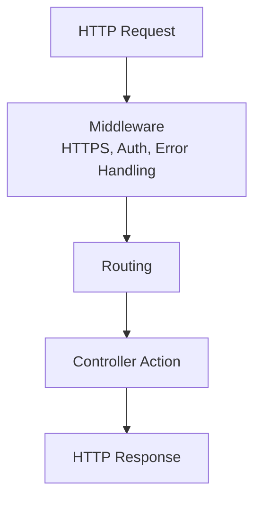

หลังสร้างโปรเจกต์แล้ว เราต้องเข้าใจว่าไฟล์แต่ละตัวทำหน้าที่อะไร เพราะเวลาเพิ่ม feature หรือแก้ bug จะต้องรู้ว่าควรเริ่มดูจากจุดไหน

บทนี้ยังไม่แก้ code เยอะ แต่จะอ่านโครงสร้างให้เข้าใจก่อน

## วิธีเรียนบทนี้

บทนี้เป็นบทอ่านไฟล์ ไม่ใช่บทให้จำทุกบรรทัดของ `Program.cs`

ให้เปิดโปรเจกต์จริงของคุณเทียบกับรูปโครงสร้างในบทนี้ แล้วจดว่าไฟล์ไหนใช้ทำอะไร ถ้าไฟล์บางไฟล์มี port หรือ package version ไม่ตรงกับตัวอย่าง ถือว่าเป็นเรื่องปกติ

## โครงสร้างเริ่มต้น

โปรเจกต์ที่สร้างด้วย `--use-controllers` จะมีไฟล์หลักประมาณนี้

```text
Backend.Api/
  Controllers/
    WeatherForecastController.cs
  Properties/
    launchSettings.json
  Program.cs
  Backend.Api.csproj
  Backend.Api.http
  appsettings.json
  appsettings.Development.json
```

ไฟล์จริงอาจต่างกันเล็กน้อยตาม template และ SDK ที่ใช้ แต่แนวคิดหลักเหมือนกัน

## Program.cs

`Program.cs` คือจุดเริ่มต้นของ application ใช้ตั้งค่า service, middleware และ endpoint

ก่อนอ่าน code ให้รู้จัก method สำคัญที่มักเห็นในไฟล์นี้ก่อน:

| สิ่งที่จะเห็น | ความหมาย |
| --- | --- |
| `WebApplication.CreateBuilder(args)` | สร้าง builder สำหรับเตรียม configuration, service และ environment |
| `builder.Services.AddControllers()` | ลงทะเบียนระบบ Controller ให้ ASP.NET Core รู้จัก |
| `builder.Services.AddOpenApi()` | ลงทะเบียน OpenAPI document สำหรับอธิบาย endpoint |
| `builder.Build()` | สร้าง application จากค่าที่ตั้งไว้ใน builder |
| `app.Environment.IsDevelopment()` | ตรวจว่ากำลังรันใน environment แบบ Development หรือไม่ |
| `app.MapOpenApi()` | เปิด endpoint สำหรับ OpenAPI document ในเครื่อง development |
| `app.UseHttpsRedirection()` | redirect request จาก HTTP ไป HTTPS เมื่อกำหนดค่าได้ |
| `app.UseAuthorization()` | เพิ่ม authorization middleware เข้า pipeline |
| `app.MapControllers()` | map request ไปยัง Controller action |
| `app.Run()` | เริ่มรัน web application |

ให้มอง `Program.cs` เป็นสองส่วนหลัก อย่าอ่านทั้งไฟล์เป็นก้อนเดียว

ส่วนแรกคือการสร้าง builder และลงทะเบียน service:

```csharp
var builder = WebApplication.CreateBuilder(args);

// Register services before the app is built.
builder.Services.AddControllers();

// OpenAPI lets tools describe and test the API endpoints.
builder.Services.AddOpenApi();

var app = builder.Build();
```

ส่วนที่สองคือการตั้งค่า request pipeline และเริ่ม application:

```csharp
// Only expose OpenAPI while developing locally.
if (app.Environment.IsDevelopment())
{
    app.MapOpenApi();
}

// Redirect HTTP requests to HTTPS when HTTPS is configured.
app.UseHttpsRedirection();

// Add authorization middleware. We will configure real auth in later chapters.
app.UseAuthorization();

// Connect attribute-routed controllers to the request pipeline.
app.MapControllers();

// Start the web application.
app.Run();
```

สิ่งที่ควรจำ:

- `builder.Services...` คือการลงทะเบียน service ที่ระบบต้องใช้
- `app.Use...` คือการเพิ่ม middleware เข้า pipeline
- `app.Map...` คือการประกาศ endpoint
- `app.Run()` คือเริ่มรัน application

ในบทหลัง ๆ เราจะกลับมาเพิ่ม database, JWT, error handler และ service ของเราในไฟล์นี้

## ภาพรวม Request Pipeline

เมื่อ API รับ request เข้ามา ASP.NET Core จะพา request ผ่าน pipeline ที่เราตั้งค่าไว้ใน `Program.cs`



ตอนนี้ pipeline ยังสั้นมาก แต่ในบทต่อ ๆ ไปเราจะเพิ่ม middleware สำหรับ error handling, authentication, authorization, logging และ OpenAPI

## Controllers

โฟลเดอร์ `Controllers` เก็บ class ที่รับ HTTP request

ตัวอย่างเช่น `UsersController` จะรับ request ที่เกี่ยวกับ user เช่น

```text
GET /api/users
POST /api/users
GET /api/users/{id}
```

Controller ไม่ควรเป็นที่รวมทุกอย่าง เมื่อระบบใหญ่ขึ้น Controller ควรเรียก service แทนการเขียน logic ยาว ๆ เอง

## .csproj

ไฟล์ `Backend.Api.csproj` คือไฟล์ project ของ .NET ใช้กำหนด target framework และ package reference

ตัวอย่าง:

```xml
<Project Sdk="Microsoft.NET.Sdk.Web">
  <PropertyGroup>
    <TargetFramework>net10.0</TargetFramework>
    <Nullable>enable</Nullable>
    <ImplicitUsings>enable</ImplicitUsings>
  </PropertyGroup>

  <ItemGroup>
    <PackageReference Include="Microsoft.AspNetCore.OpenApi" Version="10.0.8" />
  </ItemGroup>
</Project>
```

เมื่อเราติดตั้ง package เช่น EF Core หรือ JWT package ข้อมูลจะถูกเพิ่มเข้ามาในไฟล์นี้

```powershell
dotnet add package Microsoft.EntityFrameworkCore.SqlServer
```

หลังรันคำสั่งนี้ `.csproj` จะมี `PackageReference` เพิ่มขึ้น

## appsettings.json

`appsettings.json` ใช้เก็บ configuration ของระบบ เช่น connection string, JWT settings, logging level และค่าอื่นที่ไม่ควร hard-code ไว้ใน C#

ตัวอย่าง:

```json
{
  "Logging": {
    "LogLevel": {
      "Default": "Information",
      "Microsoft.AspNetCore": "Warning"
    }
  },
  "AllowedHosts": "*"
}
```

บทหลัง ๆ เราจะเพิ่ม section เช่น `ConnectionStrings` และ `Jwt`

## appsettings.Development.json

ไฟล์นี้ใช้ override configuration เฉพาะตอนรันใน environment แบบ Development

ตัวอย่างเช่นในเครื่อง local เราอาจเปิด log จาก EF Core ให้ละเอียดขึ้น แต่ใน production ไม่ควรเปิดละเอียดเท่ากัน

แนวคิดสำคัญคือ configuration แยกตาม environment ได้ โดยไม่ต้องแก้ C# code

## launchSettings.json

`Properties/launchSettings.json` ใช้กำหนด profile การรันในเครื่อง local เช่น URL, port และ environment

ตัวอย่างค่าที่เจอบ่อย:

เลข port ในไฟล์นี้เป็นตัวอย่างเท่านั้น โปรเจกต์ของคุณอาจได้ port อื่นจาก template ให้ดูค่าจริงจาก `applicationUrl` หรือจาก terminal ตอนรัน `dotnet run`

```json
{
  "$schema": "https://json.schemastore.org/launchsettings.json",
  "profiles": {
    "http": {
      "commandName": "Project",
      "dotnetRunMessages": true,
      "launchBrowser": false,
      "applicationUrl": "http://localhost:5156",
      "environmentVariables": {
        "ASPNETCORE_ENVIRONMENT": "Development"
      }
    },
    "https": {
      "commandName": "Project",
      "dotnetRunMessages": true,
      "launchBrowser": false,
      "applicationUrl": "https://localhost:7127;http://localhost:5156",
      "environmentVariables": {
        "ASPNETCORE_ENVIRONMENT": "Development"
      }
    }
  }
}
```

ไฟล์นี้มีผลกับการรันในเครื่อง development เป็นหลัก ไม่ใช่ไฟล์ที่ใช้ตั้งค่า production

เลข port ในไฟล์นี้เป็นตัวอย่างจาก template เท่านั้น เครื่องของคุณอาจเป็นเลขอื่น เช่น `http://localhost:5156` หรือ `https://localhost:7127` ให้ยึด URL ที่ `dotnet run` หรือ Visual Studio แสดงจริงเสมอ

## Backend.Api.http

ไฟล์ `.http` ใช้เก็บ request สำหรับทดสอบ API จาก Visual Studio Code หรือ Visual Studio

ช่วงแรกเราจะใช้ไฟล์นี้ทดสอบ `GET /api/users` และ CRUD endpoint หลังจากนั้นจะเพิ่ม request สำหรับ register, login และ admin endpoint

## โครงสร้างที่จะค่อย ๆ เพิ่ม

เมื่อเรียนต่อไป โปรเจกต์จะค่อย ๆ มีโครงสร้างประมาณนี้

```text
Backend.Api/
  Controllers/
  Data/
  Dtos/
  Exceptions/
  Models/
  Options/
  Repositories/
  Services/
  Program.cs
```

อย่าเพิ่งสร้างทุกโฟลเดอร์พร้อมกันถ้ายังไม่เข้าใจ เราจะเพิ่มทีละส่วนตามบทเรียน

## เวลาแก้ปัญหาควรดูไฟล์ไหน

ถ้า endpoint ไม่ถูกเรียก ให้เริ่มดู `Program.cs`, `app.MapControllers()` และ attribute route ใน controller

ถ้า application อ่านค่า configuration ไม่ถูก ให้ดู `appsettings.json`, `appsettings.Development.json` และ environment ที่กำลังรัน

ถ้า package หายหรือ build ไม่ผ่านหลังติดตั้ง library ให้ดูไฟล์ `.csproj`

ถ้า port หรือ environment ไม่ตรงกับที่คาดไว้ ให้ดู `Properties/launchSettings.json`

ถ้าต้องการทดสอบ endpoint ซ้ำ ให้ดูไฟล์ `.http`

## แบบฝึกหัด

เปิดโปรเจกต์ `Backend.Api` แล้วลองตอบคำถามเหล่านี้:

1. ไฟล์ไหนเป็นจุดเริ่มต้นของ application
2. บรรทัดไหนใน `Program.cs` ทำให้ Controller ถูก map เป็น endpoint
3. ถ้าจะเพิ่ม package EF Core ในอนาคต ไฟล์ไหนจะเปลี่ยน
4. ถ้าจะเปลี่ยน port ตอนรัน local ควรเริ่มดูไฟล์ไหน
5. ถ้าจะเก็บ request สำหรับทดสอบ API ควรใช้ไฟล์ชนิดใด

## แนวคำตอบโดยย่อ

- จุดเริ่มต้นคือ `Program.cs`
- การ map Controller อยู่ที่ `app.MapControllers()`
- package reference อยู่ในไฟล์ `.csproj`
- port local มักอยู่ใน `Properties/launchSettings.json`
- request สำหรับทดสอบ API เก็บในไฟล์ `.http`

## Checkpoint

ก่อนอ่านบทต่อไป คุณควรอธิบายหน้าที่ของไฟล์เหล่านี้ได้

- `Program.cs`
- `Controllers`
- `*.csproj`
- `appsettings.json`
- `appsettings.Development.json`
- `launchSettings.json`
- `.http`
