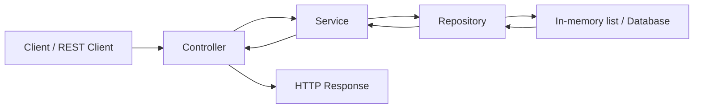

---
title: 11 - แยก Controller, Service, Repository
description: จัดชั้นของ code เพื่อให้โปรเจกต์อ่านง่ายและดูแลต่อได้
---

เมื่อ API มี endpoint ไม่กี่ตัว การเขียน logic ไว้ใน Controller อาจดูง่าย แต่เมื่อระบบเริ่มมี validation, database, business rule และ authentication Controller จะบวมเร็วมาก

ในระบบจริง Controller ที่ยาวเกินไปมักทำให้แก้ bug ยาก เพราะมีทั้ง HTTP logic, validation, business rule, query database และ mapping ปนกันในไฟล์เดียว

แนวทางที่ใช้ในหนังสือนี้คือแยก code เป็นสามชั้นหลัก:

```text
Controller -> Service -> Repository
```

ภาพรวม flow ที่เราจะใช้ซ้ำทั้งเล่ม:



## คำศัพท์ในบทนี้

`Controller` คือชั้นที่คุยกับ HTTP โดยตรง เช่น route, request body, query string และ status code

`Service` คือชั้นที่เก็บกฎของระบบหรือ business logic เช่น email ห้ามซ้ำ หรือ admin ห้ามลด role ตัวเอง

`Repository` คือชั้นที่คุยกับแหล่งข้อมูล เช่น in-memory list ในช่วงแรก และ database ผ่าน EF Core ในภายหลัง

## เป้าหมายของการแยกชั้น

การแยกชั้นไม่ได้ทำเพื่อให้มีไฟล์เยอะขึ้น แต่ทำเพื่อให้แต่ละไฟล์มีหน้าที่ชัด

```text
Controller   รับ request และส่ง response
Service      จัดการ business logic
Repository   ติดต่อแหล่งข้อมูล
```

เมื่อแยกแบบนี้ เวลาระบบโตขึ้นเราจะรู้ว่าควรแก้ code ที่ไหน

ตัวอย่าง:

- route ผิด แก้ที่ Controller
- rule ห้ามลบ admin ตัวเอง แก้ที่ Service
- query database ช้า แก้ที่ Repository หรือ DbContext query
- response มี field เกิน แก้ที่ DTO หรือ mapping

## โครงสร้างที่ต้องการ

จากเดิมที่มี logic ใน `UsersController` ไฟล์เดียว เราจะค่อย ๆ ปรับไปเป็นโครงสร้างนี้

```text
Backend.Api/
  Controllers/
    UsersController.cs
  Models/
    User.cs
  Repositories/
    IUserRepository.cs
    InMemoryUserRepository.cs
  Services/
    IUserService.cs
    UserService.cs
```

ในภาค database เราจะเปลี่ยน `InMemoryUserRepository` ให้ใช้ EF Core และ SQL Server

## หน้าที่ของ Controller

Controller ควรทำงานบาง ๆ:

- รับ route parameter, query string และ request body
- เรียก service
- แปลงผลลัพธ์เป็น HTTP response

ตัวอย่าง:

```csharp
[HttpGet("{id:int}")]
public IActionResult GetUserById(int id)
{
    var user = userService.GetUserById(id);

    if (user is null)
    {
        return NotFound();
    }

    return Ok(user);
}
```

สิ่งที่ Controller ไม่ควรทำเยอะ:

- query database โดยตรงทุก endpoint
- hash password เอง
- สร้าง JWT เอง
- ตรวจ business rule ซับซ้อนเอง
- mapping ข้อมูลหลายสิบ field เองจนไฟล์ยาว

## หน้าที่ของ Service

Service เป็นที่อยู่ของ business logic เช่นตรวจเงื่อนไขก่อนสร้างผู้ใช้ คำนวณค่า หรือกำหนด rule ของระบบ

ตัวอย่าง logic ที่ควรอยู่ใน Service:

```text
ถ้า email ซ้ำ ห้ามสร้าง user
ถ้า user ไม่ใช่ admin ห้ามเรียก admin endpoint
ถ้าเหลือ admin คนเดียว ห้าม deactivate admin คนนั้น
ก่อนบันทึก password ต้อง hash password
หลังแก้ role ต้องเขียน audit log
```

ตัวอย่าง service แบบง่าย:

```csharp
public class UserService(IUserRepository userRepository)
{
    public IReadOnlyList<User> GetUsers()
    {
        return userRepository.GetAll();
    }
}
```

## หน้าที่ของ Repository

Repository เป็นชั้นที่ติดต่อข้อมูล เช่น list ใน memory, database หรือ external API

ช่วงนี้เราจะใช้ repository แบบ in-memory ก่อน:

```csharp
public class InMemoryUserRepository
{
    private static readonly List<User> Users = [];

    public IReadOnlyList<User> GetAll()
    {
        return Users;
    }
}
```

ในภาค EF Core โครงสร้างจะเปลี่ยนเป็นการ query ผ่าน `AppDbContext`

```csharp
public Task<List<User>> GetAllAsync(CancellationToken cancellationToken)
{
    return dbContext.Users.ToListAsync(cancellationToken);
}
```

Controller และ Service จะไม่ต้องรู้รายละเอียดว่า repository เก็บข้อมูลด้วย list หรือ database

## Model คืออะไร

Model คือ object ที่ใช้แทนข้อมูลภายในระบบ

ช่วงนี้เราจะเริ่มจาก model ง่าย ๆ:

```csharp
namespace Backend.Api.Models;

public class User
{
    public int Id { get; set; }

    public string Email { get; set; } = string.Empty;
}
```

ภาค database จะขยาย `User` ให้มี field จริง เช่น `PasswordHash`, `Role`, `IsActive`, `CreatedAt`

## ภาพรวม flow หลังแยกชั้น

เมื่อ client เรียก `GET /api/users/1` flow จะเป็นแบบนี้

```text
GET /api/users/1
  -> UsersController.GetUserById(id)
  -> UserService.GetUserById(id)
  -> UserRepository.GetById(id)
  -> return response
```

แต่ละชั้นรับผิดชอบของตัวเอง ไม่ปนกัน

## อย่าแยกเยอะเกินจำเป็น

การแยกชั้นมีประโยชน์ แต่ถ้า API เล็กมากก็ไม่จำเป็นต้องสร้าง abstraction เยอะตั้งแต่แรก

หนังสือนี้เลือกแยกเพราะเราจะต่อยอดไปสู่ระบบที่มี database, authentication, authorization, test และ Docker ซึ่งโครงสร้างแบบนี้ช่วยให้ไปต่อได้ง่าย

## Checkpoint

ก่อนอ่านบทต่อไป คุณควรเข้าใจว่า

- Controller ไม่ควรทำทุกอย่างเอง
- Service ใช้เก็บ business logic
- Repository ใช้ซ่อนรายละเอียดการเข้าถึงข้อมูล
- Model ใช้แทนข้อมูลภายในระบบ
- การแยกชั้นช่วยให้เปลี่ยนจาก in-memory เป็น database ได้ง่ายขึ้นอย่างไร
