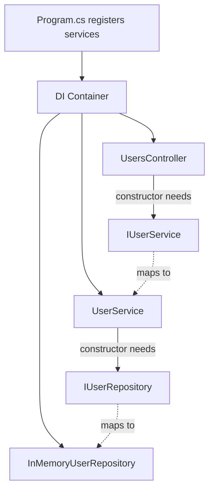

Dependency Injection หรือ DI คือวิธีส่ง object ที่ class ต้องใช้เข้ามาจากภายนอก แทนการสร้าง object เองใน class นั้น

ASP.NET Core มี DI container ในตัว ทำให้เราลงทะเบียน service ใน `Program.cs` แล้ว inject เข้า Controller, Service หรือ class อื่นได้

## วิธีเรียนบทนี้

บทนี้ยาวเพราะเป็นจุดเปลี่ยนจาก Controller ไฟล์เดียวไปเป็นหลายชั้น ให้แบ่งทำเป็นรอบ:

1. รอบแรก สร้าง `User` model และ repository ให้ compile ผ่าน
2. รอบสอง สร้าง service ให้ compile ผ่าน
3. รอบสาม ลงทะเบียน DI ใน `Program.cs`
4. รอบสี่ แก้ Controller แล้วทดสอบ endpoint เดิม

อย่าคัดลอกทั้งบทแล้วค่อย build ทีเดียว ให้ build หลังจบรอบที่ 1, 2 และ 4

## ก่อนเริ่มบทนี้

ให้เริ่มจากโปรเจกต์ที่ทำภาค 2 จบแล้ว และอยู่ในโฟลเดอร์ `Backend.Api`:

```powershell
dotnet build
```

ผลที่ต้องการคือ `Build succeeded.` และ `UsersController` ยังมี CRUD endpoint จากภาค 2 อยู่

ถ้า endpoint ในภาค 2 ยังไม่ทำงาน ให้แก้ก่อน เพราะบทนี้จะย้าย logic เดิมออกจาก Controller ไปไว้ใน Service และ Repository โดยตั้งใจให้ behavior ของ API เหมือนเดิม

## หลังจบบทนี้ ไฟล์ที่เปลี่ยน

บทนี้จะสร้างและแก้ไฟล์เหล่านี้:

```text
Models/User.cs                         เพิ่มใหม่
Repositories/IUserRepository.cs        เพิ่มใหม่
Repositories/InMemoryUserRepository.cs เพิ่มใหม่
Services/IUserService.cs               เพิ่มใหม่
Services/UserService.cs                เพิ่มใหม่
Controllers/UsersController.cs         แก้ให้เรียก IUserService
Program.cs                             เพิ่ม DI registration
```

ยังไม่เชื่อมต่อ database ในบทนี้ `InMemoryUserRepository` ยังใช้ข้อมูลใน memory เพื่อให้โฟกัสเรื่อง architecture และ DI ก่อน

ภาพรวม DI ใน ASP.NET Core:



## สิ่งที่จะใช้ในบทนี้

ก่อนเริ่มสร้างไฟล์ ให้รู้จักคำสำคัญเหล่านี้ก่อน:

| สิ่งที่จะใช้ | ความหมาย |
| --- | --- |
| `interface` | สัญญาว่า class ที่ implement ต้องมี method อะไรบ้าง |
| `implementation` | class ที่ทำงานจริงตาม interface |
| `IUserRepository` | interface สำหรับชั้น repository |
| `InMemoryUserRepository` | implementation ที่เก็บข้อมูลด้วย list ชั่วคราว |
| `IUserService` | interface สำหรับชั้น service |
| `UserService` | implementation ของ service |
| `IReadOnlyList<User>` | list ที่ caller อ่านได้ แต่ไม่ควรแก้ไขโดยตรง |
| `User?` | อาจได้ `User` หรือ `null` ถ้าหาข้อมูลไม่เจอ |
| `bool` | ใช้บอกผลลัพธ์แบบสำเร็จ/ไม่สำเร็จ เช่นลบได้หรือไม่ได้ |
| `AddScoped<TInterface, TImplementation>()` | ลงทะเบียน DI ให้สร้าง implementation เมื่อมีคนขอ interface |
| primary constructor | syntax C# ที่รับ dependency ผ่านวงเล็บหลังชื่อ class |

ลำดับการทำงานในบทนี้คือ:

```text
สร้าง Model
  -> สร้าง Repository interface
  -> สร้าง Repository implementation
  -> สร้าง Service interface
  -> สร้าง Service implementation
  -> ลงทะเบียน DI ใน Program.cs
  -> แก้ Controller ให้เรียก Service
```

บทนี้ตั้งใจให้แก้ทีละชั้น ไม่ต้องคัดลอกไฟล์ยาวรวดเดียว วิธีอ่านที่แนะนำคืออ่านคำอธิบายของแต่ละชั้นก่อน แล้วค่อยเพิ่ม code ตาม checkpoint ย่อยด้านล่าง

## ปัญหาของการ new เอง

ตัวอย่างที่ไม่ควรทำใน Controller:

```csharp
public class UsersController : ControllerBase
{
    // Avoid this: the controller is responsible for creating its own dependency.
    private readonly UserService _userService = new();
}
```

ปัญหาคือ Controller ผูกกับ `UserService` โดยตรง เปลี่ยน implementation ยาก test ยาก และเมื่อ `UserService` ต้องใช้ repository ก็ต้อง new ต่อกันเป็นทอด ๆ

DI แก้ปัญหานี้โดยให้ ASP.NET Core เป็นคนสร้าง object และส่ง dependency เข้ามาให้

## สร้าง Model

ก่อนสร้างไฟล์ ให้สร้างโฟลเดอร์นี้ก่อน:

```text
Models/
```

ให้รันจากโฟลเดอร์ `Backend.Api`

Windows PowerShell:

```powershell
New-Item -ItemType Directory -Force -Path Models
if (-not (Test-Path -LiteralPath Models/User.cs)) {
    New-Item -ItemType File -Path Models/User.cs
}
```

macOS/Linux Bash:

```bash
mkdir -p Models
touch Models/User.cs
```

จากนั้นสร้างไฟล์:

```text
Models/User.cs
```

```csharp
namespace Backend.Api.Models;

// Internal model used by the application.
public class User
{
    public int Id { get; set; }

    public string Email { get; set; } = string.Empty;
}
```

Checkpoint ย่อย:

- namespace ต้องเป็น `Backend.Api.Models`
- class ชื่อ `User`
- มี property `Id` และ `Email`

ถ้าต้องการตรวจทันที ให้รัน:

```powershell
dotnet build
```

ถ้า build ผ่าน แปลว่า model พร้อมสำหรับ repository แล้ว

## สร้าง Repository interface

ก่อนสร้างไฟล์ repository ให้สร้างโฟลเดอร์นี้ก่อน:

```text
Repositories/
```

ให้รันจากโฟลเดอร์ `Backend.Api`

Windows PowerShell:

```powershell
New-Item -ItemType Directory -Force -Path Repositories
if (-not (Test-Path -LiteralPath Repositories/IUserRepository.cs)) {
    New-Item -ItemType File -Path Repositories/IUserRepository.cs
}
```

macOS/Linux Bash:

```bash
mkdir -p Repositories
touch Repositories/IUserRepository.cs
```

จากนั้นสร้างไฟล์:

```text
Repositories/IUserRepository.cs
```

```csharp
using Backend.Api.Models;

namespace Backend.Api.Repositories;

public interface IUserRepository
{
    // Repository methods hide how data is stored.
    IReadOnlyList<User> GetAll();

    User? GetById(int id);

    User Add(string email);

    User? Update(int id, string email);

    bool Delete(int id);
}
```

Interface บอกว่า repository ต้องทำอะไรได้ โดยยังไม่บอกว่าข้างในเก็บข้อมูลแบบไหน

อธิบาย method ใน interface นี้:

| Method | ความหมาย |
| --- | --- |
| `GetAll()` | อ่าน user ทั้งหมด |
| `GetById(int id)` | อ่าน user ตาม id ถ้าไม่พบให้คืน `null` |
| `Add(string email)` | เพิ่ม user ใหม่และคืน user ที่สร้าง |
| `Update(int id, string email)` | แก้ไข user ถ้าไม่พบให้คืน `null` |
| `Delete(int id)` | ลบ user และคืน `true` ถ้าลบสำเร็จ |

การใช้ interface ทำให้ Controller และ Service ไม่ต้องรู้ว่าข้อมูลเก็บอยู่ใน list, database หรือแหล่งข้อมูลอื่น

## สร้าง Repository implementation

ถ้าสร้างโฟลเดอร์ `Repositories/` แล้วในขั้นก่อนหน้า ไม่ต้องสร้างซ้ำ

ให้รันจากโฟลเดอร์ `Backend.Api`

Windows PowerShell:

```powershell
if (-not (Test-Path -LiteralPath Repositories/InMemoryUserRepository.cs)) {
    New-Item -ItemType File -Path Repositories/InMemoryUserRepository.cs
}
```

macOS/Linux Bash:

```bash
touch Repositories/InMemoryUserRepository.cs
```

สร้างไฟล์:

```text
Repositories/InMemoryUserRepository.cs
```

ไฟล์นี้คือ class ที่ทำงานจริงตาม `IUserRepository` อย่าเพิ่งกังวลว่า code จะยาว ให้สร้างจากโครงก่อน แล้วค่อยเพิ่ม method ทีละกลุ่ม

### ขั้นที่ 1: สร้างโครง class และข้อมูลเริ่มต้น

```csharp
using Backend.Api.Models;

namespace Backend.Api.Repositories;

public class InMemoryUserRepository : IUserRepository
{
    // Temporary storage for learning. Data resets when the app restarts.
    private static readonly List<User> Users =
    [
        new() { Id = 1, Email = "admin@example.com" },
        new() { Id = 2, Email = "user@example.com" }
    ];
}
```

ตอนนี้ class ยังทำงานไม่ครบ เพราะ interface บังคับว่าต้องมี method ทั้ง 5 ตัว ขั้นต่อไปเราจะค่อย ๆ เพิ่ม method เข้าไปใน class นี้

### ขั้นที่ 2: เพิ่ม method สำหรับอ่านข้อมูล

เพิ่ม code นี้ไว้ใน class `InMemoryUserRepository` ใต้ตัวแปร `Users`

```csharp
public IReadOnlyList<User> GetAll()
{
    // Return all users from the in-memory list.
    return Users;
}

public User? GetById(int id)
{
    // Return null when no user matches the id.
    return Users.FirstOrDefault(user => user.Id == id);
}
```

สิ่งที่เกิดขึ้น:

- `GetAll()` คืน user ทั้งหมด
- `GetById(int id)` หา user ตัวแรกที่ `Id` ตรงกัน
- `FirstOrDefault(...)` คืน `null` ถ้าหาไม่เจอ จึงต้องใช้ return type เป็น `User?`

### ขั้นที่ 3: เพิ่ม method สำหรับสร้าง user

เพิ่ม method นี้ต่อจาก `GetById`

```csharp
public User Add(string email)
{
    // In memory, we generate the next id by looking at the current max id.
    var nextId = Users.Count == 0 ? 1 : Users.Max(user => user.Id) + 1;

    var user = new User
    {
        Id = nextId,
        Email = email
    };

    // Add the new user to the in-memory list.
    Users.Add(user);

    return user;
}
```

อ่าน code นี้เป็นลำดับ:

1. หา id ถัดไปจาก `Users.Max(...)`
2. สร้าง object `User`
3. เพิ่มเข้า list ด้วย `Users.Add(user)`
4. คืน user ที่สร้างกลับไปให้ service

### ขั้นที่ 4: เพิ่ม method สำหรับแก้ไข user

เพิ่ม method นี้ต่อจาก `Add`

```csharp
public User? Update(int id, string email)
{
    // Reuse GetById so lookup logic stays in one place.
    var user = GetById(id);

    if (user is null)
    {
        return null;
    }

    // Mutate the existing object in the in-memory list.
    user.Email = email;

    return user;
}
```

จุดสำคัญคือเรา reuse `GetById(id)` แทนการเขียน logic หา user ซ้ำ ถ้าหาไม่เจอให้คืน `null` เพื่อให้ controller ตอบ `404 Not Found` ได้

### ขั้นที่ 5: เพิ่ม method สำหรับลบ user

เพิ่ม method สุดท้ายนี้ต่อจาก `Update`

```csharp
public bool Delete(int id)
{
    // Find the user before removing it.
    var user = GetById(id);

    if (user is null)
    {
        return false;
    }

    // Remove the existing user from the in-memory list.
    Users.Remove(user);

    return true;
}
```

method นี้คืน `bool` เพราะ controller ต้องรู้ว่าลบสำเร็จหรือไม่:

- `true` แปลว่าลบสำเร็จ ตอบ `204 No Content`
- `false` แปลว่าไม่พบ user ตอบ `404 Not Found`

หลังใส่ครบ 5 method แล้ว `InMemoryUserRepository` จะทำงานครบตามสัญญาของ `IUserRepository`

### ตรวจ Repository ก่อนทำต่อ

ไฟล์นี้ควรมีภาพรวมประมาณนี้:

```text
InMemoryUserRepository
  - Users
  - GetAll()
  - GetById(id)
  - Add(email)
  - Update(id, email)
  - Delete(id)
```

ถ้าขาด method ใด method หนึ่ง build จะฟ้องว่า class ยัง implement interface ไม่ครบ

อธิบายส่วนสำคัญ:

- `private static readonly List<User> Users` คือข้อมูลชั่วคราวใน memory
- `new() { Id = 1, Email = "..." }` คือการสร้าง `User` object แบบย่อ
- `GetById(id)` ถูก reuse ใน `Update` และ `Delete` เพื่อไม่ต้องเขียน logic หา user ซ้ำ
- `User?` ใช้ใน method ที่อาจหา user ไม่เจอ
- `bool Delete(int id)` ใช้บอก service ว่าลบสำเร็จหรือไม่

ตอนนี้ repository ยังใช้ list แต่ในภาค database เราจะเปลี่ยน implementation ให้ไปอ่าน/เขียน SQL Server แทน

Checkpoint ย่อย:

```powershell
dotnet build
```

ถ้า build error ว่า `InMemoryUserRepository` ยังไม่ implement interface ให้กลับไปตรวจว่ามีครบทั้ง `GetAll`, `GetById`, `Add`, `Update` และ `Delete`

## สร้าง Service interface

ก่อนสร้างไฟล์ service ให้สร้างโฟลเดอร์นี้ก่อน:

```text
Services/
```

ให้รันจากโฟลเดอร์ `Backend.Api`

Windows PowerShell:

```powershell
New-Item -ItemType Directory -Force -Path Services
if (-not (Test-Path -LiteralPath Services/IUserService.cs)) {
    New-Item -ItemType File -Path Services/IUserService.cs
}
```

macOS/Linux Bash:

```bash
mkdir -p Services
touch Services/IUserService.cs
```

จากนั้นสร้างไฟล์:

```text
Services/IUserService.cs
```

```csharp
using Backend.Api.Models;

namespace Backend.Api.Services;

public interface IUserService
{
    // Service methods use use-case names, not storage names.
    IReadOnlyList<User> GetUsers();

    User? GetUserById(int id);

    User CreateUser(string email);

    User? UpdateUser(int id, string email);

    bool DeleteUser(int id);
}
```

Service interface คล้าย repository แต่ใช้ชื่อ method ในภาษาของ use case มากขึ้น เช่น `CreateUser`, `UpdateUser`, `DeleteUser`

ในระบบจริง service จะเป็นที่รวม business rule ก่อนเรียก repository เช่นตรวจ email ซ้ำ หรือ validate สิทธิ์ของ user

## สร้าง Service implementation

ถ้าสร้างโฟลเดอร์ `Services/` แล้วในขั้นก่อนหน้า ไม่ต้องสร้างซ้ำ

ให้รันจากโฟลเดอร์ `Backend.Api`

Windows PowerShell:

```powershell
if (-not (Test-Path -LiteralPath Services/UserService.cs)) {
    New-Item -ItemType File -Path Services/UserService.cs
}
```

macOS/Linux Bash:

```bash
touch Services/UserService.cs
```

สร้างไฟล์:

```text
Services/UserService.cs
```

อย่าเพิ่งคัดลอก implementation ทั้งไฟล์ ให้สร้างจากโครงก่อน แล้วค่อยเติม method ตาม interface

### ขั้นที่ 1: สร้าง using และ class

```csharp
using Backend.Api.Models;
using Backend.Api.Repositories;

namespace Backend.Api.Services;

public class UserService(IUserRepository userRepository) : IUserService
{
    // Methods will be added below.
}
```

บรรทัด `IUserRepository userRepository` คือ dependency ที่ service ต้องใช้ และ DI จะส่ง object เข้ามาให้

### ขั้นที่ 2: เพิ่ม method สำหรับอ่านข้อมูล

เพิ่ม method เหล่านี้ไว้ใน class `UserService`

```csharp
public IReadOnlyList<User> GetUsers()
{
    // Service delegates data access to the repository.
    return userRepository.GetAll();
}

public User? GetUserById(int id)
{
    // Keep controller code thin by doing lookup through the service.
    return userRepository.GetById(id);
}
```

service เรียก repository เพราะ repository เป็นคนรู้ว่าข้อมูลเก็บอยู่ที่ไหน

### ขั้นที่ 3: เพิ่ม method สำหรับสร้าง user

เพิ่ม method นี้ต่อจาก `GetUserById`

```csharp
public User CreateUser(string email)
{
    // Business rules will be added here later before saving.
    return userRepository.Add(email);
}
```

ตอนนี้ service ยังส่งต่อ email ไป repository ตรง ๆ แต่บทหลังจะเพิ่ม rule เช่นตรวจ email ซ้ำก่อนสร้าง

### ขั้นที่ 4: เพิ่ม method สำหรับแก้ไข user

เพิ่ม method นี้ต่อจาก `CreateUser`

```csharp
public User? UpdateUser(int id, string email)
{
    // Return null when the repository cannot find the user.
    return userRepository.Update(id, email);
}
```

`User?` บอกว่าการแก้ไขอาจไม่เจอ user ตาม id ที่ส่งมา

### ขั้นที่ 5: เพิ่ม method สำหรับลบ user

เพิ่ม method สุดท้ายนี้ต่อจาก `UpdateUser`

```csharp
public bool DeleteUser(int id)
{
    // Return true/false so the controller can choose 204 or 404.
    return userRepository.Delete(id);
}
```

`bool` ใช้บอก Controller ว่าลบสำเร็จหรือไม่ เพื่อเลือกตอบ `204 No Content` หรือ `404 Not Found`

หลังใส่ครบแล้ว `UserService` ควรมี method ตามนี้:

```text
GetUsers()
GetUserById(id)
CreateUser(email)
UpdateUser(id, email)
DeleteUser(id)
```

ตอนนี้ service ยังดูเหมือน pass-through ไป repository แต่ในบทหลัง ๆ service จะเริ่มมี validation, password hashing, JWT, self-protection และ audit log

Checkpoint ย่อย:

```powershell
dotnet build
```

ถ้า build error ที่ `UserService` ให้ตรวจสองอย่างก่อน:

- `UserService` มี `: IUserService` หรือไม่
- method ใน `UserService` ตรงกับ method ใน `IUserService` ทุกตัวหรือไม่

บรรทัดนี้คือ primary constructor:

```csharp
public class UserService(IUserRepository userRepository) : IUserService
```

ความหมายคือ `UserService` ต้องการ `IUserRepository` หนึ่งตัว และ ASP.NET Core DI จะส่งเข้ามาให้หลังจากเราลงทะเบียน service ใน `Program.cs`

ถ้ายังไม่คุ้นกับ syntax นี้ ให้มองว่าเทียบได้กับ constructor แบบยาวประมาณนี้:

```csharp
public class UserService : IUserService
{
    private readonly IUserRepository userRepository;

    public UserService(IUserRepository userRepository)
    {
        // Store the dependency that DI passed into the constructor.
        this.userRepository = userRepository;
    }
}
```

## ลงทะเบียน Service ใน Program.cs

เปิด `Program.cs` แล้วเพิ่ม using

```csharp
using Backend.Api.Repositories;
using Backend.Api.Services;
```

จากนั้นลงทะเบียน service ก่อน `var app = builder.Build();`

```csharp
// Required DI registrations for the controller -> service -> repository chain.
builder.Services.AddScoped<IUserRepository, InMemoryUserRepository>();
builder.Services.AddScoped<IUserService, UserService>();
```

ความหมายคือ ถ้ามี class ไหนขอ `IUserRepository` ให้สร้าง `InMemoryUserRepository` ให้

ถ้ามี class ไหนขอ `IUserService` ให้สร้าง `UserService` ให้

## Inject เข้า Controller

แก้ `UsersController` ให้รับ `IUserService`

ก่อนแก้ ให้ลบ static list เดิมใน Controller ออก เพราะตอนนี้ข้อมูลจะถูกจัดการผ่าน `InMemoryUserRepository` แทน Controller แล้ว

ในบทนี้เรายังเก็บ request record ไว้ในไฟล์ Controller ก่อน เพื่อไม่เพิ่มหลายแนวคิดพร้อมกันเกินไป บทถัดไปจะแยก DTO ไปไว้ในโฟลเดอร์ของตัวเอง

อย่าเริ่มจากการคัดลอก Controller ทั้งไฟล์ ให้แก้จาก Controller เดิมของบทที่ 7 ตามขั้นตอนนี้

### ขั้นที่ 1: เพิ่ม using ของ service

ด้านบนไฟล์ `UsersController.cs` ควรมี using นี้:

```csharp
using Microsoft.AspNetCore.Mvc;
using Backend.Api.Services;
```

`Backend.Api.Services` ทำให้ Controller รู้จัก `IUserService`

### ขั้นที่ 2: เอา list เดิมออกจาก Controller

ในบทก่อน Controller อาจมี code ประมาณนี้:

```csharp
private static readonly List<User> Users = ...
```

ให้ลบออก เพราะ list ย้ายไปอยู่ใน `InMemoryUserRepository` แล้ว

### ขั้นที่ 3: เปลี่ยนบรรทัดประกาศ class ให้รับ service

เปลี่ยนจาก Controller แบบเดิมให้เป็นแบบนี้:

```csharp
[ApiController]
[Route("api/v1/[controller]")]
public class UsersController(IUserService userService) : ControllerBase
{
    // Actions will call userService instead of touching the list directly.
}
```

บรรทัดนี้แปลว่า `UsersController` ต้องการ `IUserService` และ DI container จะส่ง object เข้ามาให้

### ขั้นที่ 4: แก้ GET ทั้งหมดให้เรียก service

ใส่ method เหล่านี้กลับเข้าไปใน class:

```csharp
[HttpGet]
public IActionResult GetUsers()
{
    // The controller only converts the service result into an HTTP response.
    return Ok(userService.GetUsers());
}

[HttpGet("{id:int}")]
public IActionResult GetUserById(int id)
{
    // Ask the service for the user; do not search the list here.
    var user = userService.GetUserById(id);

    if (user is null)
    {
        return NotFound();
    }

    return Ok(user);
}
```

Controller ไม่หา user เองแล้ว หน้าที่ของมันคือรับ request แล้วส่งงานต่อให้ service

### ขั้นที่ 5: แก้ POST ให้เรียก service

ตรวจว่าด้านบน namespace ยังมี request record อยู่:

```csharp
public record CreateUserRequest(string Email);
```

จากนั้นเพิ่ม method:

```csharp
[HttpPost]
public IActionResult CreateUser(CreateUserRequest request)
{
    // Only pass the input the service needs in this chapter.
    var user = userService.CreateUser(request.Email);

    // 201 Created points clients to the endpoint for reading this new user.
    return CreatedAtAction(nameof(GetUserById), new { id = user.Id }, user);
}
```

จุดที่ควรสังเกตคือ Controller ส่งแค่ `request.Email` ให้ service ส่วนการสร้าง id และเก็บข้อมูลเป็นหน้าที่ของ repository

### ขั้นที่ 6: แก้ PUT ให้เรียก service

ตรวจว่ามี request record นี้:

```csharp
public record UpdateUserRequest(string Email);
```

จากนั้นเพิ่ม method:

```csharp
[HttpPut("{id:int}")]
public IActionResult UpdateUser(int id, UpdateUserRequest request)
{
    // Service returns null if the id does not exist.
    var user = userService.UpdateUser(id, request.Email);

    if (user is null)
    {
        return NotFound();
    }

    return Ok(user);
}
```

ถ้า service คืน `null` แปลว่าไม่พบ user ตาม id ที่ส่งมา จึงตอบ `NotFound()`

### ขั้นที่ 7: แก้ DELETE ให้เรียก service

```csharp
[HttpDelete("{id:int}")]
public IActionResult DeleteUser(int id)
{
    // Service returns false if nothing was deleted.
    var deleted = userService.DeleteUser(id);

    if (!deleted)
    {
        return NotFound();
    }

    return NoContent();
}
```

`DeleteUser` ใน service คืน `true` หรือ `false` เพื่อให้ Controller เลือก response ได้ถูกต้อง

### ตรวจ Controller หลังแก้

หลังแก้ครบแล้ว Controller ควรเหลือหน้าที่หลักแค่นี้:

```text
UsersController
  - รับ HTTP request
  - เรียก userService
  - แปลงผลลัพธ์เป็น HTTP response
```

ถ้า Controller ยังมี `List<User>` หรือ logic หา id ถัดไป แปลว่ายังย้าย responsibility ออกไม่หมด

ตัวอย่างนี้ใช้ primary constructor ของ C# เพื่อรับ dependency และ ASP.NET Core จะสร้าง `UserService` แล้วส่งเข้ามาให้ Controller อัตโนมัติ

หลังแก้แล้ว flow ของ `POST /api/v1/users` จะเปลี่ยนจาก Controller เพิ่มข้อมูลเข้า list เอง เป็น:

```text
UsersController
  -> IUserService
  -> IUserRepository
  -> InMemoryUserRepository
```

ผลลัพธ์ของ endpoint ยังเหมือนเดิม แต่ code แต่ละชั้นมีหน้าที่ชัดขึ้น

## โครงสร้างหลังจบบทนี้

หลังทำครบแล้ว โปรเจกต์ควรมีไฟล์เหล่านี้:

```text
Backend.Api/
  Controllers/
    UsersController.cs
  Models/
    User.cs
  Repositories/
    IUserRepository.cs
    InMemoryUserRepository.cs
  Services/
    IUserService.cs
    UserService.cs
  Program.cs
```

ให้รัน build เพื่อตรวจ namespace, using และ DI registration:

```powershell
dotnet build
```

จากนั้นรัน API แล้วทดสอบ request เดิมใน `Backend.Api.http`:

```powershell
dotnet run
```

หลัง API รันแล้ว ให้ทดสอบ request หลักเหล่านี้ใน `Backend.Api.http` โดยใช้ `baseUrl` ที่ตรงกับ port จริงของเครื่องคุณ:

| Request | ผลลัพธ์ที่ควรได้ |
| --- | --- |
| `GET /api/v1/users` | `200 OK` และได้ list ของ user |
| `GET /api/v1/users/1` | `200 OK` และได้ user id `1` |
| `GET /api/v1/users/999` | `404 Not Found` |
| `POST /api/v1/users` | `201 Created` และได้ user ใหม่ |
| `PUT /api/v1/users/1` | `200 OK` และ email เปลี่ยน |
| `PUT /api/v1/users/999` | `404 Not Found` |
| `DELETE /api/v1/users/999` | `404 Not Found` |
| `DELETE /api/v1/users/1` | `204 No Content` |

ผลลัพธ์ของ endpoint ควรเหมือนภาค 2 แต่ code ภายในเปลี่ยนจาก Controller ทำทุกอย่างเอง เป็น Controller เรียก Service และ Service เรียก Repository

ถ้า status code ไม่ตรง ให้ตรวจตามลำดับนี้:

1. `Program.cs` ลงทะเบียน `IUserRepository` และ `IUserService` ก่อน `builder.Build()` หรือไม่
2. `UsersController` รับ `IUserService` ผ่าน constructor แล้วหรือยัง
3. Controller ยังมี `List<User>` เดิมค้างอยู่หรือไม่
4. ทดสอบ `DELETE /api/v1/users/1` ไปก่อนหน้าแล้วหรือยัง ถ้าลบไปแล้วให้ restart API เพื่อกลับไปข้อมูลเริ่มต้น

## Service Lifetime ที่เจอบ่อย

```text
AddTransient  สร้าง instance ใหม่ทุกครั้งที่ถูกขอ
AddScoped     สร้าง instance หนึ่งครั้งต่อ HTTP request
AddSingleton  สร้าง instance เดียวทั้ง application
```

สำหรับ Web API ทั่วไป โดยเฉพาะ service ที่เกี่ยวกับ database มักใช้ `AddScoped`

เหตุผลคือ EF Core `DbContext` ปกติใช้แบบ scoped ต่อ request ดังนั้น service และ repository ที่ใช้ database ก็ควรเป็น scoped ด้วย

## เลือก lifetime แบบไหนดี

ใช้ `AddScoped` เป็นค่าเริ่มต้นสำหรับ application service และ repository

ใช้ `AddSingleton` กับ object ที่ไม่มี state ต่อ request เช่น configuration reader บางชนิด หรือ service ที่ thread-safe จริง

ใช้ `AddTransient` กับ object เบา ๆ ที่ไม่มี state และไม่ต้องแชร์ใน request เดียวกัน

ถ้าไม่แน่ใจใน Web API ทั่วไป ให้เริ่มจาก `AddScoped`

## Error ที่เจอบ่อย

ถ้าลืมลงทะเบียน service คุณจะเจอ error ประมาณนี้ตอนเรียก endpoint

```text
Unable to resolve service for type 'Backend.Api.Services.IUserService'
```

แปลว่า Controller ขอ `IUserService` แต่ DI container ไม่รู้ว่าจะสร้างอะไรให้

ให้กลับไปเช็ก `Program.cs` ว่าลงทะเบียนครบหรือไม่

## ข้อผิดพลาดที่เจอบ่อย

ถ้า build error ว่าไม่รู้จัก `IUserService` หรือ `IUserRepository` ให้ตรวจ `using` และ namespace ของไฟล์ที่สร้าง

ถ้าเจอ error `Unable to resolve service` ตอนเรียก endpoint ให้ตรวจว่า `Program.cs` มีบรรทัดเหล่านี้ก่อน `builder.Build()`:

```csharp
// When a class asks for IUserRepository, create InMemoryUserRepository.
builder.Services.AddScoped<IUserRepository, InMemoryUserRepository>();

// When a class asks for IUserService, create UserService.
builder.Services.AddScoped<IUserService, UserService>();
```

ถ้า endpoint ทำงานแต่ข้อมูล reset หลัง restart ยังถือว่าปกติ เพราะ `InMemoryUserRepository` ยังใช้ list ใน memory

## Checkpoint

ก่อนอ่านบทต่อไป คุณควรตอบได้ว่า

- DI ช่วยแก้ปัญหาอะไร
- ทำไม Controller ไม่ควร `new UserService()` เอง
- interface ช่วยให้เปลี่ยน implementation ได้อย่างไร
- `AddScoped` ต่างจาก `AddSingleton` อย่างไร
- ถ้าเจอ error `Unable to resolve service` ควรตรวจที่ไหน
