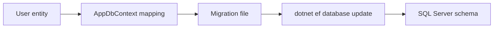

---
title: 20 - ใช้ Migration
description: สร้างและรัน EF Core migration เพื่อสร้าง database schema
---

Migration คือไฟล์ที่บอกว่า database schema ต้องเปลี่ยนอย่างไร เช่นสร้าง table ใหม่ เพิ่ม column หรือสร้าง index

ในบทนี้เราจะสร้าง migration แรกจาก `User` entity และ `AppDbContext`

ภาพรวมการทำงานของ migration:



## ตรวจความพร้อมก่อนสร้าง migration

ก่อนรันคำสั่ง migration ให้ตรวจสามอย่างนี้

```powershell
dotnet build
dotnet tool run dotnet-ef --version
docker ps
```

`dotnet build` ต้องผ่านก่อน เพราะ EF Core ต้อง compile project เพื่ออ่าน `DbContext`

`dotnet tool run dotnet-ef --version` ต้องทำงานได้

`docker ps` ควรเห็น SQL Server container ถ้าคุณใช้ database ผ่าน Docker

## สร้าง migration แรก

รันคำสั่งนี้ที่ root ของโปรเจกต์ `Backend.Api`

```powershell
dotnet tool run dotnet-ef migrations add InitialCreate
```

หลังคำสั่งสำเร็จ จะมีโฟลเดอร์ใหม่

```text
Migrations/
```

ในโฟลเดอร์นี้จะมีไฟล์ migration และ model snapshot

## ดูไฟล์ migration

เปิดไฟล์ migration ที่ถูกสร้างขึ้น จะเห็น method สำคัญสองตัว

```csharp
protected override void Up(MigrationBuilder migrationBuilder)
{
    // คำสั่งสำหรับเปลี่ยน schema ไปข้างหน้า
}

protected override void Down(MigrationBuilder migrationBuilder)
{
    // คำสั่งสำหรับย้อน migration นี้
}
```

`Up` ใช้สร้างหรือแก้ schema ส่วน `Down` ใช้ย้อนการเปลี่ยนแปลง

## อัปเดต database

รันคำสั่งนี้เพื่อเอา migration ไปรันกับ database จริง

```powershell
dotnet tool run dotnet-ef database update
```

ถ้าสำเร็จ database `BackendApiDb` จะถูกสร้าง และมี table `Users`

## ตรวจรายการ migration

```powershell
dotnet tool run dotnet-ef migrations list
```

ควรเห็น `InitialCreate`

## ปัญหาที่พบบ่อย

ถ้าเจอ error ว่าไม่พบ `DbContext` ให้ตรวจว่า `AppDbContext` ถูกสร้างเป็น `public` และลงทะเบียนใน `Program.cs` แล้ว

ถ้าเจอ error เชื่อม database ไม่ได้ ให้ตรวจว่า SQL Server เปิดอยู่ port `1433` ถูก map แล้ว และรหัสผ่านใน connection string ตรงกับตอนสร้าง container

ถ้าเจอ error ว่า login failed for user `sa` ให้รอ SQL Server start ให้เสร็จจริงก่อน หรือดู log ด้วยคำสั่งนี้

```powershell
docker logs backend-api-sql
```

## ควรแก้ไฟล์ migration ด้วยมือไหม

มือใหม่ควรหลีกเลี่ยงการแก้ไฟล์ migration ด้วยมือในช่วงแรก ให้แก้ entity หรือ `OnModelCreating` แล้วสร้าง migration ใหม่แทน

เมื่อทำงานจริง บางกรณีอาจต้องแก้ migration ด้วยมือ แต่ต้องเข้าใจผลกระทบกับ database schema ให้ดี

## Checkpoint

ก่อนอ่านบทต่อไป ให้ตรวจว่าทำได้ครบตามนี้

- รัน `dotnet tool run dotnet-ef migrations add InitialCreate` สำเร็จ
- รัน `dotnet tool run dotnet-ef database update` สำเร็จ
- database มี table `Users`
- `dotnet tool run dotnet-ef migrations list` แสดง migration ที่สร้างไว้
