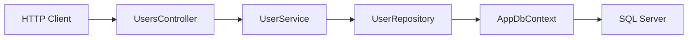

ภาคนี้เปลี่ยนจากข้อมูลใน memory ไปใช้ฐานข้อมูลจริงด้วย Entity Framework Core เพื่อให้ API เก็บข้อมูลถาวรได้

จุดสำคัญของภาคนี้คือผู้อ่านต้องเข้าใจ flow ครบตั้งแต่ติดตั้ง package, สร้าง entity, สร้าง `DbContext`, ตั้งค่า connection string, สร้าง migration, update database, ทำ CRUD ผ่าน repository และ seed ข้อมูลเริ่มต้น

## วิธีเรียนภาคนี้

ภาคนี้เป็นจุดเปลี่ยนจาก code ที่เก็บข้อมูลใน memory ไปเป็น code ที่คุยกับ database จริง อย่าคัดลอก code ยาวทีเดียวแล้วค่อย test ให้ทำตามลำดับนี้:

1. อ่านก่อนว่า class หรือ method ใหม่ทำหน้าที่อะไร
2. สร้างโฟลเดอร์และไฟล์ด้วยคำสั่งที่ให้ไว้
3. เพิ่ม code ทีละขั้นตามบท
4. รัน `dotnet build` หลังจบบทสำคัญ
5. รัน migration และทดสอบ API ด้วย `.http`

ถ้าเครื่องของคุณใช้ port ไม่ตรงกับตัวอย่าง ให้ใช้ port ที่ `dotnet run` หรือ Visual Studio แสดงจริง เช่น `http://localhost:<http-port>` หรือ `https://localhost:<https-port>`

## บทในภาคนี้

- บทที่ 16: ติดตั้ง Entity Framework Core
- บทที่ 17: สร้าง User Entity
- บทที่ 18: สร้าง DbContext
- บทที่ 19: ตั้งค่า Connection String
- บทที่ 20: ใช้ Migration
- บทที่ 21: ทำ CRUD กับฐานข้อมูลจริง
- บทที่ 22: Seed ข้อมูลเริ่มต้น

## สิ่งที่ต้องได้หลังจบภาคนี้

- โปรเจกต์ติดตั้ง EF Core package ที่จำเป็นแล้ว
- มี `User` entity และ `AppDbContext`
- เชื่อมต่อ SQL Server ผ่าน connection string ได้
- สร้างและรัน migration ได้
- CRUD API ใช้ database จริง ไม่ใช่ in-memory list
- มี seed data สำหรับทดสอบระบบฐานข้อมูล

## ภาพรวม flow หลังจบภาคนี้



## ข้อควรรู้ก่อนเริ่ม

ภาคนี้ยังไม่ทำระบบ login จริง แม้ `User` entity จะมี `PasswordHash` แล้วก็ตาม เพราะการสร้าง password hash อย่างถูกต้องจะสอนในภาค Authentication

ดังนั้นข้อมูล seed ในภาคนี้เป็นข้อมูลทดสอบฐานข้อมูลเท่านั้น ไม่ใช่บัญชีที่ใช้ login ได้จริง

ก่อนเริ่มภาคนี้ ให้โปรเจกต์จากภาค 3 build ผ่าน และเลือก SQL Server สำหรับ local development ให้ชัดเจน:

```powershell
dotnet build
```

ถ้าใช้ Windows และมี LocalDB อยู่แล้ว สามารถใช้ `(localdb)\MSSQLLocalDB` ได้ ถ้าใช้ Docker ให้เตรียม container SQL Server ตามบทที่ 19

## Checklist หลังจบภาคนี้

- `dotnet build` ผ่าน
- `dotnet tool run dotnet-ef --version` ทำงานได้
- มี `Data/AppDbContext.cs` และ migration `InitialCreate`
- `dotnet tool run dotnet-ef database update` สำเร็จ
- `Program.cs` ใช้ `UserRepository` แทน `InMemoryUserRepository`
- `GET /api/v1/users` อ่านข้อมูลจาก database จริง
- สร้าง user แล้ว restart application ข้อมูลไม่หาย
- seed data ไม่ถูกเพิ่มซ้ำทุกครั้งที่ app start
- ไม่มี password จริงหรือ production secret ถูกใส่ลง tracked `appsettings*.json`
