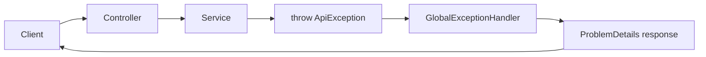

---
title: 25 - Global Exception Handler
description: จัดการ exception แบบรวมศูนย์ด้วย IExceptionHandler และ ProblemDetails
---

ถ้าใส่ `try-catch` ในทุก action method code จะซ้ำและดูแลยาก แนวทางที่ดีกว่าคือให้ Controller และ Service โยน exception ที่มีความหมาย แล้วให้ global exception handler แปลงเป็น HTTP response

บทนี้เราจะใช้ `IExceptionHandler` ของ ASP.NET Core เพื่อจัดการ exception แบบรวมศูนย์

ภาพรวม error flow หลังเพิ่ม global exception handler:



## คำศัพท์ในบทนี้

`Middleware` คือส่วนหนึ่งของ HTTP pipeline ที่ทำงานก่อนหรือหลัง Controller ได้ เช่น exception handler middleware จะดัก exception แล้วแปลงเป็น response แทนที่จะปล่อย stack trace ออกไปหา client

`ProblemDetails` คือรูปแบบ response สำหรับ error ตามมาตรฐาน RFC 7807 ทำให้ client เห็น field พื้นฐาน เช่น `title`, `status` และรายละเอียดอื่นที่เราเพิ่มเอง เช่น `code`

## เป้าหมายของบทนี้

หลังจบบทนี้ error ที่เกิดใน service จะถูกแปลงเป็น response รูปแบบเดียวกัน เช่น

```json
{
  "type": "https://httpstatuses.com/409",
  "title": "Email already exists",
  "status": 409,
  "code": "EMAIL_ALREADY_EXISTS"
}
```

## สร้าง ApiException

สร้างโฟลเดอร์

```text
Exceptions/
```

สร้างไฟล์

```text
Exceptions/ApiException.cs
```

เพิ่ม code นี้

```csharp
namespace Backend.Api.Exceptions;

public class ApiException : Exception
{
    public ApiException(string message, string code, int statusCode)
        : base(message)
    {
        Code = code;
        StatusCode = statusCode;
    }

    public string Code { get; }
    public int StatusCode { get; }
}
```

`ApiException` คือ exception ที่เราตั้งใจโยนเอง และมีข้อมูลพอสำหรับแปลงเป็น HTTP response

## สร้าง exception เฉพาะกรณี

สร้างไฟล์

```text
Exceptions\NotFoundException.cs
Exceptions\ConflictException.cs
```

เพิ่ม code ใน `NotFoundException.cs`

```csharp
using Microsoft.AspNetCore.Http;

namespace Backend.Api.Exceptions;

public class NotFoundException(string message, string code)
    : ApiException(message, code, StatusCodes.Status404NotFound);
```

เพิ่ม code ใน `ConflictException.cs`

```csharp
using Microsoft.AspNetCore.Http;

namespace Backend.Api.Exceptions;

public class ConflictException(string message, string code)
    : ApiException(message, code, StatusCodes.Status409Conflict);
```

## สร้าง GlobalExceptionHandler

สร้างไฟล์

```text
Exceptions/GlobalExceptionHandler.cs
```

เพิ่ม code นี้

```csharp
using Microsoft.AspNetCore.Diagnostics;
using Microsoft.AspNetCore.Mvc;

namespace Backend.Api.Exceptions;

public class GlobalExceptionHandler(
    ILogger<GlobalExceptionHandler> logger,
    IProblemDetailsService problemDetailsService) : IExceptionHandler
{
    public async ValueTask<bool> TryHandleAsync(
        HttpContext httpContext,
        Exception exception,
        CancellationToken cancellationToken)
    {
        if (exception is ApiException apiException)
        {
            httpContext.Response.StatusCode = apiException.StatusCode;

            var problemDetails = new ProblemDetails
            {
                Status = apiException.StatusCode,
                Title = apiException.Message,
                Type = $"https://httpstatuses.com/{apiException.StatusCode}"
            };

            problemDetails.Extensions["code"] = apiException.Code;

            await problemDetailsService.TryWriteAsync(new ProblemDetailsContext
            {
                HttpContext = httpContext,
                ProblemDetails = problemDetails,
                Exception = exception
            });

            return true;
        }

        logger.LogError(exception, "Unhandled exception occurred");

        httpContext.Response.StatusCode = StatusCodes.Status500InternalServerError;

        var internalProblemDetails = new ProblemDetails
        {
            Status = StatusCodes.Status500InternalServerError,
            Title = "Unexpected error",
            Type = "https://httpstatuses.com/500"
        };

        internalProblemDetails.Extensions["code"] = "INTERNAL_ERROR";

        await problemDetailsService.TryWriteAsync(new ProblemDetailsContext
        {
            HttpContext = httpContext,
            ProblemDetails = internalProblemDetails,
            Exception = exception
        });

        return true;
    }
}
```

## ลงทะเบียน Exception Handler

เปิด `Program.cs` แล้วเพิ่ม using

```csharp
using Backend.Api.Exceptions;
```

เพิ่ม service registration

```csharp
builder.Services.AddProblemDetails();
builder.Services.AddExceptionHandler<GlobalExceptionHandler>();
```

หลัง `var app = builder.Build();` ให้เพิ่ม middleware

```csharp
app.UseExceptionHandler();
app.UseStatusCodePages();
```

ตำแหน่งโดยรวมควรอยู่ก่อน `app.MapControllers()`

```csharp
var app = builder.Build();

app.UseExceptionHandler();
app.UseStatusCodePages();

if (app.Environment.IsDevelopment())
{
    app.MapOpenApi();
}

app.UseHttpsRedirection();
app.UseAuthorization();
app.MapControllers();

app.Run();
```

## ปรับ UserService ให้โยน exception

เปิด `UserService.cs` แล้วเพิ่ม using

```csharp
using Backend.Api.Exceptions;
```

จากนั้นปรับ `IUserService` ให้ method ที่ไม่พบข้อมูลโยน exception แทนการคืน `null` หรือ `false`

```csharp
using Backend.Api.Dtos.Users;

namespace Backend.Api.Services;

public interface IUserService
{
    Task<IReadOnlyList<UserResponse>> GetUsersAsync();
    Task<UserResponse> GetUserByIdAsync(int id);
    Task<UserResponse> CreateUserAsync(CreateUserRequest request);
    Task<UserResponse> UpdateUserAsync(int id, UpdateUserRequest request);
    Task DeleteUserAsync(int id);
}
```

ปรับ method `GetUserByIdAsync`

```csharp
public async Task<UserResponse> GetUserByIdAsync(int id)
{
    var user = await userRepository.GetByIdAsync(id);

    if (user is null)
    {
        throw new NotFoundException("User not found", "USER_NOT_FOUND");
    }

    return ToResponse(user);
}
```

ปรับ `CreateUserAsync`

```csharp
public async Task<UserResponse> CreateUserAsync(CreateUserRequest request)
{
    var existingUser = await userRepository.GetByEmailAsync(request.Email);

    if (existingUser is not null)
    {
        throw new ConflictException("Email already exists", "EMAIL_ALREADY_EXISTS");
    }

    var user = new User
    {
        Email = request.Email,
        PasswordHash = "pending-auth",
        Role = "User",
        IsActive = true
    };

    var createdUser = await userRepository.CreateAsync(user);

    return ToResponse(createdUser);
}
```

ปรับ `UpdateUserAsync`

```csharp
public async Task<UserResponse> UpdateUserAsync(int id, UpdateUserRequest request)
{
    var user = await userRepository.GetByIdAsync(id);

    if (user is null)
    {
        throw new NotFoundException("User not found", "USER_NOT_FOUND");
    }

    user.Email = request.Email;

    await userRepository.UpdateAsync(user);

    return ToResponse(user);
}
```

ปรับ `DeleteUserAsync`

```csharp
public async Task DeleteUserAsync(int id)
{
    var user = await userRepository.GetByIdAsync(id);

    if (user is null)
    {
        throw new NotFoundException("User not found", "USER_NOT_FOUND");
    }

    await userRepository.DeleteAsync(user);
}
```

เมื่อ service โยน exception แล้ว Controller ไม่ต้องรับมือทุกกรณีเอง

## ปรับ Controller ให้บางลง

ตัวอย่าง `GET /api/users/{id}`

```csharp
[HttpGet("{id:int}")]
public async Task<IActionResult> GetUserById(int id)
{
    var user = await userService.GetUserByIdAsync(id);

    return Ok(user);
}
```

ตัวอย่าง `POST /api/users`

```csharp
[HttpPost]
public async Task<IActionResult> CreateUser(CreateUserRequest request)
{
    var user = await userService.CreateUserAsync(request);

    return CreatedAtAction(nameof(GetUserById), new { id = user.Id }, user);
}
```

ตัวอย่าง `DELETE /api/users/{id}`

```csharp
[HttpDelete("{id:int}")]
public async Task<IActionResult> DeleteUser(int id)
{
    await userService.DeleteUserAsync(id);

    return NoContent();
}
```

ตัวอย่าง `PUT /api/users/{id}`

```csharp
[HttpPut("{id:int}")]
public async Task<IActionResult> UpdateUser(int id, UpdateUserRequest request)
{
    var user = await userService.UpdateUserAsync(id, request);

    return Ok(user);
}
```

## ทดสอบ Global Exception Handler

เรียก user id ที่ไม่มีอยู่

```http
GET https://localhost:7001/api/users/999999
Accept: application/json
```

ควรได้ `404 Not Found` พร้อม `code` เป็น `USER_NOT_FOUND`

ลองสร้าง email ซ้ำ

```http
POST https://localhost:7001/api/users
Content-Type: application/json

{
  "email": "demo-user@example.com"
}
```

ควรได้ `409 Conflict` พร้อม `code` เป็น `EMAIL_ALREADY_EXISTS`

## ทำไมไม่ควรส่ง exception.Message ทุกกรณี

สำหรับ exception ที่เราตั้งใจโยนเอง เช่น `NotFoundException` และ `ConflictException` สามารถใช้ message เป็นข้อความ response ได้

แต่สำหรับ exception ที่ไม่คาดคิด เช่น database ล่มหรือ null reference ไม่ควรส่ง message จริงออกไป เพราะอาจเปิดเผยรายละเอียดภายในระบบ

ดังนั้น handler จึงตอบข้อความกลาง ๆ ว่า `Unexpected error` สำหรับ error ที่ไม่รู้จัก

## Checkpoint

ก่อนอ่านบทต่อไป ให้ตรวจว่าทำได้ครบตามนี้

- มี `ApiException`, `NotFoundException`, `ConflictException`
- มี `GlobalExceptionHandler`
- `Program.cs` เรียก `AddProblemDetails`, `AddExceptionHandler`, `UseExceptionHandler`
- `UserService` โยน exception แทนการคืน `null` ใน business error
- Controller บางลงและไม่มี `try-catch` ซ้ำ
