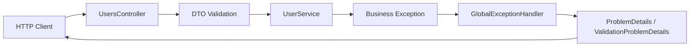

ภาคนี้ทำให้ API แข็งแรงขึ้น โดยตรวจ request ที่เข้ามาและจัดการ error แบบรวมศูนย์

หลังจบภาคฐานข้อมูล API ของเราบันทึกข้อมูลลง SQL Server ได้แล้ว แต่ยังมีปัญหาที่ระบบจริงต้องแก้ เช่น email ผิดรูปแบบ, request body ว่าง, email ซ้ำ, database error และ exception ที่ไม่ควรถูกส่งเป็น stack trace ให้ client เห็น

## วิธีเรียนภาคนี้

ภาคนี้มีทั้ง validation rule, exception class, middleware และ response format ให้ทำทีละชั้น:

1. เริ่มจาก validation ที่ DTO ก่อน
2. แยก custom validation ที่ตรวจรูปแบบ input
3. ย้าย business error ไปให้ service โยน exception
4. ให้ global exception handler แปลง exception เป็น response
5. ปรับ error response ให้ frontend ใช้งานต่อได้ง่าย
6. ทดสอบ status code ด้วย `.http`

อย่าเริ่มจากการคัดลอก handler ทั้งไฟล์ ให้เข้าใจก่อนว่า error แต่ละชนิดเกิดที่ชั้นไหนและควรถูกแปลงเป็น HTTP response แบบใด

ถ้าเครื่องของคุณใช้ port ไม่ตรงกับตัวอย่าง ให้ใช้ port ที่ `dotnet run` หรือ Visual Studio แสดงจริง เช่น `http://localhost:<http-port>` หรือ `https://localhost:<https-port>`

ตัวอย่าง `.http` ในภาคนี้จะใช้ตัวแปรสองตัว:

```http
@baseUrl = http://localhost:<http-port>
@usersPath = /api/v1/users
```

หนังสือเล่มนี้ใช้ route หลักเป็น `/api/v1/users` เพื่อให้ผู้เรียนโฟกัสเรื่อง validation และ error handling ก่อน ถ้าได้ `404 Not Found` จาก request ที่ควรเข้า endpoint ให้ตรวจว่า `@usersPath` ตรงกับ `[Route("api/v1/[controller]")]` ใน `UsersController`

## บทในภาคนี้

- บทที่ 23: Validation ด้วย Data Annotations
- บทที่ 24: Custom Validation
- บทที่ 25: Global Exception Handler
- บทที่ 26: Error Response Format
- บทที่ 27: เลือกใช้ HTTP Status Code ให้ถูกต้อง

## สิ่งที่ต้องได้หลังจบภาคนี้

- DTO ตรวจ input ด้วย Data Annotations ได้
- API ตอบ `400 Bad Request` อัตโนมัติเมื่อ request ไม่ผ่าน validation
- มี custom validation rule สำหรับ rule ที่ attribute พื้นฐานไม่พอ
- มี exception handler กลาง ไม่ต้องใส่ `try-catch` ซ้ำใน Controller
- Error response มีรูปแบบสม่ำเสมอและมี `code` ให้ frontend ใช้ต่อได้
- เลือก status code หลัก ๆ สำหรับ CRUD, validation และ business error ได้ถูกต้อง

## ภาพรวม flow หลังจบภาคนี้



## แนวคิดสำคัญ

Validation คือการกัน request ที่ผิดตั้งแต่ขอบของระบบ ส่วน error handling คือการแปลงปัญหาที่เกิดระหว่างทำงานให้เป็น response ที่ client เข้าใจได้

ทั้งสองเรื่องนี้ควรทำให้เป็นระบบตั้งแต่ต้น เพราะถ้าปล่อยให้ Controller แต่ละตัวตอบ error คนละรูปแบบ เมื่อโปรเจกต์โตขึ้น frontend และ tester จะทำงานยากทันที

## Checklist หลังจบภาคนี้

- `dotnet build` ผ่าน
- `POST /api/v1/users` ด้วย email ผิดรูปแบบตอบ `400 Bad Request`
- validation error มี `code = VALIDATION_FAILED` และมี `traceId`
- `GET /api/v1/users/999999` ตอบ `404 Not Found` พร้อม `code = USER_NOT_FOUND`
- email ซ้ำตอบ `409 Conflict` พร้อม `code = EMAIL_ALREADY_EXISTS`
- Controller ไม่สร้าง error object เองหลายรูปแบบ
- API ไม่ส่ง stack trace หรือ exception detail ที่ไม่จำเป็นกลับไปหา client
