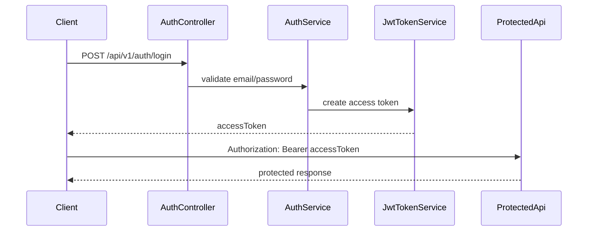

JWT คือ token ที่ client แนบมากับ request เพื่อบอก API ว่าผู้ใช้คือใครและมี role อะไร

บทนี้เราจะทำสองเรื่องพร้อมกัน:

- สร้าง JWT token ตอน login สำเร็จ
- ตั้งค่า ASP.NET Core ให้ validate token ที่ client ส่งกลับมา

ภาพรวม login และการใช้ JWT:



## วิธีเรียนบทนี้

บทนี้มีหลายชิ้น ให้ทำทีละรอบ:

1. ติดตั้ง JWT Bearer package
2. เพิ่ม config `Jwt` ใน `appsettings.json`
3. สร้าง `JwtOptions`
4. สร้าง `JwtTokenService`
5. ให้ `AuthService` ใช้ token service
6. ตั้งค่า authentication middleware
7. ทดสอบ login ว่าได้ JWT จริง

## ก่อนเริ่มบทนี้

ให้ตรวจว่าคุณมี `AuthService.LoginAsync` ที่ตรวจ email/password ได้แล้ว และตอนนี้ยังคืน temporary token จากบทก่อนหน้า

## สิ่งที่จะใช้ในบทนี้

| สิ่งที่จะใช้ | ความหมาย |
| --- | --- |
| JWT | token ที่บรรจุ claims และถูก sign ด้วย key |
| claim | ข้อมูลชิ้นเล็กใน token เช่น user id, email, role |
| issuer | ระบบที่ออก token |
| audience | client หรือ API ที่ token นี้ตั้งใจให้ใช้ |
| signing key | secret key ที่ใช้ sign token |
| `JwtBearer` | authentication handler สำหรับอ่าน Bearer token |
| `TokenValidationParameters` | rules สำหรับ validate token |

## หลังจบบทนี้ ไฟล์ที่เปลี่ยน

```text
Backend.Api.csproj
appsettings.json
Options/JwtOptions.cs
Services/JwtTokenService.cs
Services/AuthService.cs
Program.cs
```

เมื่อจบบทนี้ login จะได้ JWT จริง แต่ endpoint อื่นจะยังไม่ถูกบังคับ login จนกว่าจะเพิ่ม `[Authorize]` ในบทถัดไป

## ขั้นที่ 1: ติดตั้ง JWT Bearer package

รันคำสั่งนี้ที่ root ของโปรเจกต์ `Backend.Api`

```powershell
dotnet add package Microsoft.AspNetCore.Authentication.JwtBearer --version 10.0.9
```

package นี้ใช้สำหรับ validate JWT bearer token ใน ASP.NET Core

ให้ใช้ package major version ที่ตรงกับ `TargetFramework` ของโปรเจกต์ เช่น `net10.0` ใช้ package ตระกูล `10.x` ถ้าอนาคต template ของคุณใช้ .NET รุ่นใหม่กว่า ให้เลือก version ที่ตรงกับ framework นั้น

## ขั้นที่ 2: เพิ่ม JWT configuration

เปิด `appsettings.json` แล้วเพิ่ม section `Jwt`

```json
{
  "Jwt": {
    "Issuer": "Backend.Api",
    "Audience": "Backend.ApiClient",
    "SigningKey": "change-this-development-key-at-least-32-bytes",
    "ExpirationMinutes": 60
  }
}
```

ถ้าไฟล์มี key อื่นอยู่แล้ว ให้รวม `Jwt` เข้าไปใน object เดิม ไม่ต้องสร้าง JSON ซ้อนสองชุด

`SigningKey` ต้องยาวพอและต้องเก็บเป็น secret ใน production อย่าใช้ค่าตัวอย่างนี้ในระบบจริง

ในบทนี้ใส่ค่าไว้ใน `appsettings.json` เพื่อให้เรียนต่อได้ง่ายในเครื่อง local เท่านั้น ถ้าต้องการเลี่ยงการ commit key ลงไฟล์ config ให้ใช้ user secrets แทน:

```powershell
dotnet user-secrets init
dotnet user-secrets set "Jwt:SigningKey" "replace-with-local-development-signing-key-at-least-32-bytes"
```

บน production ให้ใช้ environment variable หรือ secret manager เช่น `Jwt__SigningKey` ไม่ควรใช้ key ตัวอย่างจากหนังสือ

## ขั้นที่ 3: สร้าง JwtOptions

รันจากโฟลเดอร์ `Backend.Api`

Windows PowerShell:

```powershell
New-Item -ItemType Directory -Force -Path Options
New-Item -ItemType File -Path Options/JwtOptions.cs
```

macOS/Linux Bash:

```bash
mkdir -p Options
touch Options/JwtOptions.cs
```

เปิดไฟล์:

```text
Options/JwtOptions.cs
```

เพิ่ม code นี้:

```csharp
namespace Backend.Api.Options;

public class JwtOptions
{
    public string Issuer { get; set; } = string.Empty;
    public string Audience { get; set; } = string.Empty;
    public string SigningKey { get; set; } = string.Empty;
    public int ExpirationMinutes { get; set; } = 60;
}
```

class นี้ใช้ bind ค่า `Jwt` จาก `appsettings.json` ให้เป็น object ที่ code ใช้งานได้

## ขั้นที่ 4: สร้าง JwtTokenService

รันจากโฟลเดอร์ `Backend.Api`

Windows PowerShell:

```powershell
New-Item -ItemType File -Path Services/JwtTokenService.cs
```

macOS/Linux Bash:

```bash
touch Services/JwtTokenService.cs
```

เปิดไฟล์:

```text
Services/JwtTokenService.cs
```

เริ่มจาก using และ class:

```csharp
using System.IdentityModel.Tokens.Jwt;
using System.Security.Claims;
using System.Text;
using Microsoft.Extensions.Options;
using Microsoft.IdentityModel.Tokens;
using Backend.Api.Dtos.Auth;
using Backend.Api.Models;
using Backend.Api.Options;

namespace Backend.Api.Services;

public class JwtTokenService(IOptions<JwtOptions> jwtOptions)
{
}
```

## ขั้นที่ 5: เพิ่ม method GenerateLoginResponse

เพิ่ม method นี้ใน `JwtTokenService`

```csharp
public LoginResponse GenerateLoginResponse(User user)
{
    var options = jwtOptions.Value;
    var expiresAtUtc = DateTime.UtcNow.AddMinutes(options.ExpirationMinutes);
```

เพิ่ม signing key และ credentials:

```csharp
    var signingKey = new SymmetricSecurityKey(
        Encoding.UTF8.GetBytes(options.SigningKey));

    var credentials = new SigningCredentials(
        signingKey,
        SecurityAlgorithms.HmacSha256);
```

`SymmetricSecurityKey` ใช้ secret key เดียวกันทั้งตอน sign และตอน validate token

## ขั้นที่ 6: เพิ่ม claims

เพิ่ม claims ใน method เดิม:

```csharp
    var claims = new List<Claim>
    {
        new(JwtRegisteredClaimNames.Sub, user.Id.ToString()),
        new(JwtRegisteredClaimNames.Email, user.Email),
        new("role", user.Role)
    };
```

claim ที่ใช้ในหนังสือนี้:

- `sub` คือ user id
- `email` คือ email ของ user
- `role` คือ role สำหรับ authorization

JWT payload อ่านได้จากฝั่ง client จึงห้ามใส่ password, password hash, signing key หรือข้อมูลลับอื่นลงใน claim

## ขั้นที่ 7: สร้าง token และ response

เพิ่ม code นี้ต่อจาก claims:

```csharp
    var token = new JwtSecurityToken(
        issuer: options.Issuer,
        audience: options.Audience,
        claims: claims,
        expires: expiresAtUtc,
        signingCredentials: credentials);

    var accessToken = new JwtSecurityTokenHandler().WriteToken(token);

    return new LoginResponse
    {
        AccessToken = accessToken,
        TokenType = "Bearer",
        ExpiresIn = options.ExpirationMinutes * 60
    };
}
```

`WriteToken` แปลง token object ให้เป็น string ที่ client เอาไปใส่ใน `Authorization: Bearer ...` ได้

## ขั้นที่ 8: ลงทะเบียน JwtOptions และ JwtTokenService

เปิด `Program.cs` แล้วเพิ่ม using:

```csharp
using System.IdentityModel.Tokens.Jwt;
using System.Text;
using Microsoft.AspNetCore.Authentication.JwtBearer;
using Microsoft.IdentityModel.Tokens;
using Backend.Api.Options;
```

เพิ่ม code หลังสร้าง `builder`:

```csharp
var jwtOptions = builder.Configuration.GetSection("Jwt").Get<JwtOptions>()
    ?? throw new InvalidOperationException("Jwt options not found.");

if (string.IsNullOrWhiteSpace(jwtOptions.SigningKey) ||
    Encoding.UTF8.GetByteCount(jwtOptions.SigningKey) < 32)
{
    throw new InvalidOperationException("Jwt signing key must be at least 32 bytes.");
}
```

จากนั้น bind options และลงทะเบียน service:

```csharp
builder.Services.Configure<JwtOptions>(
    builder.Configuration.GetSection("Jwt"));

builder.Services.AddScoped<JwtTokenService>();
```

## ขั้นที่ 9: Inject JwtTokenService เข้า AuthService

เปิด `AuthService.cs` แล้วแก้ constructor ให้รับ `JwtTokenService`

```csharp
public class AuthService(
    IUserRepository userRepository,
    IPasswordHasher<User> passwordHasher,
    JwtTokenService jwtTokenService)
```

จากนั้นแก้ท้าย method `LoginAsync` จาก temporary token:

```csharp
return new LoginResponse
{
    AccessToken = "temporary-token-created-in-next-chapter",
    TokenType = "Bearer",
    ExpiresIn = 0
};
```

เป็น JWT response จริง:

```csharp
return jwtTokenService.GenerateLoginResponse(user);
```

## ขั้นที่ 10: ตั้งค่า Authentication

เพิ่ม code นี้ใน `Program.cs`

```csharp
builder.Services
    .AddAuthentication(JwtBearerDefaults.AuthenticationScheme)
    .AddJwtBearer(options =>
    {
        options.MapInboundClaims = false;
        options.TokenValidationParameters = new TokenValidationParameters
        {
            ValidateIssuer = true,
            ValidateAudience = true,
            ValidateLifetime = true,
            ValidateIssuerSigningKey = true,
            ValidIssuer = jwtOptions.Issuer,
            ValidAudience = jwtOptions.Audience,
            IssuerSigningKey = new SymmetricSecurityKey(
                Encoding.UTF8.GetBytes(jwtOptions.SigningKey)),
            ClockSkew = TimeSpan.Zero,
            NameClaimType = JwtRegisteredClaimNames.Sub,
            RoleClaimType = "role"
        };
    });

builder.Services.AddAuthorization();
```

`MapInboundClaims = false` ทำให้ claim ที่เราใส่ไว้ เช่น `sub`, `email`, `role` ไม่ถูกแปลงชื่ออัตโนมัติ

`RoleClaimType = "role"` ทำให้ `[Authorize(Roles = "Admin")]` ใช้ claim ชื่อ `role` ได้

## ขั้นที่ 11: เพิ่ม middleware

หลัง `app.UseHttpsRedirection();` ให้เพิ่ม:

```csharp
app.UseAuthentication();
app.UseAuthorization();
```

ลำดับต้องเป็น `UseAuthentication()` ก่อน `UseAuthorization()`

ตำแหน่งโดยรวมจะประมาณนี้:

```csharp
app.UseHttpsRedirection();

app.UseAuthentication();
app.UseAuthorization();

app.MapControllers();
```

## ตรวจ build

รันจากโฟลเดอร์ `Backend.Api`

```powershell
dotnet build
```

ถ้าได้ error เรื่อง signing key สั้นเกินไป ให้ตรวจค่า `Jwt:SigningKey` ใน `appsettings.json`

## ทดสอบ login

รัน API:

```powershell
dotnet run
```

ส่ง request login ด้วย user จาก seed data:

```http
@baseUrl = http://localhost:<http-port>
@authPath = /api/v1/auth

### Login
POST {{baseUrl}}{{authPath}}/login
Content-Type: application/json

{
  "email": "demo-user@example.com",
  "password": "User1234!"
}
```

ผลลัพธ์ที่คาดหวังคือ `200 OK` พร้อม `accessToken` ที่เป็น JWT จริง

JWT string จะมี 3 ส่วนคั่นด้วยจุด `.` เช่น:

```text
header.payload.signature
```

ถ้า `accessToken` ยังเป็น `temporary-token-created-in-next-chapter` แปลว่ายังไม่ได้แก้ `AuthService.LoginAsync` ให้เรียก `jwtTokenService.GenerateLoginResponse(user)`

ให้ copy ค่า `accessToken` ไว้ใช้เป็น `@token` ในบทถัดไป

## Checkpoint

ก่อนอ่านบทต่อไป ให้ตรวจว่าทำได้ครบตามนี้

- ติดตั้ง `Microsoft.AspNetCore.Authentication.JwtBearer`
- มี `JwtOptions`
- มี `JwtTokenService`
- signing key ยาวอย่างน้อย 32 bytes และไม่ใช้ค่าตัวอย่างใน production
- `Program.cs` ตั้งค่า `AddAuthentication().AddJwtBearer(...)`
- middleware เรียก `UseAuthentication()` ก่อน `UseAuthorization()`
- login สำเร็จแล้วได้ `accessToken`
