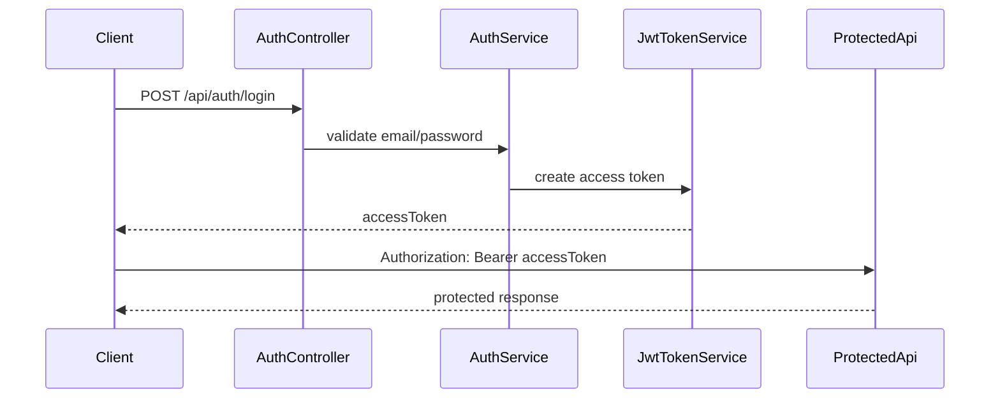

---
title: 31 - สร้าง JWT Token
description: สร้าง access token พร้อม claims และตั้งค่า JWT Bearer authentication
---

JWT คือ token ที่ client แนบมากับ request เพื่อบอก API ว่าผู้ใช้คือใครและมี role อะไร

บทนี้เราจะทำสองเรื่องพร้อมกัน

- สร้าง JWT token ตอน login สำเร็จ
- ตั้งค่า ASP.NET Core ให้ validate token ที่ client ส่งกลับมา

ภาพรวม login และการใช้ JWT:



## ก่อนเริ่มบทนี้

ให้ตรวจว่าคุณมี `AuthService.LoginAsync` ที่ตรวจ email/password ได้แล้ว และตอนนี้ยังคืน temporary token จากบทก่อนหน้า

บทนี้ต้องแก้ทั้ง `AuthService`, เพิ่ม `JwtTokenService`, เพิ่ม config ใน `appsettings.json` และตั้งค่า authentication middleware ใน `Program.cs`

## คำศัพท์ในบทนี้

`Claim` คือข้อมูลชิ้นเล็ก ๆ ใน token เช่น user id, email หรือ role ฝั่ง API จะอ่าน claim เพื่อรู้ว่า request นี้มาจากผู้ใช้คนไหน

`Middleware` คือ code ใน HTTP pipeline ที่ทำงานระหว่างรับ request และส่ง response เช่น authentication middleware จะอ่าน `Authorization` header แล้ว validate token ก่อน request ไปถึง controller ที่ถูกป้องกัน

## หลังจบบทนี้ ไฟล์ที่เปลี่ยน

```text
Backend.Api.csproj
appsettings.json
Options/JwtOptions.cs
Services/JwtTokenService.cs
Services/AuthService.cs
Program.cs
```

เมื่อจบบทนี้ login จะได้ JWT จริง แต่ endpoint อื่นจะยังไม่ถูกบังคับ login จนกว่าจะเพิ่ม `[Authorize]` ในบทถัดไป

## ติดตั้ง JWT Bearer package

รันคำสั่งนี้ที่ root ของโปรเจกต์ `Backend.Api`

```powershell
dotnet add package Microsoft.AspNetCore.Authentication.JwtBearer --version 10.0.9
```

package นี้ใช้สำหรับ validate JWT bearer token ใน ASP.NET Core

## เพิ่ม JWT configuration

เปิด `appsettings.json` แล้วเพิ่ม section `Jwt`

```json
{
  "Jwt": {
    "Issuer": "Backend.Api",
    "Audience": "Backend.ApiClient",
    "SigningKey": "change-this-development-key-at-least-32-characters",
    "ExpirationMinutes": 60
  }
}
```

ถ้าไฟล์มี key อื่นอยู่แล้ว ให้รวม `Jwt` เข้าไปใน object เดิม

`SigningKey` ต้องยาวพอและต้องเก็บเป็น secret ใน production อย่าใช้ค่าตัวอย่างนี้ในระบบจริง

## สร้าง JwtOptions

สร้างโฟลเดอร์

```text
Options/
```

สร้างไฟล์

```text
Options/JwtOptions.cs
```

เพิ่ม code นี้

```csharp
namespace Backend.Api.Options;

public class JwtOptions
{
    public string Issuer { get; set; } = string.Empty;
    public string Audience { get; set; } = string.Empty;
    public string SigningKey { get; set; } = string.Empty;
    public int ExpirationMinutes { get; set; } = 60;
}
```

## สร้าง JwtTokenService

สร้างไฟล์

```text
Services/JwtTokenService.cs
```

เพิ่ม code นี้

```csharp
using System.IdentityModel.Tokens.Jwt;
using System.Security.Claims;
using System.Text;
using Microsoft.Extensions.Options;
using Microsoft.IdentityModel.Tokens;
using Backend.Api.Dtos.Auth;
using Backend.Api.Models;
using Backend.Api.Options;

namespace Backend.Api.Services;

public class JwtTokenService(IOptions<JwtOptions> jwtOptions)
{
    public LoginResponse GenerateLoginResponse(User user)
    {
        var options = jwtOptions.Value;
        var expiresAtUtc = DateTime.UtcNow.AddMinutes(options.ExpirationMinutes);

        var signingKey = new SymmetricSecurityKey(
            Encoding.UTF8.GetBytes(options.SigningKey));

        var credentials = new SigningCredentials(
            signingKey,
            SecurityAlgorithms.HmacSha256);

        var claims = new List<Claim>
        {
            new(JwtRegisteredClaimNames.Sub, user.Id.ToString()),
            new(JwtRegisteredClaimNames.Email, user.Email),
            new("role", user.Role)
        };

        var token = new JwtSecurityToken(
            issuer: options.Issuer,
            audience: options.Audience,
            claims: claims,
            expires: expiresAtUtc,
            signingCredentials: credentials);

        var accessToken = new JwtSecurityTokenHandler().WriteToken(token);

        return new LoginResponse
        {
            AccessToken = accessToken,
            TokenType = "Bearer",
            ExpiresIn = options.ExpirationMinutes * 60
        };
    }
}
```

## ลงทะเบียน JwtOptions และ JwtTokenService

เปิด `Program.cs` แล้วเพิ่ม using

```csharp
using System.IdentityModel.Tokens.Jwt;
using System.Text;
using Microsoft.AspNetCore.Authentication.JwtBearer;
using Microsoft.IdentityModel.Tokens;
using Backend.Api.Options;
```

เพิ่ม code หลังสร้าง `builder`

```csharp
var jwtOptions = builder.Configuration.GetSection("Jwt").Get<JwtOptions>()
    ?? throw new InvalidOperationException("Jwt options not found.");

if (string.IsNullOrWhiteSpace(jwtOptions.SigningKey) ||
    jwtOptions.SigningKey.Length < 32)
{
    throw new InvalidOperationException("Jwt signing key must be at least 32 characters.");
}

builder.Services.Configure<JwtOptions>(
    builder.Configuration.GetSection("Jwt"));

builder.Services.AddScoped<JwtTokenService>();
```

## Inject JwtTokenService เข้า AuthService

เปิด `AuthService.cs` แล้วแก้ constructor ให้รับ `JwtTokenService`

```csharp
public class AuthService(
    IUserRepository userRepository,
    IPasswordHasher<User> passwordHasher,
    JwtTokenService jwtTokenService)
```

จากนั้นแก้ท้าย method `LoginAsync` จาก temporary token

```csharp
return new LoginResponse
{
    AccessToken = "temporary-token-created-in-next-chapter",
    TokenType = "Bearer",
    ExpiresIn = 0
};
```

เป็น JWT response จริง

```csharp
return jwtTokenService.GenerateLoginResponse(user);
```

## ตั้งค่า Authentication

เพิ่ม code นี้ใน `Program.cs`

```csharp
builder.Services
    .AddAuthentication(JwtBearerDefaults.AuthenticationScheme)
    .AddJwtBearer(options =>
    {
        options.MapInboundClaims = false;
        options.TokenValidationParameters = new TokenValidationParameters
        {
            ValidateIssuer = true,
            ValidateAudience = true,
            ValidateLifetime = true,
            ValidateIssuerSigningKey = true,
            ValidIssuer = jwtOptions.Issuer,
            ValidAudience = jwtOptions.Audience,
            IssuerSigningKey = new SymmetricSecurityKey(
                Encoding.UTF8.GetBytes(jwtOptions.SigningKey)),
            ClockSkew = TimeSpan.Zero,
            NameClaimType = JwtRegisteredClaimNames.Sub,
            RoleClaimType = "role"
        };
    });

builder.Services.AddAuthorization();
```

`MapInboundClaims = false` ทำให้ claim ที่เราใส่ไว้ เช่น `sub`, `email`, `role` ไม่ถูกแปลงชื่ออัตโนมัติ ทำให้เวลาอ่าน claim ในบทถัดไปตรงไปตรงมากว่า

`RoleClaimType = "role"` ทำให้ `[Authorize(Roles = "Admin")]` ใช้ claim ชื่อ `role` ได้

## เพิ่ม middleware

หลัง `app.UseHttpsRedirection();` ให้เพิ่ม

```csharp
app.UseAuthentication();
app.UseAuthorization();
```

ลำดับต้องเป็น `UseAuthentication()` ก่อน `UseAuthorization()`

ตำแหน่งโดยรวมจะประมาณนี้

```csharp
app.UseHttpsRedirection();

app.UseAuthentication();
app.UseAuthorization();

app.MapControllers();
```

## ทดสอบ login

รัน API

```powershell
dotnet run
```

ส่ง request login ด้วย user จาก seed data

```http
POST https://localhost:7001/api/auth/login
Content-Type: application/json

{
  "email": "demo-user@example.com",
  "password": "User1234!"
}
```

ผลลัพธ์ที่คาดหวังคือ `200 OK` พร้อม `accessToken`

## ถ้าได้ error signing key

ถ้าเจอ error เรื่อง key สั้นเกินไป ให้ตรวจค่า `Jwt:SigningKey` ใน `appsettings.json`

สำหรับ HMAC SHA-256 ควรใช้ key ที่ยาวพอ อย่างน้อย 32 characters สำหรับบทเรียนนี้

## Checkpoint

ก่อนอ่านบทต่อไป ให้ตรวจว่าทำได้ครบตามนี้

- ติดตั้ง `Microsoft.AspNetCore.Authentication.JwtBearer`
- มี `JwtOptions`
- มี `JwtTokenService`
- `Program.cs` ตั้งค่า `AddAuthentication().AddJwtBearer(...)`
- middleware เรียก `UseAuthentication()` ก่อน `UseAuthorization()`
- login สำเร็จแล้วได้ `accessToken`
