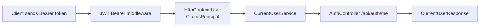

---
title: 32 - อ่านข้อมูลผู้ใช้ปัจจุบันจาก Token
description: ดึง user id, email และ role จาก claims ใน JWT
---

เมื่อ client แนบ JWT มากับ request และ token ผ่านการ validate แล้ว ASP.NET Core จะสร้าง `ClaimsPrincipal` ไว้ใน `HttpContext.User`

บทนี้เราจะสร้าง `CurrentUserService` เพื่ออ่านข้อมูลผู้ใช้ปัจจุบันจาก claims โดยไม่ต้องเขียน code ซ้ำใน Controller ทุกตัว

ภาพรวมการอ่าน current user จาก token:



## รูปแบบ Authorization header

client ต้องส่ง header แบบนี้

```http
Authorization: Bearer jwt-token-here
```

คำว่า `Bearer` ต้องมี และต้องมีช่องว่างก่อน token

## สร้าง CurrentUserService

สร้างไฟล์

```text
Services/CurrentUserService.cs
```

เพิ่ม code นี้

```csharp
using System.IdentityModel.Tokens.Jwt;
using System.Security.Claims;

namespace Backend.Api.Services;

public class CurrentUserService(IHttpContextAccessor httpContextAccessor)
{
    private ClaimsPrincipal? User => httpContextAccessor.HttpContext?.User;

    public bool IsAuthenticated =>
        User?.Identity?.IsAuthenticated == true;

    public int? UserId
    {
        get
        {
            var value = User?.FindFirstValue(JwtRegisteredClaimNames.Sub);

            return int.TryParse(value, out var userId) ? userId : null;
        }
    }

    public string? Email =>
        User?.FindFirstValue(JwtRegisteredClaimNames.Email);

    public string? Role =>
        User?.FindFirstValue("role");
}
```

## ลงทะเบียน CurrentUserService

เปิด `Program.cs` แล้วเพิ่ม

```csharp
builder.Services.AddHttpContextAccessor();
builder.Services.AddScoped<CurrentUserService>();
```

`AddHttpContextAccessor()` ทำให้ service อ่าน `HttpContext` ปัจจุบันได้

## เพิ่ม endpoint GET /api/auth/me

แก้ constructor ของ `AuthController`

```csharp
public class AuthController(
    AuthService authService,
    CurrentUserService currentUserService) : ControllerBase
```

เพิ่ม using

```csharp
using Microsoft.AspNetCore.Authorization;
```

เพิ่ม action นี้

```csharp
[Authorize]
[HttpGet("me")]
public IActionResult Me()
{
    if (!currentUserService.IsAuthenticated ||
        currentUserService.UserId is null ||
        currentUserService.Email is null ||
        currentUserService.Role is null)
    {
        throw new UnauthorizedException(
            "Invalid token",
            "INVALID_TOKEN");
    }

    return Ok(new CurrentUserResponse
    {
        Id = currentUserService.UserId.Value,
        Email = currentUserService.Email,
        Role = currentUserService.Role
    });
}
```

อย่าลืมเพิ่ม using สำหรับ exception ถ้ายังไม่มี

```csharp
using Backend.Api.Exceptions;
```

## ทดสอบ endpoint me

เรียก login ก่อน แล้ว copy token จาก `accessToken`

```http
@baseUrl = https://localhost:7001
@token = paste-token-here

GET {{baseUrl}}/api/auth/me
Authorization: Bearer {{token}}
Accept: application/json
```

ผลลัพธ์ที่คาดหวังคือข้อมูลผู้ใช้ที่อยู่ใน token

```json
{
  "id": 1,
  "email": "demo-user@example.com",
  "role": "User"
}
```

## ถ้าไม่ได้ส่ง token

ลองเรียก endpoint เดิมโดยไม่ส่ง Authorization header

```http
GET {{baseUrl}}/api/auth/me
Accept: application/json
```

ผลลัพธ์ที่คาดหวังคือ `401 Unauthorized`

## Checkpoint

ก่อนอ่านบทต่อไป ให้ตรวจว่าทำได้ครบตามนี้

- มี `CurrentUserService`
- ลงทะเบียน `AddHttpContextAccessor`
- `GET /api/auth/me` ใช้ `[Authorize]`
- ส่ง token แล้วได้ข้อมูล user ปัจจุบัน
- ไม่ส่ง token แล้วได้ `401 Unauthorized`
