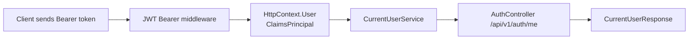

เมื่อ client แนบ JWT มากับ request และ token ผ่านการ validate แล้ว ASP.NET Core จะสร้าง `ClaimsPrincipal` ไว้ใน `HttpContext.User`

บทนี้เราจะสร้าง `CurrentUserService` เพื่ออ่านข้อมูลผู้ใช้ปัจจุบันจาก claims โดยไม่ต้องเขียน code ซ้ำใน Controller ทุกตัว

ภาพรวมการอ่าน current user จาก token:



## วิธีเรียนบทนี้

ให้ทำตามลำดับนี้:

1. เข้าใจรูปแบบ `Authorization` header
2. สร้าง `CurrentUserService`
3. ลงทะเบียน `HttpContextAccessor`
4. เพิ่ม `GET /api/v1/auth/me`
5. ทดสอบด้วย token และไม่ส่ง token

## สิ่งที่จะใช้ในบทนี้

| สิ่งที่จะใช้ | ความหมาย |
| --- | --- |
| `Authorization` header | header ที่ client ใช้ส่ง token |
| `Bearer` | scheme ของ access token |
| `ClaimsPrincipal` | object ที่แทนผู้ใช้หลัง token ถูก validate |
| `FindFirstValue(...)` | อ่านค่า claim ตามชื่อ |
| `IHttpContextAccessor` | service ที่ช่วยอ่าน `HttpContext` ใน service |
| `[Authorize]` | บังคับให้ endpoint ต้องมี token ที่ valid |

## หลังจบบทนี้ ไฟล์ที่เปลี่ยน

```text
Services/CurrentUserService.cs
Controllers/AuthController.cs
Program.cs
```

## รูปแบบ Authorization header

client ต้องส่ง header แบบนี้:

```http
Authorization: Bearer jwt-token-here
```

คำว่า `Bearer` ต้องมี และต้องมีช่องว่างก่อน token

## ขั้นที่ 1: สร้าง CurrentUserService

รันจากโฟลเดอร์ `Backend.Api`

Windows PowerShell:

```powershell
New-Item -ItemType File -Path Services/CurrentUserService.cs
```

macOS/Linux Bash:

```bash
touch Services/CurrentUserService.cs
```

เปิดไฟล์:

```text
Services/CurrentUserService.cs
```

เริ่มจาก using และ class:

```csharp
using System.IdentityModel.Tokens.Jwt;
using System.Security.Claims;

namespace Backend.Api.Services;

public class CurrentUserService(IHttpContextAccessor httpContextAccessor)
{
    private ClaimsPrincipal? User => httpContextAccessor.HttpContext?.User;
}
```

`HttpContext.User` คือผู้ใช้ที่ authentication middleware สร้างจาก JWT

## ขั้นที่ 2: เพิ่ม IsAuthenticated

เพิ่ม property นี้ใน class:

```csharp
public bool IsAuthenticated =>
    User?.Identity?.IsAuthenticated == true;
```

property นี้ใช้เช็กว่ามี user ที่ผ่าน authentication แล้วหรือไม่

## ขั้นที่ 3: อ่าน user id จาก sub claim

เพิ่ม property นี้:

```csharp
public int? UserId
{
    get
    {
        var value = User?.FindFirstValue(JwtRegisteredClaimNames.Sub);

        return int.TryParse(value, out var userId) ? userId : null;
    }
}
```

`sub` เป็น claim มาตรฐานที่เราใช้เก็บ user id ตอนสร้าง JWT

## ขั้นที่ 4: อ่าน email และ role

เพิ่ม property เหล่านี้:

```csharp
public string? Email =>
    User?.FindFirstValue(JwtRegisteredClaimNames.Email);

public string? Role =>
    User?.FindFirstValue("role");
```

ชื่อ claim ต้องตรงกับตอนสร้าง token ใน `JwtTokenService`

## ขั้นที่ 5: ลงทะเบียน CurrentUserService

เปิด `Program.cs` แล้วเพิ่มก่อน `builder.Build()`:

```csharp
builder.Services.AddHttpContextAccessor();
builder.Services.AddScoped<CurrentUserService>();
```

`AddHttpContextAccessor()` ทำให้ service อ่าน `HttpContext` ปัจจุบันได้

## ขั้นที่ 6: เพิ่ม CurrentUserService เข้า AuthController

เปิด `Controllers/AuthController.cs`

แก้ constructor:

```csharp
public class AuthController(
    AuthService authService,
    CurrentUserService currentUserService) : ControllerBase
```

เพิ่ม using:

```csharp
using Microsoft.AspNetCore.Authorization;
using Backend.Api.Exceptions;
```

## ขั้นที่ 7: เพิ่ม endpoint GET /api/v1/auth/me

เพิ่ม action นี้ใน `AuthController`

```csharp
[Authorize]
[HttpGet("me")]
public IActionResult Me()
{
    if (!currentUserService.IsAuthenticated ||
        currentUserService.UserId is null ||
        currentUserService.Email is null ||
        currentUserService.Role is null)
    {
        throw new UnauthorizedException(
            "Invalid token",
            "INVALID_TOKEN");
    }
```

ต่อด้วย response:

```csharp
    return Ok(new CurrentUserResponse
    {
        Id = currentUserService.UserId.Value,
        Email = currentUserService.Email,
        Role = currentUserService.Role
    });
}
```

`[Authorize]` ทำให้ action นี้ถูกเรียกเฉพาะ request ที่มี token valid แล้ว

## ตรวจ build

รันจากโฟลเดอร์ `Backend.Api`

```powershell
dotnet build
```

ถ้า build error ว่าไม่รู้จัก `[Authorize]` ให้ตรวจ using นี้:

```csharp
using Microsoft.AspNetCore.Authorization;
```

## ทดสอบ endpoint me

เรียก login ก่อน:

```http
@baseUrl = http://localhost:<http-port>
@authPath = /api/v1/auth

### Login
POST {{baseUrl}}{{authPath}}/login
Content-Type: application/json

{
  "email": "demo-user@example.com",
  "password": "User1234!"
}
```

จาก response ให้ copy ค่า `accessToken` แล้วนำมาใส่ในตัวแปร `@token`:

```http
@token = paste-token-here

### Me
GET {{baseUrl}}{{authPath}}/me
Authorization: Bearer {{token}}
Accept: application/json
```

ผลลัพธ์ที่คาดหวังคือข้อมูลผู้ใช้ที่อยู่ใน token:

```json
{
  "id": 1,
  "email": "demo-user@example.com",
  "role": "User"
}
```

ในบทนี้ `me` อ่านข้อมูลจาก claims ใน token เพื่อให้เห็นกลไกของ JWT ให้ชัดก่อน ถ้า user ถูกปิดใช้งานหลังจากออก token แล้ว token เดิมอาจยังมี claim เดิมจนกว่าจะหมดอายุ ในระบบ production มักตรวจ user จาก database เพิ่ม หรือใช้ refresh token/session policy ซึ่งจะต่อยอดในภาค Admin และ production hardening

## ถ้าไม่ได้ส่ง token

ลองเรียก endpoint เดิมโดยไม่ส่ง Authorization header:

```http
GET {{baseUrl}}{{authPath}}/me
Accept: application/json
```

ผลลัพธ์ที่คาดหวังคือ `401 Unauthorized`

ถ้าได้ `401` ทั้งที่ส่ง token แล้ว ให้ตรวจว่า header ต้องเป็น `Authorization: Bearer <token>` และมีช่องว่างระหว่าง `Bearer` กับ token

## Checkpoint

ก่อนอ่านบทต่อไป ให้ตรวจว่าทำได้ครบตามนี้

- มี `CurrentUserService`
- ลงทะเบียน `AddHttpContextAccessor`
- `GET /api/v1/auth/me` ใช้ `[Authorize]`
- ส่ง token แล้วได้ข้อมูล user ปัจจุบัน
- ไม่ส่ง token แล้วได้ `401 Unauthorized`
