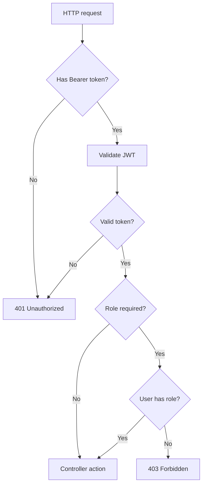

---
title: "33 - ป้องกัน API ด้วย [Authorize]"
description: ใช้ Authorize attribute เพื่อบังคับให้ endpoint ต้อง login และเตรียม role สำหรับภาค Admin
---

หลังจาก API validate JWT ได้แล้ว เราสามารถใช้ `[Authorize]` เพื่อบังคับว่า endpoint นี้ต้อง login ก่อน

ถ้า request ไม่มี token หรือ token ไม่ถูกต้อง ASP.NET Core จะตอบ `401 Unauthorized`

ภาพรวม request ที่ผ่าน `[Authorize]`:



## ป้องกัน UsersController

หลังมีระบบ register แล้ว endpoint สร้างผู้ใช้แบบ public ไม่ควรอยู่ที่ `POST /api/users` อีกต่อไป

ให้เปิด `UsersController.cs` แล้วเพิ่ม using

```csharp
using Microsoft.AspNetCore.Authorization;
```

จากนั้นใส่ `[Authorize]` ที่ระดับ Controller

```csharp
[Authorize]
[ApiController]
[Route("api/[controller]")]
public class UsersController(IUserService userService) : ControllerBase
{
    // actions
}
```

เมื่อใส่ `[Authorize]` ที่ controller ทุก action ใน controller นี้ต้อง login ก่อน

## ควรทำอย่างไรกับ POST /api/users

ในภาคนี้แนะนำให้ลบหรือปิด endpoint `POST /api/users` ชั่วคราว เพราะ public register ถูกย้ายไปที่ `POST /api/auth/register` แล้ว

ถ้ายังเก็บ endpoint นี้ไว้ ให้ถือว่าเป็น endpoint ที่ต้อง login และในภาค Admin เราจะย้าย logic การสร้าง user โดย admin ไปไว้ที่ admin controller แยก

ใน end-state แบบ production-grade ถ้ายังเหลือ `UsersController` จากบท CRUD เดิม ให้จำกัดทั้ง controller เป็น `Admin` หรือถอดออกจาก production API เพื่อป้องกัน user ปกติอ่านหรือแก้ไขข้อมูลผู้ใช้อื่น

## AllowAnonymous ใช้เมื่อไหร่

ถ้า controller ทั้งตัวถูกใส่ `[Authorize]` แต่บาง action ต้องเปิด public ให้ใช้ `[AllowAnonymous]`

ตัวอย่าง

```csharp
[Authorize]
[ApiController]
[Route("api/[controller]")]
public class ExampleController : ControllerBase
{
    [AllowAnonymous]
    [HttpGet("public")]
    public IActionResult Public()
    {
        return Ok();
    }
}
```

ใน `AuthController` ของเราไม่จำเป็นต้องใส่ `[Authorize]` ที่ระดับ controller เพราะ register และ login ต้องเป็น public อยู่แล้ว เราใส่ `[Authorize]` เฉพาะ action `me`

## เตรียม role-based authorization

ตอนสร้าง token เราใส่ claim ชื่อ `role` แล้ว และตั้งค่า `RoleClaimType = "role"` ใน `TokenValidationParameters`

ดังนั้นในภาค Admin เราจะใช้ attribute แบบนี้ได้

```csharp
[Authorize(Roles = "Admin")]
```

ตัวอย่าง endpoint ที่ต้องเป็น Admin

```csharp
[Authorize(Roles = "Admin")]
[HttpGet("admin-only")]
public IActionResult AdminOnly()
{
    return Ok(new { message = "Admin only" });
}
```

ถ้า user login แล้วแต่ role ไม่ใช่ `Admin` API จะตอบ `403 Forbidden`

## ทดสอบ endpoint ที่ถูกป้องกัน

เรียก endpoint โดยไม่ส่ง token

```http
GET {{baseUrl}}/api/users
Accept: application/json
```

ควรได้ `401 Unauthorized`

จากนั้นใส่ token

```http
GET {{baseUrl}}/api/users
Authorization: Bearer {{token}}
Accept: application/json
```

ควรได้ `200 OK`

## เพิ่ม request ใน Backend.Api.http

```http
@baseUrl = https://localhost:7001
@token = paste-token-here

### Register
POST {{baseUrl}}/api/auth/register
Content-Type: application/json

{
  "email": "new-user@example.com",
  "password": "Passw0rd!"
}

### Login
POST {{baseUrl}}/api/auth/login
Content-Type: application/json

{
  "email": "new-user@example.com",
  "password": "Passw0rd!"
}

### Me
GET {{baseUrl}}/api/auth/me
Authorization: Bearer {{token}}
Accept: application/json

### Protected users endpoint
GET {{baseUrl}}/api/users
Authorization: Bearer {{token}}
Accept: application/json
```

## Checkpoint

เมื่อจบภาคนี้ คุณควรทำได้ครบตามนี้

- `AuthController` มี register, login และ me endpoint
- register และ login เปิด public
- me ใช้ `[Authorize]`
- `UsersController` ถูกป้องกันด้วย `[Authorize]`
- ไม่ส่ง token แล้วได้ `401`
- ส่ง token ที่ถูกต้องแล้วเข้า endpoint ที่ต้อง login ได้
- เข้าใจว่า `[Authorize(Roles = "Admin")]` จะใช้ต่อในภาค Admin
