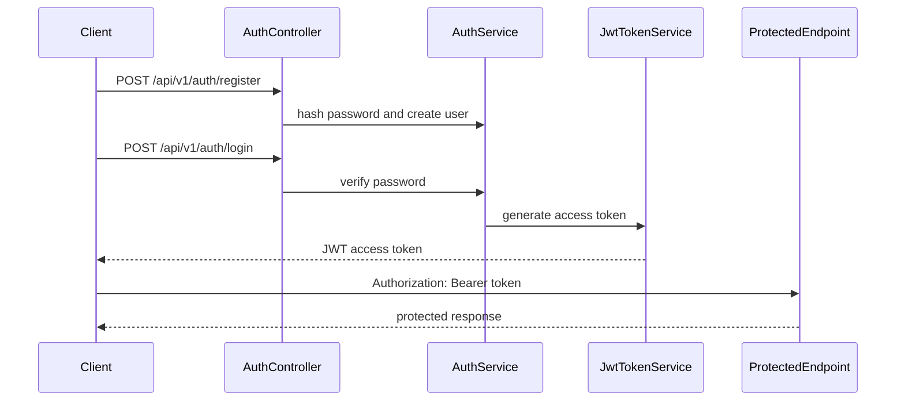

ภาคนี้เพิ่มระบบยืนยันตัวตนให้ API โดยเริ่มจาก register, login, hash password, สร้าง JWT, อ่านข้อมูลผู้ใช้ปัจจุบันจาก token และป้องกัน endpoint ด้วย `[Authorize]`

หลังจบภาคนี้ API จะรู้ว่าผู้เรียกเป็นใคร และสามารถแยก endpoint ที่เปิด public ออกจาก endpoint ที่ต้อง login ได้

## ก่อนเริ่มภาคนี้

ให้ตรวจว่าทำภาค 5 จบแล้ว และโปรเจกต์อยู่ในสถานะนี้:

- `dotnet build` ผ่าน
- มี `User` entity ที่มี `Email`, `PasswordHash`, `Role` และ `IsActive`
- มี `IUserRepository` ที่ค้น user ด้วย email ได้
- มี global error handling ที่คืน `ProblemDetails` พร้อม `code`
- endpoint หลักยังใช้ prefix `/api/v1`

## วิธีเรียนภาคนี้

Authentication มีหลายชิ้นที่เชื่อมกัน ถ้าคัดลอก code ยาวทีเดียวจะ debug ยาก ให้ทำตามลำดับนี้:

1. วาง contract ของ `register`, `login`, `me`
2. hash password ก่อนบันทึก user
3. ตรวจ email/password ตอน login
4. สร้าง JWT access token
5. อ่าน claim จาก token
6. ใส่ `[Authorize]` ป้องกัน endpoint

ทุกครั้งที่เพิ่ม service หรือ controller ใหม่ ให้รัน `dotnet build` ก่อนทดสอบด้วย `.http`

ถ้าเครื่องของคุณใช้ port ไม่ตรงกับตัวอย่าง ให้ใช้ port ที่ `dotnet run` หรือ Visual Studio แสดงจริง เช่น `http://localhost:<http-port>` หรือ `https://localhost:<https-port>`

ตัวอย่าง `.http` ในภาคนี้จะใช้ตัวแปรเหล่านี้:

```http
@baseUrl = http://localhost:<http-port>
@authPath = /api/v1/auth
@usersPath = /api/v1/users
```

หนังสือเล่มนี้ใช้ `/api/v1` เป็น prefix ของ API ตั้งแต่ต้น เพื่อให้ contract ที่ frontend จะใช้ต่อมี version ชัดเจน

`AuthController` ในหนังสือใช้ route คงที่ `/api/v1/auth` จึงให้ `@authPath` เป็น `/api/v1/auth` ตลอดภาคนี้

## ขอบเขตของภาคนี้

ภาคนี้เป็น authentication รุ่นแรกของโปรเจกต์ เพื่อให้เข้าใจ flow หลักก่อน ได้แก่ register, login, JWT access token, current user และ protected endpoint

ถ้าเปิดดู final project หลังเรียนจบทั้งเล่ม คุณอาจเห็น field เพิ่ม เช่น `refreshToken`, `expiresAt`, `isEmailVerified` หรือ `Guid` id สิ่งเหล่านั้นมาจากภาค 9 เรื่อง production hardening ไม่ต้องเพิ่มตั้งแต่ภาคนี้ เพราะจะทำให้ flow auth พื้นฐานใหญ่เกินไป

## บทในภาคนี้

- บทที่ 28: ออกแบบ Register และ Login
- บทที่ 29: Hash Password
- บทที่ 30: สร้าง Login API
- บทที่ 31: สร้าง JWT Token
- บทที่ 32: อ่านข้อมูลผู้ใช้ปัจจุบันจาก Token
- บทที่ 33: ป้องกัน API ด้วย `[Authorize]`

## สิ่งที่ต้องได้หลังจบภาคนี้

- มี DTO สำหรับ register, login และ current user
- password ถูก hash ก่อนบันทึกลง database
- login ตรวจ password ด้วย password hasher
- API สร้าง JWT access token ได้
- client แนบ token ผ่าน `Authorization: Bearer ...` ได้
- endpoint ที่ต้อง login ถูกป้องกันด้วย `[Authorize]`
- อ่าน user id, email และ role จาก token ได้

## ภาพรวม flow หลังจบภาคนี้



## สิ่งที่ภาคนี้ยังไม่ทำ

ภาคนี้ยังไม่ทำ refresh token, forgot password, email confirmation หรือ OAuth login เพราะเรื่องเหล่านี้จะทำให้มือใหม่หลุดจากแกนหลักของ Web API เราจะเน้น access token และ role พื้นฐานก่อน แล้วกลับมายกระดับ refresh token และ security hardening ในภาค 9

## Checkpoint ปิดภาค

ก่อนขึ้นภาค Admin ให้ตรวจอย่างน้อย:

- `POST /api/v1/auth/register` สมัคร user ใหม่ได้
- `POST /api/v1/auth/login` คืน JWT access token จริง
- `GET /api/v1/auth/me` ไม่ส่ง token แล้วได้ `401 Unauthorized`
- `GET /api/v1/auth/me` ส่ง token แล้วได้ email และ role ของ user
- `GET /api/v1/users` ไม่ส่ง token แล้วได้ `401 Unauthorized`
- `GET /api/v1/users` ส่ง token แล้วเข้า endpoint ได้ตามสถานะของบทนี้
