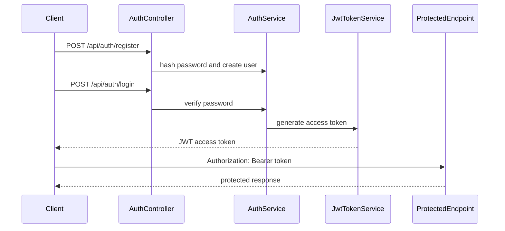

---
title: ภาค 6 - Authentication ด้วย JWT
description: สร้างระบบ register, login, password hash, JWT และป้องกัน endpoint ด้วย Authorize
---

ภาคนี้เพิ่มระบบยืนยันตัวตนให้ API โดยเริ่มจาก register, login, hash password, สร้าง JWT, อ่านข้อมูลผู้ใช้ปัจจุบันจาก token และป้องกัน endpoint ด้วย `[Authorize]`

หลังจบภาคนี้ API จะรู้ว่าผู้เรียกเป็นใคร และสามารถแยก endpoint ที่เปิด public ออกจาก endpoint ที่ต้อง login ได้

## วิธีเรียนภาคนี้

Authentication มีหลายชิ้นที่เชื่อมกัน ถ้าคัดลอก code ยาวทีเดียวจะ debug ยาก ให้ทำตามลำดับนี้:

1. วาง contract ของ `register`, `login`, `me`
2. hash password ก่อนบันทึก user
3. ตรวจ email/password ตอน login
4. สร้าง JWT access token
5. อ่าน claim จาก token
6. ใส่ `[Authorize]` ป้องกัน endpoint

ทุกครั้งที่เพิ่ม service หรือ controller ใหม่ ให้รัน `dotnet build` ก่อนทดสอบด้วย `.http`

ถ้าเครื่องของคุณใช้ port ไม่ตรงกับตัวอย่าง ให้ใช้ port ที่ `dotnet run` หรือ Visual Studio แสดงจริง เช่น `http://localhost:5156` หรือ `https://localhost:7127`

## บทในภาคนี้

- บทที่ 28: ออกแบบ Register และ Login
- บทที่ 29: Hash Password
- บทที่ 30: สร้าง Login API
- บทที่ 31: สร้าง JWT Token
- บทที่ 32: อ่านข้อมูลผู้ใช้ปัจจุบันจาก Token
- บทที่ 33: ป้องกัน API ด้วย `[Authorize]`

## สิ่งที่ต้องได้หลังจบภาคนี้

- มี DTO สำหรับ register, login และ current user
- password ถูก hash ก่อนบันทึกลง database
- login ตรวจ password ด้วย password hasher
- API สร้าง JWT access token ได้
- client แนบ token ผ่าน `Authorization: Bearer ...` ได้
- endpoint ที่ต้อง login ถูกป้องกันด้วย `[Authorize]`
- อ่าน user id, email และ role จาก token ได้

## ภาพรวม flow หลังจบภาคนี้

## สิ่งที่ภาคนี้ยังไม่ทำ

ภาคนี้ยังไม่ทำ refresh token, forgot password, email confirmation หรือ OAuth login เพราะเรื่องเหล่านี้จะทำให้มือใหม่หลุดจากแกนหลักของ Web API เราจะเน้น access token และ role พื้นฐานก่อน แล้วกลับมายกระดับ refresh token และ security hardening ในภาค 9
