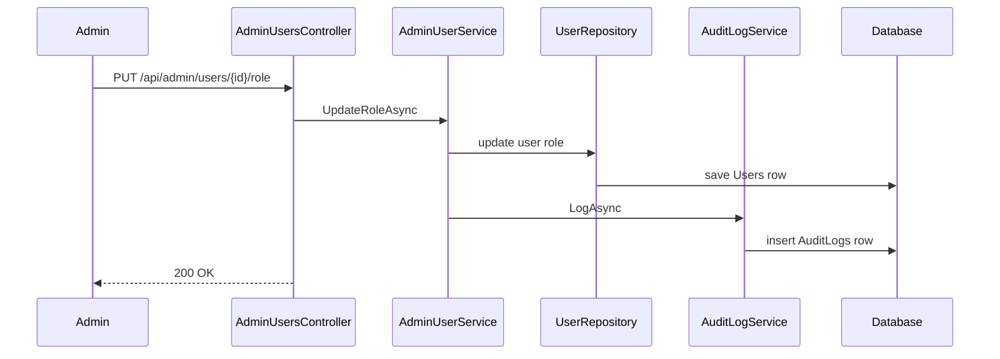

---
title: 39 - ทำ Audit Log
description: บันทึกเหตุการณ์สำคัญในระบบ admin เพื่อใช้ตรวจสอบย้อนหลัง
---

Audit log ใช้บันทึกว่าใครทำอะไรกับข้อมูลสำคัญ เมื่อไหร่ และมีผลกับใคร

ระบบ admin ที่แก้ role หรือปิดบัญชีผู้ใช้ควรมี audit log เพราะ action เหล่านี้กระทบสิทธิ์และความปลอดภัยของระบบ

ภาพรวม audit log เมื่อ admin action สำเร็จ:



## เหตุการณ์ที่ควร log ในภาคนี้

- Admin เปลี่ยน role ผู้ใช้
- Admin เปิดหรือปิดบัญชีผู้ใช้
- Admin พยายามทำ action ที่ถูกปฏิเสธ อาจ log ในอนาคตเมื่อระบบ logging พร้อมขึ้น

บทนี้จะ log เฉพาะ action ที่สำเร็จก่อน

## สร้าง AuditLog Entity

สร้างไฟล์

```text
Models/AuditLog.cs
```

เพิ่ม code นี้

```csharp
namespace Backend.Api.Models;

public class AuditLog
{
    public Guid Id { get; set; } = Guid.NewGuid();
    public int? ActorUserId { get; set; }
    public string Action { get; set; } = string.Empty;
    public string EntityName { get; set; } = string.Empty;
    public string EntityId { get; set; } = string.Empty;
    public string? Detail { get; set; }
    public string? IpAddress { get; set; }
    public DateTimeOffset CreatedAt { get; set; } = DateTimeOffset.UtcNow;
}
```

`ActorUserId` คือ admin ที่ทำ action

`EntityName` และ `EntityId` คือข้อมูลปลายทางที่ถูกกระทำ เช่น `User` และ id ของ user ที่ถูกเปลี่ยน role

`Detail` ใช้เก็บรายละเอียดอ่านง่าย เช่น `Role changed from User to Admin`

`IpAddress` ใช้ช่วยตรวจสอบย้อนหลังว่า request มาจากที่ใด ถ้า runtime ไม่มี IP เช่นตอน integration test สามารถเก็บ fallback เช่น `unknown` ได้

## เพิ่ม DbSet ใน AppDbContext

เปิด `Data/AppDbContext.cs` แล้วเพิ่ม

```csharp
public DbSet<AuditLog> AuditLogs => Set<AuditLog>();
```

เพิ่ม mapping ใน `OnModelCreating`

```csharp
modelBuilder.Entity<AuditLog>(entity =>
{
    entity.HasKey(log => log.Id);
    entity.HasIndex(log => log.CreatedAt);
    entity.HasIndex(log => new { log.ActorUserId, log.CreatedAt });
    entity.HasIndex(log => new { log.EntityName, log.EntityId, log.CreatedAt });

    entity.Property(log => log.Action)
        .IsRequired()
        .HasMaxLength(100);

    entity.Property(log => log.Detail)
        .HasMaxLength(1000);

    entity.Property(log => log.IpAddress)
        .HasMaxLength(45);

    entity.Property(log => log.CreatedAt)
        .IsRequired();
});
```

## สร้าง migration

หลังเพิ่ม entity ให้สร้าง migration ใหม่

```powershell
dotnet tool run dotnet-ef migrations add AddAuditLogs
dotnet tool run dotnet-ef database update
```

ถ้า `dotnet tool run dotnet-ef migrations add` error ให้รัน `dotnet build` ก่อนเพื่อดู compile error ที่ชัดกว่า

## สร้าง AuditLogService

สร้างไฟล์

```text
Services/AuditLogService.cs
```

เพิ่ม code นี้

```csharp
using Backend.Api.Data;
using Backend.Api.Models;

namespace Backend.Api.Services;

public class AuditLogService(AppDbContext db)
{
    public async Task LogAsync(
        int? actorUserId,
        string action,
        string entityName,
        string entityId,
        string? ipAddress,
        string? detail)
    {
        db.AuditLogs.Add(new AuditLog
        {
            ActorUserId = actorUserId,
            Action = action,
            EntityName = entityName,
            EntityId = entityId,
            IpAddress = ipAddress,
            Detail = detail
        });

        await db.SaveChangesAsync();
    }
}
```

## ลงทะเบียน AuditLogService

เปิด `Program.cs` แล้วเพิ่ม

```csharp
builder.Services.AddScoped<AuditLogService>();
```

## Inject AuditLogService เข้า AdminUserService

แก้ constructor

```csharp
public class AdminUserService(
    IUserRepository userRepository,
    CurrentUserService currentUserService,
    AuditLogService auditLogService)
```

## Log ตอนเปลี่ยน role

ใน `UpdateRoleAsync` ให้เก็บค่าเดิมก่อนเปลี่ยน

```csharp
var oldRole = user.Role;
user.Role = Roles.Normalize(request.Role);

await userRepository.UpdateAsync(user);

await auditLogService.LogAsync(
    currentAdminId,
    "USER_ROLE_CHANGED",
    nameof(User),
    user.Id.ToString(),
    null,
    $"Role changed from {oldRole} to {user.Role}");

return ToResponse(user);
```

## Log ตอนเปลี่ยนสถานะ

ใน `UpdateStatusAsync` ให้เก็บค่าเดิมก่อนเปลี่ยน

```csharp
var oldIsActive = user.IsActive;
user.IsActive = nextIsActive;

await userRepository.UpdateAsync(user);

await auditLogService.LogAsync(
    currentAdminId,
    "USER_STATUS_CHANGED",
    nameof(User),
    user.Id.ToString(),
    null,
    $"IsActive changed from {oldIsActive} to {user.IsActive}");

return ToResponse(user);
```

## สร้าง endpoint ดู audit log แบบง่าย

สำหรับช่วงเรียน ให้เพิ่ม endpoint แบบง่ายใน admin controller อีกตัว

สร้าง service method สำหรับอ่าน log ล่าสุดอาจทำในภาค production ต่อ แต่ตอนนี้ให้ตรวจผ่าน database tool หรือ SQL query ก่อนก็พอ

ตัวอย่าง SQL สำหรับตรวจ

```sql
SELECT TOP 20 *
FROM AuditLogs
ORDER BY CreatedAt DESC;
```

## Production-grade audit events

ในระบบจริง audit log ไม่ควรมีเฉพาะ admin action เท่านั้น แต่ควรครอบคลุม security event สำคัญด้วย เช่น:

- `USER_REGISTERED`
- `LOGIN_SUCCEEDED`
- `LOGIN_FAILED`
- `ACCOUNT_LOCKED`
- `REFRESH_TOKEN_ROTATED`
- `REFRESH_TOKEN_REVOKED`
- `EMAIL_VERIFICATION_REQUESTED`
- `EMAIL_VERIFIED`
- `PASSWORD_RESET_REQUESTED`
- `PASSWORD_RESET_COMPLETED`
- `USER_ROLE_CHANGED`
- `USER_STATUS_CHANGED`

ใน final project และ validation project ล่าสุด เราเพิ่ม `AuditActions` เพื่อรวมชื่อ action ไว้ที่เดียว และเพิ่ม integration test ที่ยิง register, login, refresh token, forgot password และ reset password แล้วตรวจว่า records ถูกเขียนลง `AuditLogs` จริง

เพราะ audit log จะโตต่อเนื่องตามจำนวน request สำคัญ final project จึงมี index สำหรับ query ที่ใช้บ่อย เช่นอ่าน log ล่าสุดด้วย `CreatedAt`, ไล่เหตุการณ์ของ user เดียวด้วย `EntityName + EntityId + CreatedAt` และไล่ action ของ actor ด้วย `ActorUserId + CreatedAt`

## ข้อควรระวัง

Audit log ไม่ควรเก็บ password, token หรือ secret

Audit log ควรเก็บข้อมูลพอให้ตรวจสอบย้อนหลังได้ แต่ไม่ควรกลายเป็นที่รั่วข้อมูลส่วนตัวโดยไม่จำเป็น

## Checkpoint

ก่อนอ่านบทต่อไป ให้ตรวจว่าทำได้ครบตามนี้

- มี `AuditLog` entity
- `AppDbContext` มี `DbSet<AuditLog>`
- สร้าง migration `AddAuditLogs`
- มี index สำหรับ `CreatedAt`, entity target และ actor lookup
- มี `AuditLogService`
- เปลี่ยน role แล้วเกิด audit log
- เปลี่ยน status แล้วเกิด audit log
