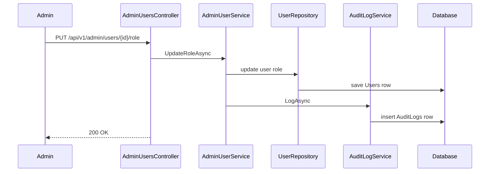

Audit log ใช้บันทึกว่าใครทำอะไรกับข้อมูลสำคัญ เมื่อไหร่ และมีผลกับใคร

ระบบ admin ที่แก้ role หรือปิดบัญชีผู้ใช้ควรมี audit log เพราะ action เหล่านี้กระทบสิทธิ์และความปลอดภัยของระบบ

ภาพรวม audit log เมื่อ admin action สำเร็จ:



## วิธีเรียนบทนี้

ให้ทำตามลำดับ:

1. สร้าง `AuditLog` entity
2. เพิ่ม `DbSet` และ mapping
3. สร้าง migration
4. สร้าง `AuditLogService`
5. inject เข้า `AdminUserService`
6. log ตอนเปลี่ยน role/status สำเร็จ
7. ตรวจข้อมูลใน database

## เหตุการณ์ที่ควร log ในภาคนี้

- Admin เปลี่ยน role ผู้ใช้
- Admin เปิดหรือปิดบัญชีผู้ใช้
- Admin พยายามทำ action ที่ถูกปฏิเสธ อาจ log ในอนาคตเมื่อระบบ logging พร้อมขึ้น

บทนี้จะ log เฉพาะ action ที่สำเร็จก่อน

## สิ่งที่จะใช้ในบทนี้

| สิ่งที่จะใช้ | ความหมาย |
| --- | --- |
| `AuditLog` | entity สำหรับบันทึกเหตุการณ์ |
| `ActorUserId` | user id ของคนที่ทำ action |
| `EntityName` | ชื่อ entity ที่ถูกกระทำ เช่น `User` |
| `EntityId` | id ของ record ที่ถูกกระทำ |
| `Detail` | ข้อความอธิบายเหตุการณ์ |
| `AuditLogService` | service สำหรับเขียน audit log |

## หลังจบบทนี้ ไฟล์ที่เปลี่ยน

```text
Models/AuditLog.cs
Data/AppDbContext.cs
Services/AuditLogService.cs
Services/AdminUserService.cs
Program.cs
Migrations/
```

## ขั้นที่ 1: สร้าง AuditLog Entity

รันจากโฟลเดอร์ `Backend.Api`

Windows PowerShell:

```powershell
New-Item -ItemType File -Path Models/AuditLog.cs
```

macOS/Linux Bash:

```bash
touch Models/AuditLog.cs
```

เปิดไฟล์:

```text
Models/AuditLog.cs
```

เพิ่ม code นี้:

```csharp
namespace Backend.Api.Models;

public class AuditLog
{
    public Guid Id { get; set; } = Guid.NewGuid();
    public int? ActorUserId { get; set; }
    public string Action { get; set; } = string.Empty;
    public string EntityName { get; set; } = string.Empty;
    public string EntityId { get; set; } = string.Empty;
    public string? Detail { get; set; }
    public string? IpAddress { get; set; }
    public DateTimeOffset CreatedAt { get; set; } = DateTimeOffset.UtcNow;
}
```

`ActorUserId` คือ admin ที่ทำ action ส่วน `EntityName` และ `EntityId` คือข้อมูลปลายทางที่ถูกกระทำ

## ขั้นที่ 2: เพิ่ม DbSet ใน AppDbContext

เปิด `Data/AppDbContext.cs` แล้วเพิ่ม property:

```csharp
public DbSet<AuditLog> AuditLogs => Set<AuditLog>();
```

ถ้าไฟล์ยังไม่มี using ของ models ให้ตรวจว่ามี:

```csharp
using Backend.Api.Models;
```

## ขั้นที่ 3: เพิ่ม mapping ของ AuditLog

ใน `OnModelCreating` เพิ่ม mapping สำหรับ `AuditLog`:

```csharp
modelBuilder.Entity<AuditLog>(entity =>
{
    entity.HasKey(log => log.Id);
    entity.HasIndex(log => log.CreatedAt);
    entity.HasIndex(log => new { log.ActorUserId, log.CreatedAt });
    entity.HasIndex(log => new { log.EntityName, log.EntityId, log.CreatedAt });

    entity.Property(log => log.Action)
        .IsRequired()
        .HasMaxLength(100);

    entity.Property(log => log.Detail)
        .HasMaxLength(1000);

    entity.Property(log => log.IpAddress)
        .HasMaxLength(45);

    entity.Property(log => log.CreatedAt)
        .IsRequired();
});
```

property constraints ต้องอยู่ข้างใน block `modelBuilder.Entity<AuditLog>(entity => { ... })` เพราะตัวแปร `entity` มีอายุอยู่เฉพาะใน block นี้เท่านั้น

index เหล่านี้ช่วย query log ล่าสุด, log ของ actor และ log ของ target entity ได้เร็วขึ้น

## ขั้นที่ 4: สร้าง migration

หลังเพิ่ม entity ให้สร้าง migration ใหม่:

```powershell
dotnet build
dotnet tool run dotnet-ef migrations add AddAuditLogs
dotnet tool run dotnet-ef database update
```

ถ้า `migrations add` error ให้ดูผล `dotnet build` ก่อน เพราะ migration ต้อง compile project ได้

## ขั้นที่ 5: สร้าง AuditLogService

รันจากโฟลเดอร์ `Backend.Api`

Windows PowerShell:

```powershell
New-Item -ItemType File -Path Services/AuditLogService.cs
```

macOS/Linux Bash:

```bash
touch Services/AuditLogService.cs
```

เปิดไฟล์:

```text
Services/AuditLogService.cs
```

เพิ่ม using และ class:

```csharp
using Backend.Api.Data;
using Backend.Api.Models;

namespace Backend.Api.Services;

public class AuditLogService(AppDbContext db)
{
}
```

## ขั้นที่ 6: เพิ่ม LogAsync

เพิ่ม method นี้ใน `AuditLogService`

```csharp
public async Task LogAsync(
    int? actorUserId,
    string action,
    string entityName,
    string entityId,
    string? ipAddress,
    string? detail)
{
    db.AuditLogs.Add(new AuditLog
    {
        ActorUserId = actorUserId,
        Action = action,
        EntityName = entityName,
        EntityId = entityId,
        IpAddress = ipAddress,
        Detail = detail
    });

    await db.SaveChangesAsync();
}
```

## ขั้นที่ 7: ลงทะเบียนและ inject AuditLogService

เปิด `Program.cs` แล้วเพิ่ม:

```csharp
builder.Services.AddScoped<AuditLogService>();
```

เปิด `AdminUserService.cs` แล้วแก้ constructor:

```csharp
public class AdminUserService(
    IUserRepository userRepository,
    CurrentUserService currentUserService,
    AuditLogService auditLogService)
```

## ขั้นที่ 8: Log ตอนเปลี่ยน role

ใน `UpdateRoleAsync` ให้เก็บค่าเดิมก่อนเปลี่ยน:

```csharp
var oldRole = user.Role;
user.Role = nextRole;
```

หลัง `await userRepository.UpdateAsync(user);` ให้ log:

```csharp
await auditLogService.LogAsync(
    currentAdminId,
    "USER_ROLE_CHANGED",
    nameof(User),
    user.Id.ToString(),
    null,
    $"Role changed from {oldRole} to {user.Role}");
```

## ขั้นที่ 9: Log ตอนเปลี่ยนสถานะ

ใน `UpdateStatusAsync` ให้เก็บค่าเดิมก่อนเปลี่ยน:

```csharp
var oldIsActive = user.IsActive;
user.IsActive = nextIsActive;
```

หลัง `await userRepository.UpdateAsync(user);` ให้ log:

```csharp
await auditLogService.LogAsync(
    currentAdminId,
    "USER_STATUS_CHANGED",
    nameof(User),
    user.Id.ToString(),
    null,
    $"IsActive changed from {oldIsActive} to {user.IsActive}");
```

## ตรวจ audit log

ก่อนตรวจ database ให้แน่ใจว่า `Backend.Api.http` มี `@adminUsersPath`, `@adminToken` และ `@targetUserId` จากบทก่อนหน้าแล้ว

สำหรับช่วงเรียน ให้ตรวจผ่าน database tool หรือ SQL query ก่อน:

```sql
SELECT TOP 20 *
FROM AuditLogs
ORDER BY CreatedAt DESC;
```

ให้ทดสอบโดยเรียก `PUT {{adminUsersPath}}/{{targetUserId}}/role` หรือ `PUT {{adminUsersPath}}/{{targetUserId}}/status` ให้สำเร็จก่อน แล้วค่อยรัน SQL นี้

หลังเปลี่ยน role หรือ status สำเร็จ ควรเห็น record ใหม่ใน `AuditLogs` ที่มี `Action` เป็น `USER_ROLE_CHANGED` หรือ `USER_STATUS_CHANGED`

## Production-grade audit events

ในระบบจริง audit log ไม่ควรมีเฉพาะ admin action เท่านั้น แต่ควรครอบคลุม security event สำคัญด้วย เช่น:

- `USER_REGISTERED`
- `LOGIN_SUCCEEDED`
- `LOGIN_FAILED`
- `ACCOUNT_LOCKED`
- `REFRESH_TOKEN_ROTATED`
- `REFRESH_TOKEN_REVOKED`
- `EMAIL_VERIFICATION_REQUESTED`
- `EMAIL_VERIFIED`
- `PASSWORD_RESET_REQUESTED`
- `PASSWORD_RESET_COMPLETED`
- `USER_ROLE_CHANGED`
- `USER_STATUS_CHANGED`

ในบท production hardening จะรวมชื่อ action ไว้ที่เดียวด้วย `AuditActions` และเพิ่ม test ตรวจว่า records ถูกเขียนลง `AuditLogs` จริง

## ข้อควรระวัง

Audit log ไม่ควรเก็บ password, token หรือ secret

Audit log ควรเก็บข้อมูลพอให้ตรวจสอบย้อนหลังได้ แต่ไม่ควรกลายเป็นที่รั่วข้อมูลส่วนตัวโดยไม่จำเป็น

## Checkpoint

ก่อนอ่านบทต่อไป ให้ตรวจว่าทำได้ครบตามนี้

- มี `AuditLog` entity
- `AppDbContext` มี `DbSet<AuditLog>`
- สร้าง migration `AddAuditLogs`
- มี index สำหรับ `CreatedAt`, entity target และ actor lookup
- มี `AuditLogService`
- เปลี่ยน role แล้วเกิด audit log
- เปลี่ยน status แล้วเกิด audit log
