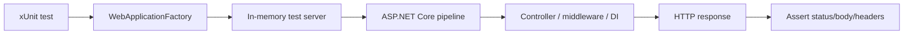

---
title: 46 - Integration Test
description: ทดสอบ API ผ่าน HTTP pipeline จริงด้วย WebApplicationFactory
---

Integration test ใช้ตรวจว่า endpoint, routing, middleware, DI, validation และ authentication ทำงานร่วมกันถูกต้อง

ใน ASP.NET Core เราสามารถใช้ `WebApplicationFactory<Program>` เพื่อสร้าง test server และยิง HTTP request เข้า API ได้โดยไม่ต้องเปิด server จริงแยกเอง

ภาพรวม integration test ด้วย `WebApplicationFactory`:



## ก่อนเริ่มบทนี้

ให้ตรวจว่าคุณมี test project จากบทก่อนหน้าแล้ว:

```text
Backend.Api/
Backend.Api.Tests/
Backend.Api.slnx หรือ Backend.Api.sln
```

คำสั่งในบทนี้ให้รันจาก root ของ solution คือโฟลเดอร์ที่มี `Backend.Api` และ `Backend.Api.Tests` อยู่ข้างกัน

## คำศัพท์ในบทนี้

`Integration test` คือ test ที่รันหลายส่วนของระบบร่วมกัน เช่น routing, middleware, DI และ controller ไม่ใช่ทดสอบ method เดี่ยวแบบ unit test

`WebApplicationFactory<Program>` คือ helper ที่สร้าง test server จาก `Program.cs` ของ API เพื่อให้ test ยิง HTTP request เข้า application pipeline จริงได้

## หลังจบบทนี้ ไฟล์ที่เปลี่ยน

```text
Backend.Api/Program.cs
Backend.Api.Tests/Backend.Api.Tests.csproj
Backend.Api.Tests/TestApiFactory.cs
Backend.Api.Tests/AuthIntegrationTests.cs
```

หลังจบบทนี้ควรมี integration test อย่างน้อยหนึ่งตัวที่รันด้วย `dotnet test` ได้โดยไม่ต้องเปิด API server แยกเอง

## ติดตั้ง package

ที่ test project ให้รัน

```powershell
dotnet add Backend.Api.Tests\Backend.Api.Tests.csproj package Microsoft.AspNetCore.Mvc.Testing
```

## เปิด Program ให้ test project เข้าถึง

เปิด `Program.cs` ของ API แล้วเพิ่มท้ายไฟล์

```csharp
public partial class Program { }
```

เพราะ top-level statements จะสร้าง `Program` class ให้แบบ implicit การเพิ่ม partial class ทำให้ test project reference ได้ง่าย

## ควบคุม database seeding ตอน test

ถ้าโปรเจกต์มี `DataSeeder` ที่รันตอน application start ให้ปรับ `Program.cs` ให้ปิด seeding ได้ผ่าน configuration

```csharp
var seedDatabase = app.Configuration.GetValue("DataSeeding:Enabled", true);

if (seedDatabase)
{
    using var scope = app.Services.CreateScope();
    var seeder = scope.ServiceProvider.GetRequiredService<DataSeeder>();
    await seeder.SeedAsync();
}
```

ตอน integration test เราจะตั้ง `DataSeeding__Enabled=false` เพื่อให้ test แรกไม่ต้องใช้ SQL Server จริง

## เขียน test สำหรับ protected endpoint

สร้างไฟล์

```text
Backend.Api.Tests/TestApiFactory.cs
```

เพิ่ม code นี้

```csharp
using Microsoft.AspNetCore.Mvc.Testing;

namespace Backend.Api.Tests;

public class TestApiFactory : WebApplicationFactory<Program>
{
    private readonly Dictionary<string, string?> previousValues = [];

    public TestApiFactory()
    {
        SetEnvironmentVariable(
            "ConnectionStrings__DefaultConnection",
            "Server=localhost,1433;Database=BackendApiTests;User Id=sa;Password=Test_Local_Password_123!;TrustServerCertificate=True;");
        SetEnvironmentVariable("Jwt__Issuer", "Backend.Api");
        SetEnvironmentVariable("Jwt__Audience", "Backend.ApiClient");
        SetEnvironmentVariable(
            "Jwt__SigningKey",
            "test-signing-key-at-least-32-characters");
        SetEnvironmentVariable("Jwt__ExpirationMinutes", "60");
        SetEnvironmentVariable("DataSeeding__Enabled", "false");
    }

    protected override void Dispose(bool disposing)
    {
        foreach (var (key, value) in previousValues)
        {
            Environment.SetEnvironmentVariable(key, value);
        }

        base.Dispose(disposing);
    }

    private void SetEnvironmentVariable(string key, string value)
    {
        previousValues[key] = Environment.GetEnvironmentVariable(key);
        Environment.SetEnvironmentVariable(key, value);
    }
}
```

สาเหตุที่ใช้ environment variable คือโปรเจกต์นี้ validate config ตั้งแต่ startup ถ้าใช้ `ConfigureAppConfiguration` ใน test factory ค่าอาจมาช้าเกินไปสำหรับ code ที่อ่าน config ช่วงต้น `Program.cs`

จากนั้นสร้างไฟล์

```text
Backend.Api.Tests/AuthIntegrationTests.cs
```

เพิ่ม code นี้

```csharp
using System.Net;
using Microsoft.AspNetCore.Mvc.Testing;

namespace Backend.Api.Tests;

public class AuthIntegrationTests(TestApiFactory factory) : IClassFixture<TestApiFactory>
{
    [Fact]
    public async Task Me_WhenNoToken_ReturnsUnauthorized()
    {
        var client = CreateClient();

        var response = await client.GetAsync("/api/auth/me");

        Assert.Equal(HttpStatusCode.Unauthorized, response.StatusCode);
    }

    private HttpClient CreateClient()
    {
        return factory.CreateClient(new WebApplicationFactoryClientOptions
        {
            BaseAddress = new Uri("https://localhost")
        });
    }
}
```

## ระวังเรื่อง database ใน integration test

ถ้า application start แล้วต้องเชื่อม SQL Server จริง test อาจ fail เมื่อไม่มี database

แนวทางที่ทำได้มีหลายแบบ

- ใช้ SQL Server container สำหรับ test
- override connection string ไปที่ test database
- ใช้ SQLite in-memory สำหรับบาง scenario
- แยก startup logic ที่ seed database ให้ควบคุมได้ใน test

สำหรับมือใหม่ ให้เริ่มจาก test endpoint ที่ไม่ต้องใช้ database ก่อน เช่น `GET /api/auth/me` แบบไม่ส่ง token เพราะ authentication middleware ตอบ `401` ก่อนเข้าถึง database

## เพิ่ม test validation

เพิ่ม test register validation ได้โดยไม่ต้องมี database จริง เพราะ invalid model จะถูกตอบ `400` ก่อนเข้า service ที่คุยกับ database

```csharp
[Fact]
public async Task Register_WhenEmailInvalid_ReturnsBadRequest()
{
    var client = CreateClient();

    var response = await client.PostAsJsonAsync("/api/auth/register", new
    {
        email = "not-an-email",
        password = "Passw0rd!"
    });

    Assert.Equal(HttpStatusCode.BadRequest, response.StatusCode);
}
```

ต้องเพิ่ม using

```csharp
using System.Net.Http.Json;
```

## รัน integration test

```powershell
dotnet test
```

ถ้า test fail ตั้งแต่ application start ให้ดู error จาก configuration หรือ database ก่อน เพราะ integration test ใช้ startup path ใกล้เคียงของจริง

## Checkpoint

ก่อนอ่านบทต่อไป ให้ตรวจว่าทำได้ครบตามนี้

- test project ติดตั้ง `Microsoft.AspNetCore.Mvc.Testing`
- API มี `public partial class Program { }`
- seeding database ถูกควบคุมได้ด้วย `DataSeeding:Enabled`
- มี `TestApiFactory` ที่ตั้งค่า connection string, JWT และปิด seeding สำหรับ test
- มี integration test สำหรับ `GET /api/auth/me` แบบไม่ส่ง token
- รัน `dotnet test` ผ่านอย่างน้อยหนึ่ง integration test
- เข้าใจว่าการ test database ต้องจัด test database ให้ชัดเจน
