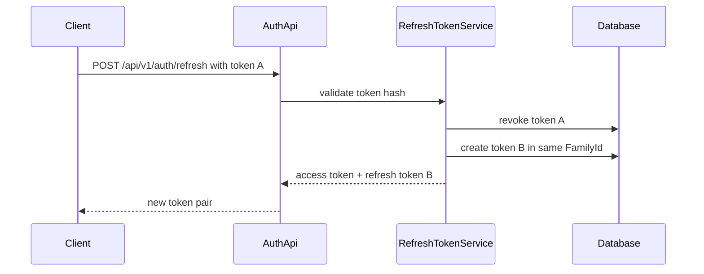
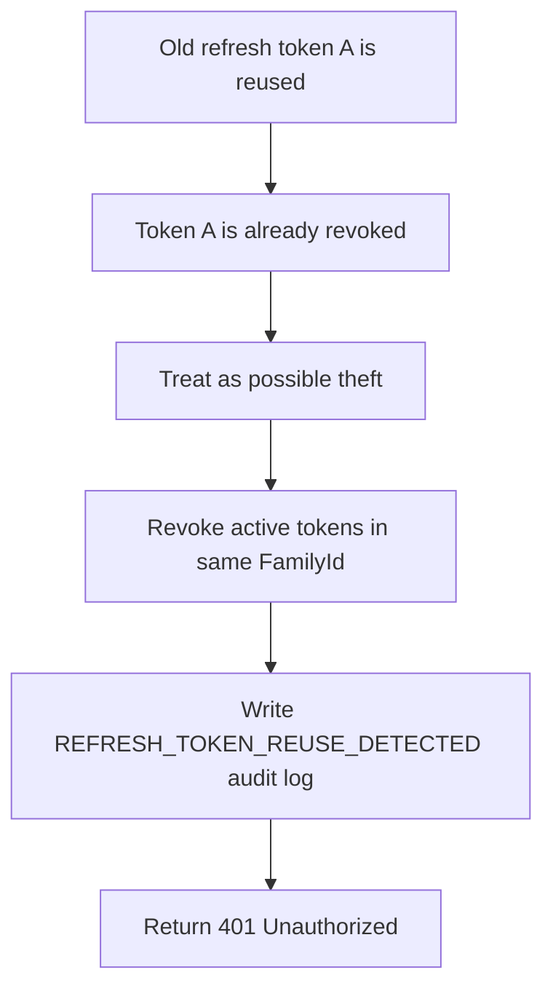

JWT access token ควรมีอายุสั้น เพราะเมื่อ token หลุดไปแล้ว server revoke token ได้ยาก ถ้า access token อยู่ได้นาน ความเสียหายก็ยาวตามไปด้วย Production API จึงมักใช้คู่กัน:

- access token: อายุสั้น ใช้เรียก API
- refresh token: อายุยาวกว่า ใช้ขอ access token ใหม่

ภาพรวม refresh token rotation:



แต่ refresh token ต้องถูกเก็บแบบระวังมากกว่า access token เพราะมีอายุยาวกว่า ในบทนี้เราใช้แนวทางนี้:

- สร้าง refresh token ด้วย random bytes
- เก็บเฉพาะ hash ใน database ไม่เก็บ token ตัวจริง
- เมื่อใช้ refresh token แล้ว revoke token เดิม
- ออก refresh token ใหม่แทน เรียกว่า token rotation
- เก็บ `FamilyId` เพื่อรู้ว่า token แต่ละรุ่นอยู่ใน session family เดียวกัน
- เก็บ `RevocationReason` เพื่อรู้ว่า token ถูก revoke เพราะ rotate, logout, reset password หรือ reuse detection
- ถ้าเอา token เก่าที่ rotate แล้วมาใช้ซ้ำ ระบบจะมองว่าอาจถูกขโมย และ revoke active token ทั้ง family

บทนี้ต่อจาก production user model ในบท 51 ดังนั้นตัวอย่างจะใช้ `Guid UserId` และ timestamp แบบ `DateTimeOffset` ถ้า project ของคุณยังใช้ model เดิมจากภาค 1-8 ให้ทำ migration ในบท 51 ให้เรียบร้อยก่อน ไม่อย่างนั้น `RefreshToken.UserId`, JWT subject, `CurrentUserService` และ admin/audit code จะใช้ชนิดข้อมูลไม่ตรงกัน

## RefreshToken model

```csharp
public class RefreshToken
{
    public Guid Id { get; set; } = Guid.NewGuid();
    public Guid UserId { get; set; }
    public Guid FamilyId { get; set; } = Guid.NewGuid();
    public required string TokenHash { get; set; }
    public string? UserAgent { get; set; }
    public DateTimeOffset ExpiresAt { get; set; }
    public DateTimeOffset? RevokedAt { get; set; }
    public string? ReplacedByTokenHash { get; set; }
    public string? RevocationReason { get; set; }
}
```

`FamilyId` ใช้ผูก refresh token หลายรุ่นที่เกิดจากการ rotate ต่อกัน เช่น login ได้ token A จากนั้น refresh ได้ token B ทั้ง A และ B จะอยู่ family เดียวกัน

`RevocationReason` ช่วยให้ตรวจสอบย้อนหลังได้ว่า token ถูก revoke เพราะอะไร เช่น `Rotated`, `UserRevoked`, `PasswordReset` หรือ `ReuseDetected`

## Endpoint ที่เพิ่ม

```http
POST /api/v1/auth/refresh
POST /api/v1/auth/revoke
GET /api/v1/auth/sessions
DELETE /api/v1/auth/sessions/{familyId}
DELETE /api/v1/auth/sessions
```

`/api/v1/auth/refresh` รับ refresh token เดิม แล้วคืน access token + refresh token ชุดใหม่

`/api/v1/auth/revoke` ใช้ logout ฝั่ง client หรือ revoke token ที่ไม่ต้องการใช้อีก

`/api/v1/auth/sessions` ใช้ดู session/device ที่ยัง active ของ user ปัจจุบัน โดยระบบ group refresh token ตาม `FamilyId` และแสดงเวลาสร้าง session, เวลาที่ออก token ล่าสุด, IP และ user agent ที่เกี่ยวข้อง

`DELETE /api/v1/auth/sessions/{familyId}` ใช้ revoke session เดียว เช่น ผู้ใช้ต้องการออกจากระบบเฉพาะ device หนึ่ง ส่วน `DELETE /api/v1/auth/sessions` ใช้ revoke refresh token session ทั้งหมดของ user ปัจจุบัน

เมื่อ revoke session ระบบจะเขียน audit log ด้วย action `REFRESH_TOKEN_SESSION_REVOKED` หรือ `ALL_REFRESH_TOKEN_SESSIONS_REVOKED`

## Reuse detection

เมื่อ refresh token ถูกใช้สำเร็จ ระบบจะ:

1. สร้าง refresh token ใหม่ใน `FamilyId` เดิม
2. mark token เดิมเป็น revoked
3. ใส่ `ReplacedByTokenHash`
4. ใส่ `RevocationReason = "Rotated"`

ภาพรวมเมื่อมีการใช้ token เก่าซ้ำ:



ถ้ามี request เอา token เดิมกลับมาใช้ซ้ำอีกครั้ง ระบบจะถือว่าเป็นเหตุการณ์เสี่ยง เพราะอาจแปลว่า refresh token เดิมรั่วไปอยู่กับ attacker

ในกรณีนี้ระบบควรทำดังนี้:

- revoke active token ทั้ง family
- ใส่ `RevocationReason = "ReuseDetected"`
- ตอบ `401 Unauthorized`
- เขียน audit log action `REFRESH_TOKEN_REUSE_DETECTED`

แนวคิดนี้ทำให้ attacker ที่ถือ token เก่าซึ่งถูก rotate แล้ว ไม่สามารถใช้ token family นั้นต่อได้ และผู้ดูแลระบบมี audit trail สำหรับตรวจสอบย้อนหลัง

## Pseudo-code ของ rotation และ session revoke

```text
Refresh(rawToken):
  tokenHash = Hash(rawToken)
  storedToken = find refresh token by tokenHash with user

  if storedToken is missing, expired, or revoked without rotation:
    return 401

  if storedToken was already rotated:
    revoke every active token in the same FamilyId
    write REFRESH_TOKEN_REUSE_DETECTED audit log
    return 401

  newRawToken = generate secure random token
  newHash = Hash(newRawToken)
  create new refresh token with the same UserId and FamilyId
  mark storedToken as revoked with reason Rotated
  save ReplacedByTokenHash = newHash
  write REFRESH_TOKEN_ROTATED audit log
  return new access token and newRawToken
```

```text
RevokeSession(currentUserId, familyId):
  revoke active tokens where UserId == currentUserId and FamilyId == familyId
  if no token was revoked:
    return 404

  write REFRESH_TOKEN_SESSION_REVOKED audit log
  return 204

RevokeAllSessions(currentUserId):
  revoke every active token for currentUserId
  write ALL_REFRESH_TOKEN_SESSIONS_REVOKED audit log with revoked count
  return 204
```

## จุดที่ต้องระวัง

อย่าเก็บ refresh token เป็น plain text ใน database ถ้าฐานข้อมูลหลุด คนที่ได้ database จะเอา token ไปแลก access token ได้ทันที การเก็บ hash ทำให้ database leak ไม่กลายเป็น session leak โดยตรง

ควรมี integration test ตรวจว่าเมื่อ reuse refresh token เก่าแล้ว token ใหม่ใน family เดียวกันถูก revoke, มี `RevocationReason = "ReuseDetected"` และเกิด audit log `REFRESH_TOKEN_REUSE_DETECTED`

นอกจากนี้ยังมี test สำหรับ session/device management: login แล้วเก็บ `UserAgent`, list active sessions, revoke session ของตัวเอง, ป้องกันการ revoke session ของ user อื่น, revoke all sessions และตรวจ audit log ของการ revoke

## Checkpoint

ก่อนอ่านบทต่อไป ให้ตรวจว่าทำได้ครบตามนี้

- refresh token เก็บเฉพาะ hash
- rotate token แล้ว revoke token เดิม
- reuse token เดิมแล้ว revoke ทั้ง family
- session/device endpoints ใช้ token family และตรวจ owner ของ session
- audit log มี event สำหรับ rotate, revoke และ reuse detection
